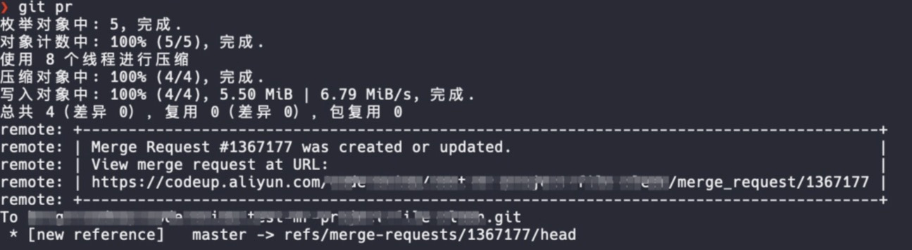
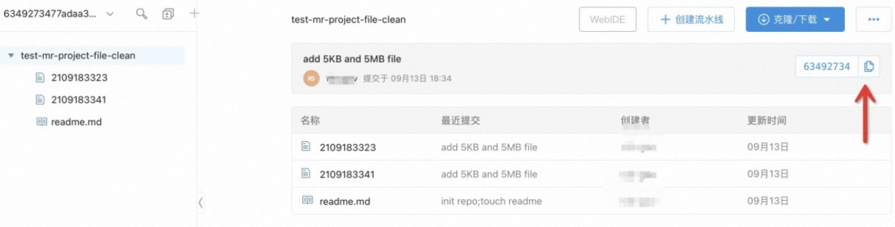
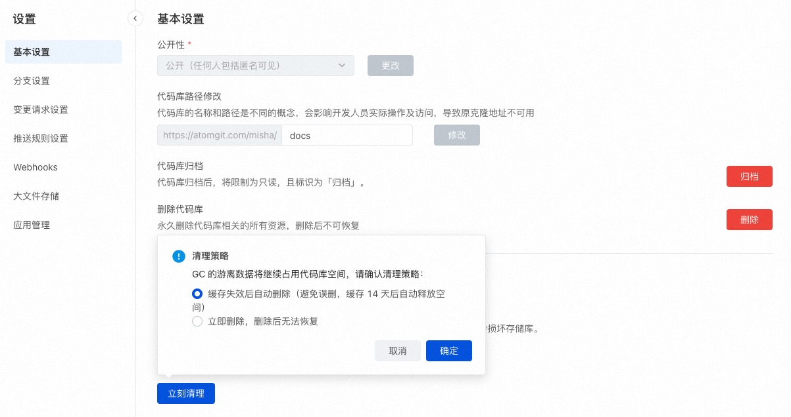

本文介绍代码库容量限制以及如何清理代码库容量。

#### 1. 代码库存储空间容量是否有限制？

默认单个代码库具备 2GB Git 存储空间，以及 x GB LFS 存储空间。
> 什么是大文件存储 Git LFS 容量？参见 [大文件存储](../repo/lfs.md)。

#### 2. 如何清理代码库容量？

为了保证平台资源不被恶意滥用，同时保障每位用户流畅的使用体验，推荐单个代码库 Git 数据保持在 2GB 以内，二进制大文件请使用 Git LFS 大文件存储管理。

单个代码库容量即将到达推荐阈值时，需要自行进行容量清理，强烈建议二进制文件切换为 LFS 存储，提升代码推拉速度，切换后不影响日常使用流程。

##### 容量未达上限

为了不影响你的日常研发工作，当容量达到存储限额的 90% 时，建议开发者及时进行仓库容量清理，当容量超过上限后将禁止写操作，届时将无法删除文件。

* 文件清理：作为开发者，请及时删除不需要的文件，释放仓库容量。
* GC 清理：作为代码库管理员，点击库设置-基本设置，可以在代码库接近存储限制时使用库 GC 功能，压缩存储库对象，减少磁盘占用，提升读写仓库的效率。
* LFS 空间清理：使用 LFS 管理二进制文件，当删除 Git 源文件时，LFS 资源文件不会连带删除，仍然占用 LFS 存储空间，需要手动对 LFS 资源文件进行清理。库管理员点击代码库设置，可见大文件存储菜单，勾选期望删除的文件后进行删除。

##### 容量已达上限

当达到推荐容量上限后，平台将暂时锁定仓库的写操作权限，此时仅允许在库设置中进行库容量 GC 优化。

#### 3.代码库中 Git 大文件如何清理？

如果在代码库中提交了大量的二进制文件，可能导致代码库容量超出限制而无法写入，或者单个文件过大，超出单文件大小限制而无法写入。

此时建议对已提交代码库的历史大文件进行清理，然后将大文件使用 Git-LFS 进行存储管理。Git 大文件转 LFS 管理参见 [大文件存储](../repo/lfs.md)。

##### 数据备份

清理操作会改写代码库提交历史，清除历史的大文件，建议将远程代码库克隆下来，先在本地进行备份。

##### 工具安装

清理仓库大文件需要修改仓库的提交历史，git-filter-repo 是 Git 官方社区推荐的修改仓库提交历史的工具，本文介绍使用 git-filter-repo 来清理仓库大文件的方法。

安装方法参考 [git-filter-repo 安装说明](https://github.com/newren/git-filter-repo/tree/main/contrib/filter-repo-demos)，或直接使用下述命令安装：

```shell
pip3 install git-filter-repo
```

##### 克隆裸库
克隆待处理的代码库裸库，以 HTTP 协议为例：

```shell
git clone --mirror --bare HTTPs://atomgit.com/example/example.git
```

##### 清理大文件

进入克隆好的裸库中：
```shell
cd example.git
```
git-filter-repo 支持三种方式的大文件清理：按照文件大小、路径或者按照文件 blob ID，以下通过示例详细说明其使用方法。

* 按文件大小清理

假如要清理大于 100M 以上的文件，执行下述命令：

```shell
git filter-repo --strip-blobs-bigger-than 100M
```

--strip-blobs-bigger-than 参数支持K、M和G三种单位，比如这儿的100M也可以换成10K，1G等。

* 按文件路径清理

假如已知大文件的路径，可以通过组合 --path 和 --invert-paths 参数来清理相关大文件。例如，要从仓库的提交历史中删除 path/of/large/file.lib 文件和 bin/ 目录，可以执行下述命令：

```shell
git filter-repo --path path/of/large/file.lib --path /bin/ --invert-paths
```

这两个参数组合起来可保留除了--path 指定的目录/文件外的其他所有文件/目录，即从仓库历史提交中清除 --path 指定的所有目录/文件。

* 按文件 blob ID 清理

假如已知大文件的 blob ID，可以将大文件的 blob ID写入一个文件中，比如在文件 ids.txt 中写入下述几个大文件 blob ID

```shell
e152814d14939a20f5399acf80b606ad018f872a
b747204ba81985a3f41314ef55d4c4a24868ede2
```

然后执行

```shell
 git filter-repo  --strip-blobs-with-ids ids.txt
```

##### 更新服务端仓库

首先更新 example.git 仓库配置，在 example.git 中执行下述命令

```shell
git config remote.origin.mirror false
```

使用本地去除大文件后的仓库强制更新远程仓库

```shell
git push -u origin refs/heads/*:refs/heads/* -f
git push -u origin refs/tags/*:refs/tags/* -f
```

##### 查看远端更新效果

登录仓库页面上确认对应代码库的相关大文件已经从各个分支的提交历史中被清除。

##### 仓库立即清理

执行完上述操作后，由于清理存在等待周期，服务端仓库大小此时可能并没有明显变化。

如需立即生效，需要仓库管理员在仓库的“设置”中点击存储库 GC的“立即清理”，并选择“立即删除”，执行完清理操作后相关大文件将从服务端仓库中彻底清除。

#### 如何清理 Agit 集中式评审引入的大文件空间？

通过推送评审模式创建的变更请求，源提交可能携带了大文件。

当评审未合入时，携带大文件的提交不会存在于仓库已有的任何分支和标签中，但会存在于评审产生的特殊引用（用于在评审中保持源提交不被回收，参考git GC的原理）中，因此会导致即使关闭评审并强制 GC 依然无法清理服务端仓库的大小。

##### 解决办法

1. 找到带入大文件的评审页面，如果评审处于打开状态，请先关闭它；

2. 找到评审产生的特殊引用，示意如下：

* Case1：本地创建评审信息尚在，在本地客户端直接获取特殊引用


如上图：命令行创建时反馈信息中，最后一行->右边的引用，就是评审产生的特殊引用：refs/merge-requests/1367177/head

* Case2：本地创建评审信息不在，通过页面查找评审 ID，拼接特殊引用：refs/merge-requests/:ID/head

如上图，当前页面地址 merge_request 后的数字，为评审 ID，即：1367177。此时评审引用为：refs/merge-requests/1367177/head

此外，还需要获取评审暂存引用：


点击评审源的 commit ID，如上图的63492734。在commit详情页面点击复制 commit ID，如下图：



在这里是：6349273477adaa3b9d18fea9033fe01f26656a1d，那么评审的暂存引用为：refs/keep-around/6349273477adaa3b9d18fea9033fe01f26656a1d

3. 通过命令行删除特殊引用

```shell
cd your_local_repository
git push origin :refs/merge-requests/1367177/head
git push oriign :refs/keep-around/6349273477adaa3b9d18fea9033fe01f26656a1d
```

4. 在仓库设置页面的存储空间管理-存储库GC，选择“立即清理”，清理策略请选择“立即删除”

