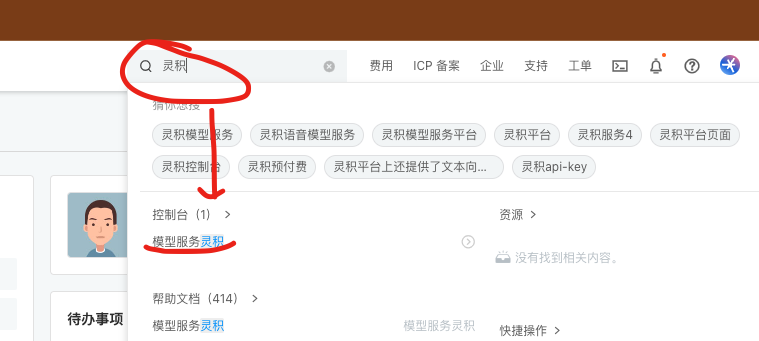

## 一、设置ApiKey/token

您可前往个人设置页 https://atomgit.com/-/profile/ai 点击 “添加AI” 按钮设置您的 ApiKey/token

## 二、ApiKey/token获取方式

### 通义千问
通过两种方式获取

1）在阿里云控制台搜索“灵积”

进入控制台后在管理中心->API-KEY管理中点击“创建新的API-KEY”并保存好创建的Key

    注意：在配置到AtomGit上时需要加上固定前缀"Bearer ",注意包含一个空格！

2）直接访问【[API-KEY管理](https://dashscope.console.aliyun.com/apiKey)】

