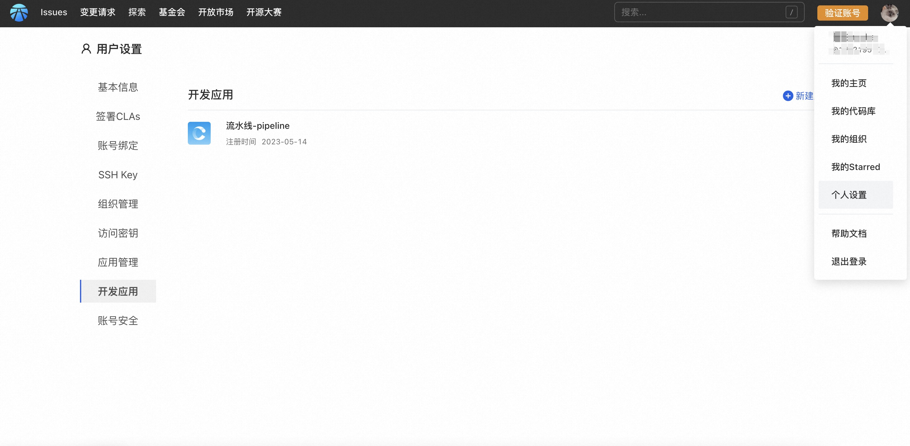
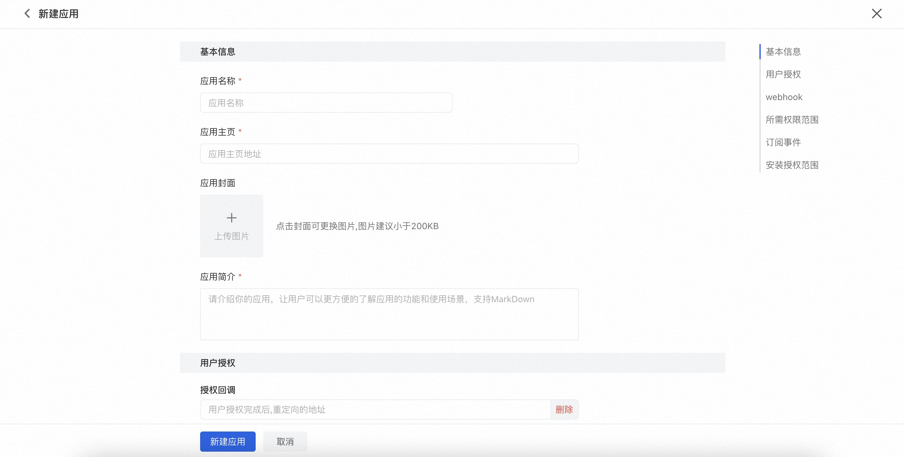
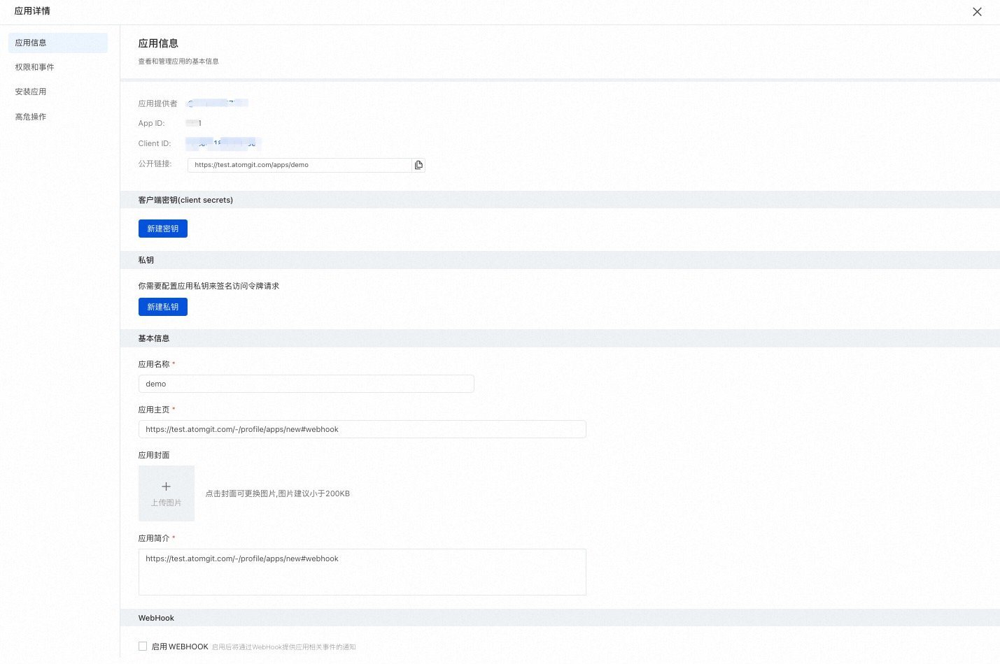
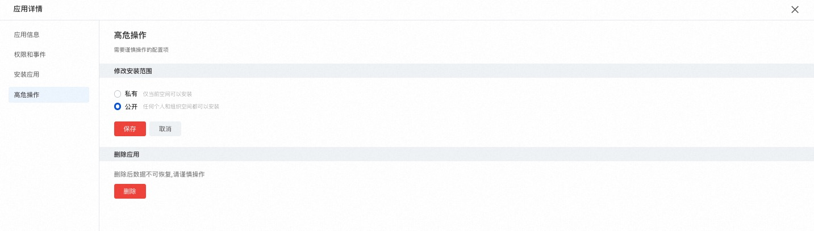
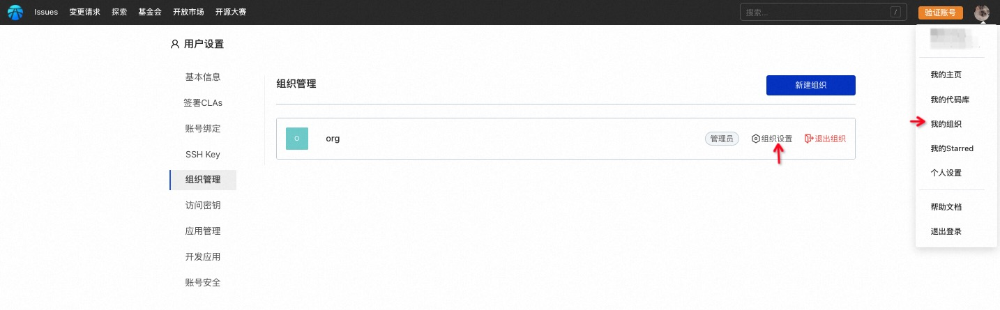
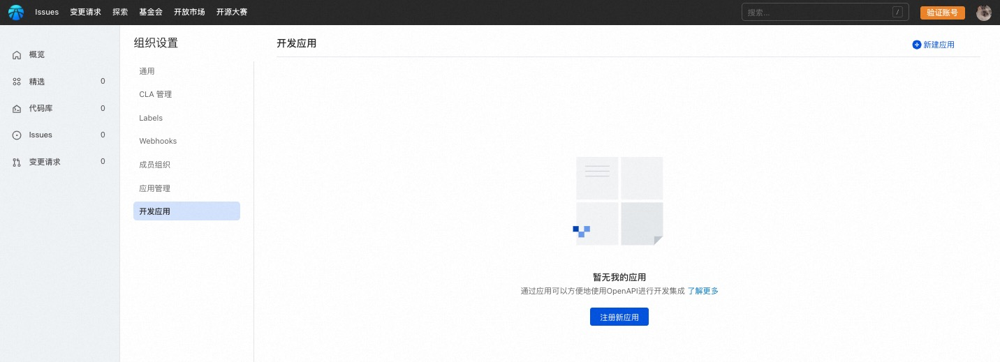

## 开发应用
平台支持接入三方的应用，并为应用提供授权。应用可调用 OpenAPI 获取被授权的平台数据，通过应用在 AtomGit 站外自由进行业务的数据处理，并提供了数据结果的回写途径，在提交状态、变更请求状态中回显处理结果，以实现扩展的代码质量、安全检查等目的。

### 应用接入
应用需要接入到空间下，AtomGit 有两类空间：

* 个人空间
* 组织空间

#### 个人空间
1. 点击右上角头像，进入「个人设置」，选择「开发应用」：

2. 点击「新建应用」，填写应用信息表单：

* **应用基本信息**
包括名称、主页、封面等。   

* **用户授权配置**
安装授权的回调配置和是否需要Oauth授权，将用于应用申请用户授权以通过OpenAPI获取对应数据。

* **WebHook配置**
启用后将通过WebHook提供应用相关事件的通知

* **应用所需权限范围选择**
应用需要申请获取的用户权限范围，包括代码库权限、组织权限、用户权限。

* **应用需要订阅的事件**
根据选择的权限范围和WebHook设置，可对应选择能够订阅的事件，发生对应事件时将通知给应用，进而可进一步自定义处理。

* **应用安装范围设置**
包括私有和公开，私有应用只有当前空间可以安装，公开应用任意空间可以安装。当应用要上架到应用开放市场时，必须设置为公开应用。

3. 应用创建完成后，将进入应用详情：

在应用详情中可针对应用基本信息、权限和事件进行修改配置。

当使用应用进行 OpenAPI 调用前，需要按需新建客户端密钥或是私钥，如何通过应用使用 OpenAPI 参见[应用接入示例](app-demo)。

**安装应用**
安装应用有两种常用方式：

* 通过应用详情 - 安装应用，选择期望安装的空间进行安装；
* 通过开放市场进行安装，参见[开放市场](app-market)。

**高危操作**
包括修改公开性和删除应用。

#### 组织空间
仅允许组织管理员角色为组织接入应用。

1. 点击右上角头像，进入「我的组织」，点击目标组织：

2. 进入组织设置，选择「开发应用」：

3. 点击「新建应用」填写应用信息，组织空间下新建应用过程，同个人空间下开发应用，不再赘述。