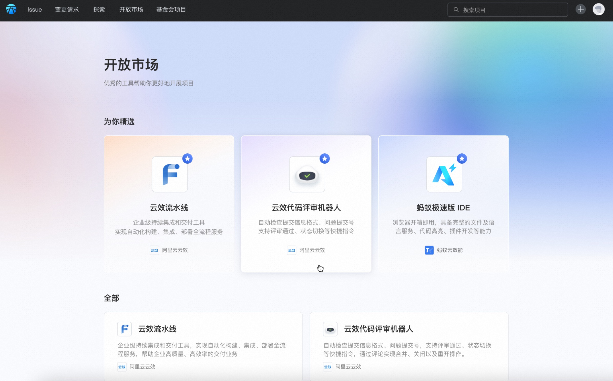
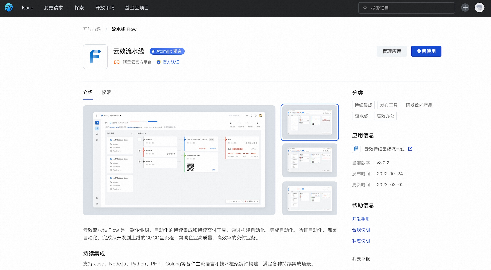
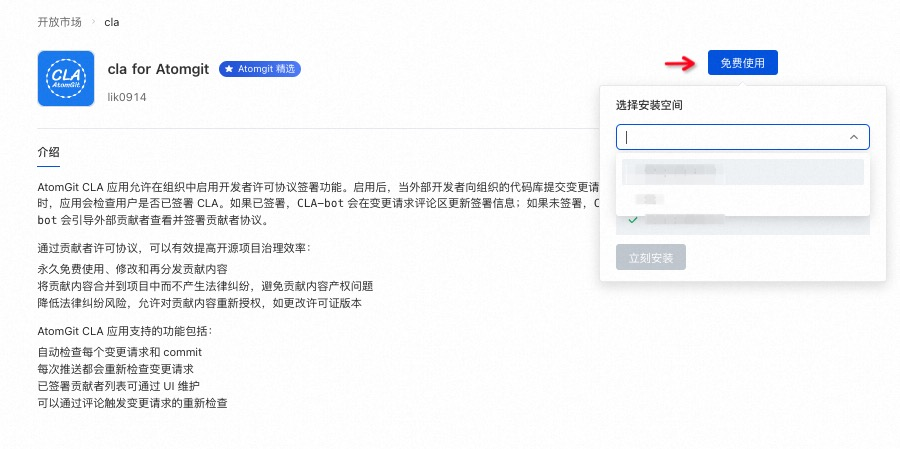
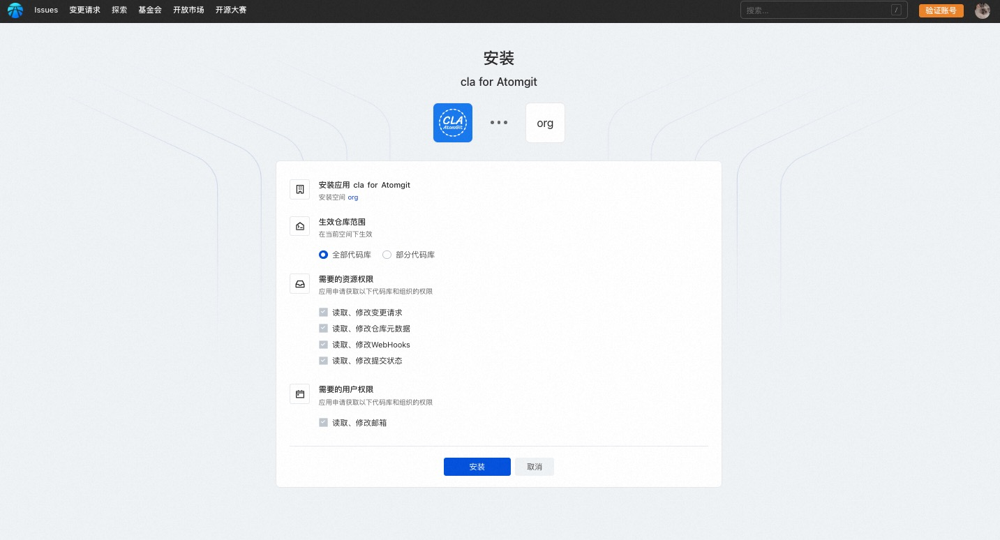
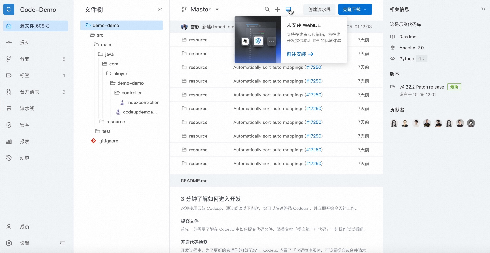
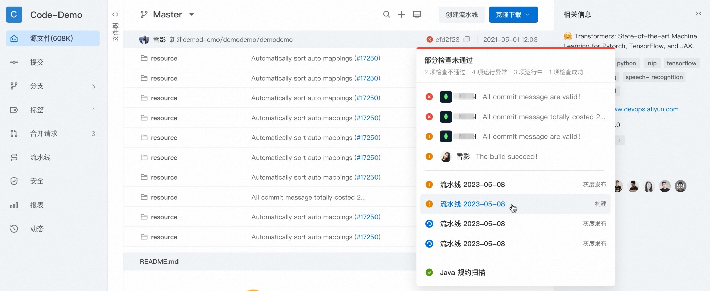
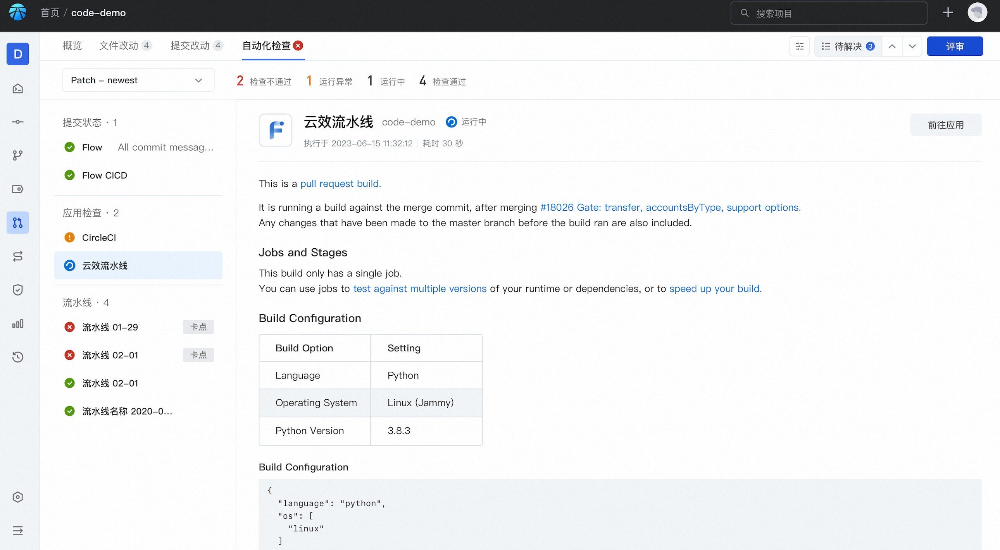

## 开放市场
平台提供了开放市场，供用户自行选择安装适合自己工程的应用，并将持续建设市场应用的丰富度。

点击应用卡片可进入应用详情：

### 安装应用
1. 进入应用详情，点击「免费使用」，根据提示选择期望安装的空间：

2. 进入安装确认页面，确认安装和授权信息：

* 生效仓库范围：控制应用可获取的代码库数据范围。
如果选择部分代码库，则需要手动选择可被获取数据的库加入列表：

* 资源和用户权限确认：根据应用接入时要求获取的权限进行申明，确认后完成应用安装。

安装完成后将跳转至应用填写的回调地址，如果应用同时要求获取Oauth的用户授权，则会跳转三方应用进入Oauth授权流程。

应用安装授权完成后，则可以根据应用本身提供的能力进行运作。
* 如 WebIDE 应用，安装完成后可在代码库内通过 WebIDE 按钮启动在线编码服务：

* 如持续集成类的应用，安装完成后可在代码库内针对提交和变更请求回写检查结果状态，辅助进行代码评审工作：

