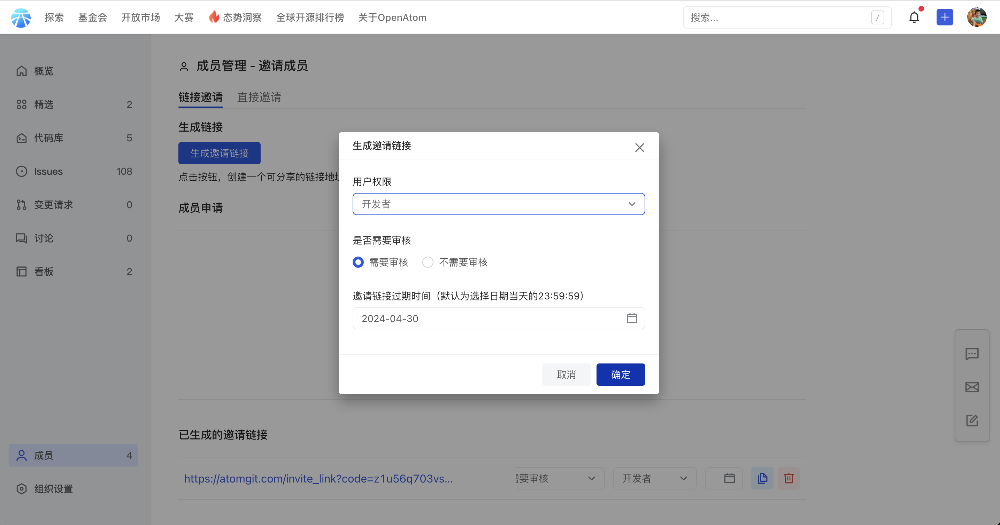
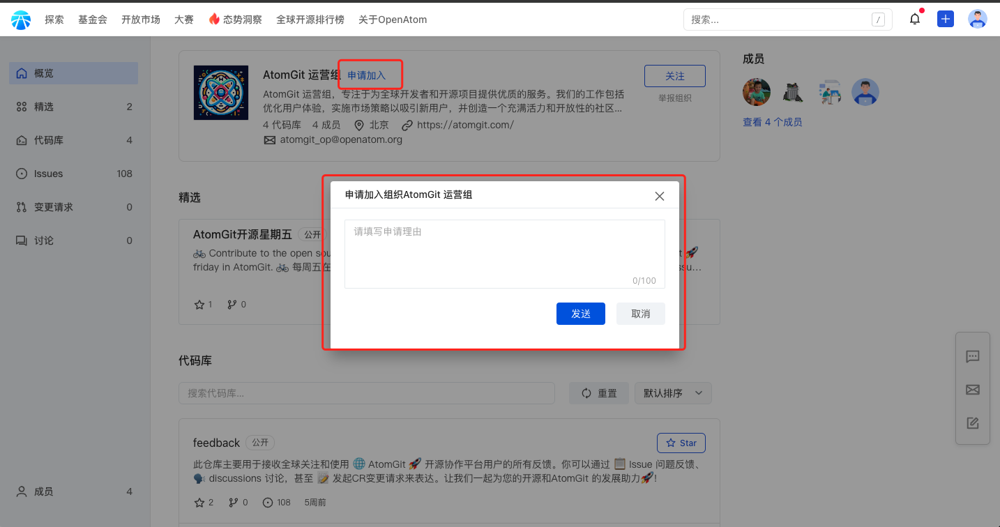
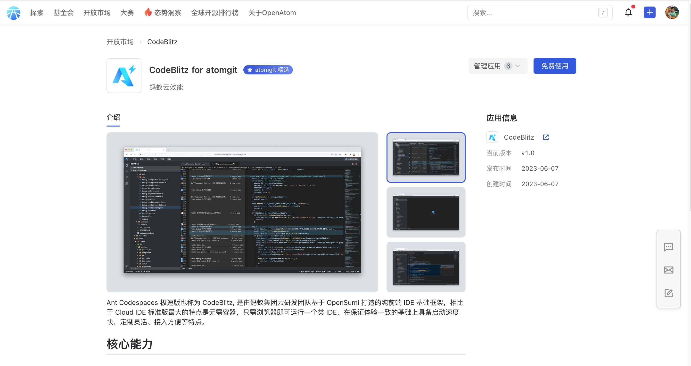
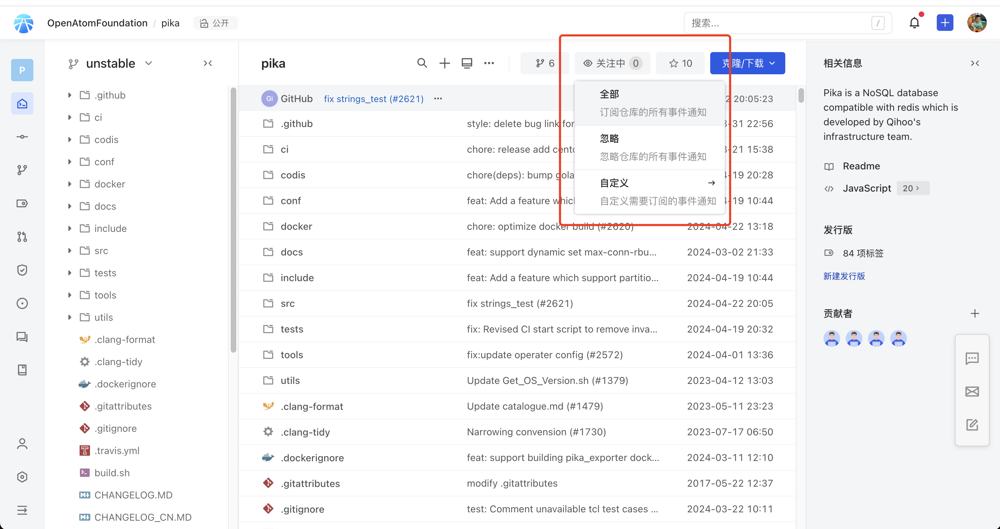
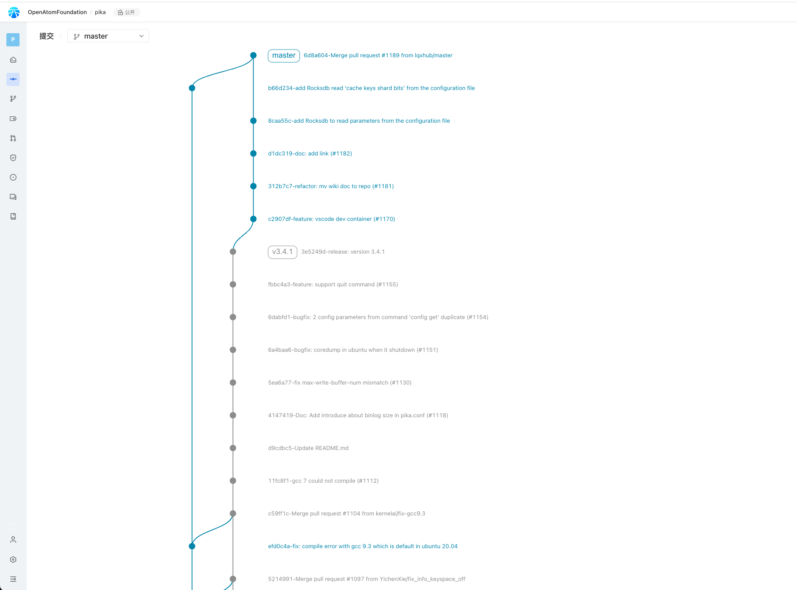
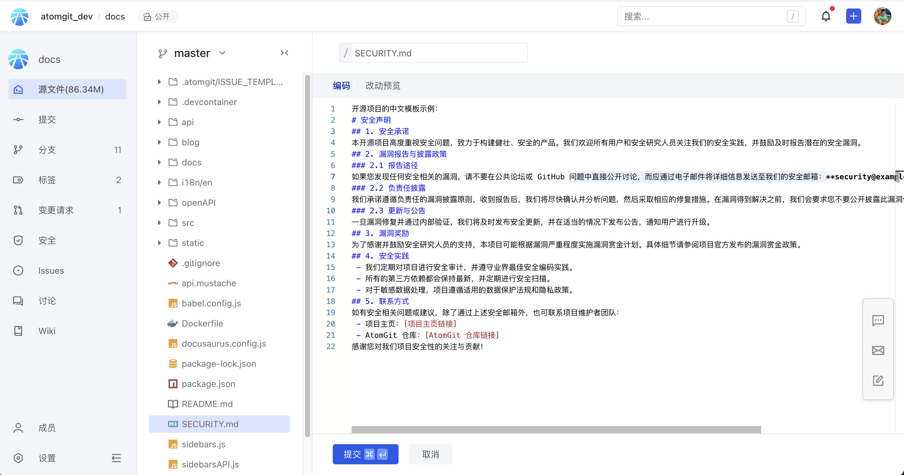

# v0.9.0 版本 
<!-- 大版本更新简述，控制在 200字左右 -->
## 更新内容
### 功能新增
 - 组织邀请链接
 - 应用上架审核
 - 仓库 watch 功能
 - 代码提交图谱
 - 创建支持指定文件模板
### 功能优化
 - 编程语言分布展示优化
 - 优化自动化检查相关 openApi 异常提示
 - 下载zip包增加登录校验
 - 阅读体验提升
 - 支持快捷使用 Issue 引用 回复功能
 - 平台关键操作增加二次确认
### 缺陷修复
 - 授权登录修复（兼容鸿蒙最新系统）
 - 修复应用安装详情页应用描述文本渲染异常
 - 修复 Fork 库列表个数超限检索异常问题
 - 移除成员修复没有确定按钮问题
 - 修复 markdown 编辑器显示问题

## 详情
### 功能新增
#### 组织邀请链接
代码托管平台作为软件开发团队协作的核心工具，通常提供组织邀请链接和开放申请加入功能，为团队管理和成员扩张提供了极大的便利。

AtomGit 组织邀请链接功能允许平台上的组织或项目管理者生成一个特定权限的链接，通过该链接，管理员可以邀请指定的用户加入组织或项目，同时生成的邀请链接支持是否必须被审核功能。这种方式确保了只有被邀请的用户才能加入，从而保证了团队的安全性和隐私性。管理员可以根据需要，随时生成新的邀请链接或撤销旧的链接，灵活控制团队的成员构成。

开放申请加入功能则是一种更为开放的团队成员扩张方式。在这种模式下，任何对组织或项目感兴趣的用户，都可以通过平台提供的申请入口，提交加入请求。组织或项目的管理员会收到这些申请，并根据申请人的信息、技能和贡献等因素，决定是否接受其加入。这种方式有助于吸引更多潜在的优秀成员，同时管理员也能通过筛选申请，确保团队的质量和凝聚力。

#### 应用上架审核
代码托管平台生态应用审核在保障平台安全性、提升用户体验、维护平台秩序和促进可持续发展等方面都具有重要作用，我们本次更新完善了应用审核能力。

#### 仓库 watch 功能
AtomGit 的 Watch 功能允许用户关注感兴趣的项目，以便及时获取项目的最新动态。一旦启用 Watch 功能，用户将收到所关注项目的更新通知，包括新的提交、变更请求、Issue等。这种功能有助于用户及时跟踪项目的进展，了解其他开发者的贡献和讨论。  
通过 Watch 功能，用户可以更好地掌握项目的整体情况，以便在需要时做出贡献或提出反馈。同时，这也是一种表达对项目支持和关注的方式，有助于增强开发者社区的互动和合作。

### 代码提交图谱（Graph）
仓库的 Graph 功能是一个可视化工具，用于展示 Git 存储库中的分支组织结构和提交历史。它通过图形化的方式，清晰地展示了每个分支的状态、名称以及各个分支之间的合并和分叉情况。此外，Git Graph还详细展示了每个提交的哈希值、作者、时间戳和提交信息，帮助用户快速了解每个提交的目的和更改内容。  
通过Git Graph，开发者可以更轻松地浏览和理解代码的开发过程，快速找到引入问题的提交或回滚错误的更改，从而更有效地进行团队协作和代码审查。

### 创建支持指定文件模板
支持通过安全板块新建 SECURITY.md 文件时，直接通过模板创建，后续在 actions 等场景，都将支持此功能。

### 功能优化
 - 编程语言分布展示优化
 - 优化自动化检查相关 openApi 异常提示
 - 下载zip包增加登录校验
 - 阅读体验提升
 - 支持快捷使用 Issue 引用 回复功能
 - 平台关键操作增加二次确认
 - Issue 支持 svg 格式文件

 *参考: [https://atomgit.com/atomgit_operate/feedback/issues](https://atomgit.com/atomgit_operate/feedback/issues)*
### 缺陷修复
 - 授权登录修复（兼容鸿蒙最新系统）
 - 修复应用安装详情页应用描述文本渲染异常
 - 修复 Fork 库列表个数超限检索异常问题
 - 移除成员修复没有确定按钮问题
 - 修复 markdown 编辑器显示问题

  *参考: [https://atomgit.com/atomgit_operate/feedback/issues](https://atomgit.com/atomgit_operate/feedback/issues)*