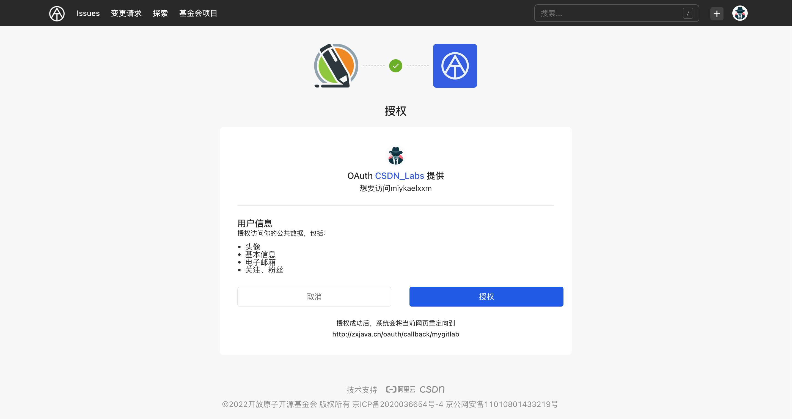

## 授权 OAuth 应用

当你在使用其他用户创建的 OAuth 应用时，你会被要求进行 OAuth 应用的授权操作，在授权完成后，该应用可以通过 API 获取你的 AtomGit 账号信息。

1. 登录 AtomGit
1. 访问 OAuth 应用，并点击授权链接
1. 跳转到 AtomGit 授权中间页
1. 确认应用所需的授权信息，并单击【授权】按钮
1. 跳转至 OAuth 应用授权成功回调页面，并正常使用 OAuth 应用提供的相关服务

