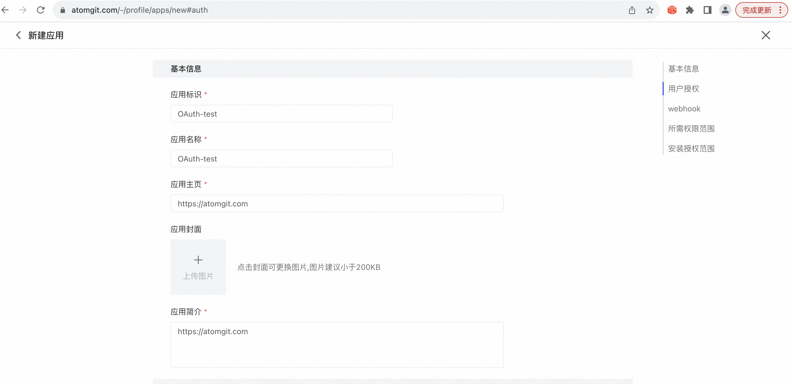
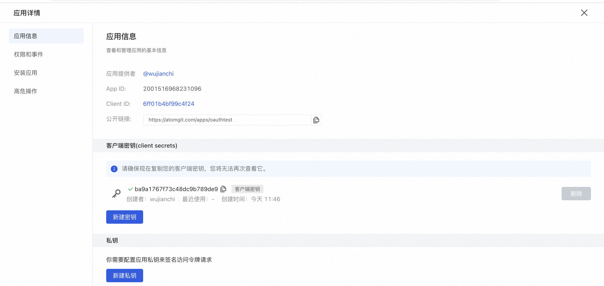

## 创建 OAuth 应用

1. 登录 AtomGit
1. 点击右上角的头像，然后选择**个人设置**
1. 在用户设置菜单上，选择**应用开发**
1. 设置 OAuth 应用的相关信息
    - 应用标识
    - 应用名称
    - 应用 Logo
    - 应用主页
    - 应用简介
    - 用户授权中的授权回调 URL ，用户成功授权后，重定向的地址
    - 所需权限范围中选择OAuth应用所需权限，正常OAuth登录场景可选用户相关权限
1. 单击【新建应用】按钮

创建完成后，可在应用详情->应用信息中查看应用程序 ID（Client ID） 以及点击新建客户端密钥获取应用程序密钥（Secret ID）

请妥善保管你的**【应用程序秘钥】**，该秘钥仅在创建成功后显示一次，离开当前页面后，将不再展示

