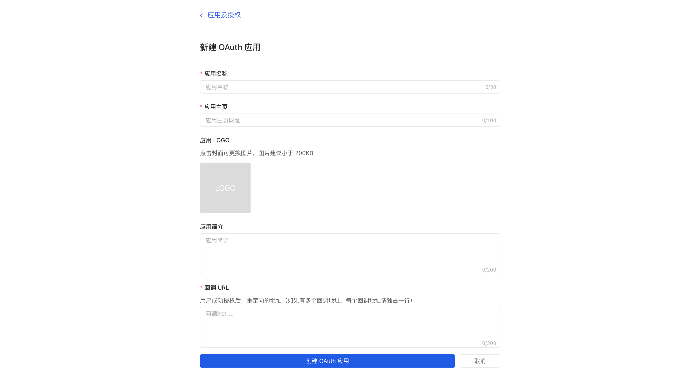
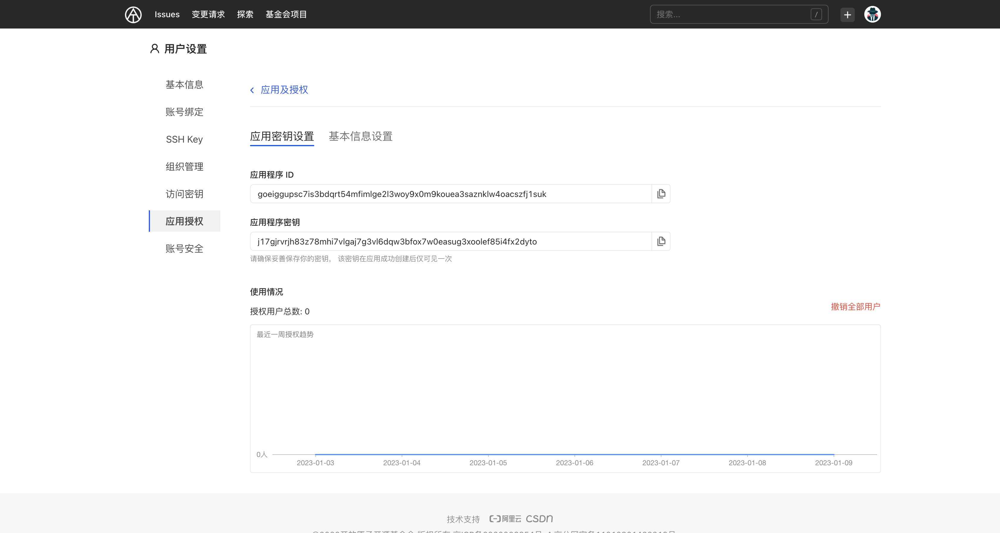

## 创建 OAuth 应用

1. 登录 AtomGit
1. 点击右上角的头像，然后选择**个人设置**
1. 在用户设置菜单上，选择**应用授权**
1. 设置 OAuth 应用的相关信息
    - 应用名称
    - 应用主页
    - 应用 Logo
    - 应用简介
    - 回调 URL ，用户成功授权后，重定向的地址
1. 单击【创建 OAuth 应用】按钮

创建完成后，系统将会返回该 OAuth 应用的应用程序 ID（Client ID） 以及应用程序秘钥（Secret ID）

请妥善保管你的**【应用程序秘钥】**，该秘钥仅在创建成功后显示一次，离开当前页面后，将不再展示

