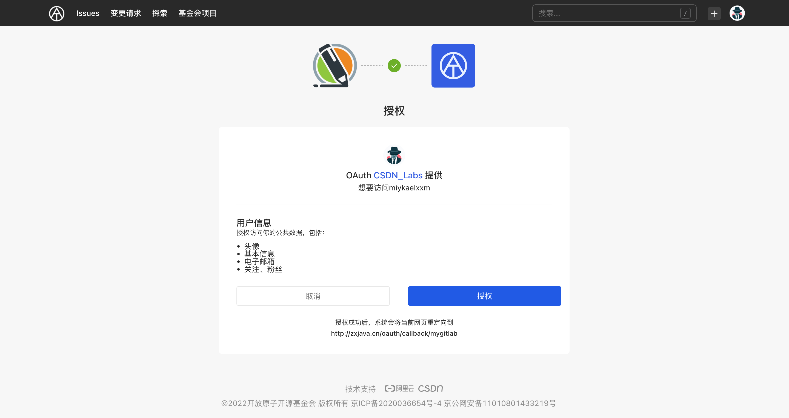
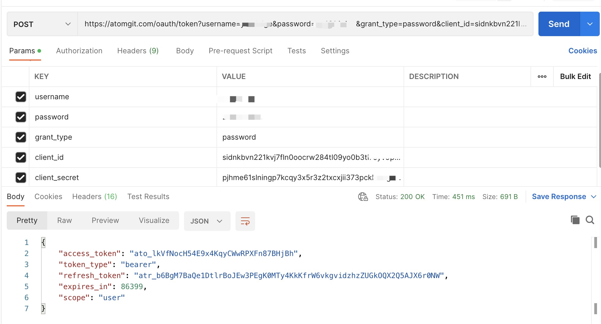

## OAuth2 获取AccessToken

### 1. 授权码模式

A. 应用通过 浏览器 或 Webview 将用户引导到AtomGit三方认证页面上（ **GET请求** ）

```
https://atomgit.com/oauth/authorize?client_id={client_id}&redirect_uri={redirect_uri}&response_type=code
```

B. 用户对应用进行授权（注：如果用户未登录，则会先跳转到登录页，登录完成后跳转到授权页面）
 
注意: 如果之前已经授权过的需要跳过授权页面，需要在上面第一步的 URL 加上 scope 参数，且 scope 的值需要和用户上次授权的勾选的一致。如用户在上次授权了read:user。则步骤A 中 GET 请求应为：

```
https://atomgit.com/oauth/authorize?client_id={client_id}&redirect_uri={redirect_uri}&response_type=code&scope=read:user
```

C. AtomGit认证服务器通过回调地址{redirect_uri}将 用户授权码 传递给 应用服务器 或者直接在 Webview 中跳转到携带 用户授权码的回调地址上，Webview 直接获取code即可（{redirect_uri}?code=abc&state=xyz)

D. 应用服务器 或 Webview 使用 access_token API 向 AtomGit认证服务器发送post请求传入 用户授权码 以及 回调地址（ **POST请求** ）**注：请求过程建议将 client_secret 放在 Body 中传值，以保证数据安全。**

```
https://atomgit.com/oauth/token?grant_type=authorization_code&code={code}&client_id={client_id}&redirect_uri={redirect_uri}&client_secret={client_secret}
```

E. AtomGit认证服务器返回 access_token,应用通过 access_token 访问 Open API 使用用户数据。

F. 当 access_token 过期后（有效期为一天），你可以通过以下 refresh_token 方式重新获取 access_token（ **POST请求** ）
```
https://atomgit.com/oauth/token?grant_type=refresh_token&refresh_token={refresh_token}&client_id={client_id}&client_secret={client_secret}
```


### 2. 密码模式

A. 用户向客户端提供邮箱地址和密码。客户端将邮箱地址和密码发给AtomGit认证服务器，并向AtomGit认证服务器请求令牌。（ **POST请求。Content-Type: application/x-www-form-urlencoded** ）

```
curl -X POST --data-urlencode "grant_type=password" --data-urlencode "username={email}" --data-urlencode "password={password}" --data-urlencode "client_id={client_id}" --data-urlencode "client_secret={client_secret}" --data-urlencode "scope=projects read:user issues notes" https://atomgit.com/oauth/token
```

scope表示权限范围，有以下选项，请求时使用空格隔开

```
user repo admin:repo_issues admin:org delete_repo admin:ssh_signing_key project admin:repo_hook workflow
```

B. AtomGit认证服务器返回 access_token

>  通过OAuth获取的accessToken以'ato'前缀开头,有效期为一天,refreshToken以'atr'前缀开头，有效期为七天。

C.应用通过 access_token 访问 Open API 的[用户信息](/openAPI/api_versioned/get-the-authenticated-user)接口，获取用户数据。


