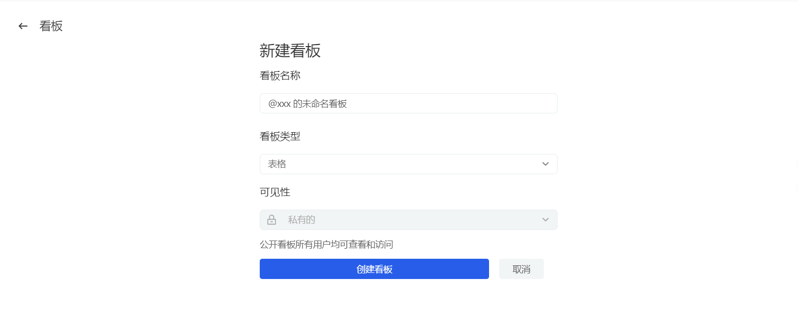
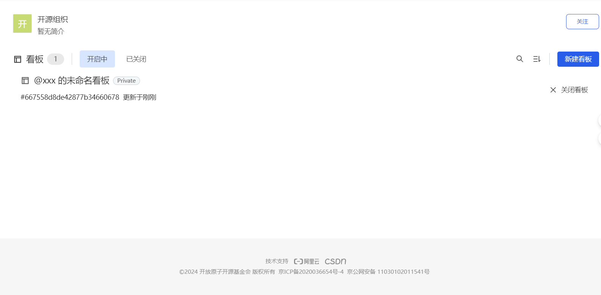

## 看板
看板是 AtomGit 提供的项目管理工具，可以帮助组织和团队更好地组织、跟踪和协作项目的进度。

### 组织工作流程
看板提供了一个集中式工作区，可以根据需要创建多个视图，每个视图都包含多个列，代表项目的不同阶段或类别。通过拖放问题和拉取请求，你可以轻松地将它们从一个列移动到另一个列，从而跟踪它们的状态并促进协作。

### 表视图功能
看板提供了表视图功能，你可以根据需要筛选、分组、排序和自定义显示视图的内容。通过筛选、分组、排序和分列等功能，你可以根据各种条件快速找到看板中的任务，并自定义显示哪些字段和属性。

### 自定义字段
看板支持自定义字段，你可以根据项目的需求添加自定义字段，例如优先级、截止日期等，以便更好地组织和管理项目的任务。

### 新建看板
1. 进入组织页面后，单击左侧的【看板】菜单，进入看板列表页面
2. 点击新建看板按钮，输入看板名称，选择看板类型，点击创建看板
   

### 看板列表
创建看板后用户,看板页显示所有的看板列表，可通过搜索、排序、关闭功能对看板进行管理

进入组织页面后，单击左侧的【看板】菜单，进入看板列表页面,
1. 点击看板名称，进入看板详情页面
2. 点击【管理看板】按钮，进入管理看板页面
3. 点击【添加问题】按钮，选择问题类型，输入问题标题，点击添加问题
4. 点击【添加看板】按钮，选择看板类型，输入看板名称，点击添加看板
5. 点击【删除看板】按钮，删除看板

### 添加 Issue 到看板
1. 进入组织页面后，单击左侧的【看板】菜单，进入看板列表页面
2. 点击看板名称，进入看板详情页面
3. 点击 【从代码库添加任务】按钮，选择代码库，勾选 issue，点击添加已选择的任务

### 看板设置
点击看板名称，进入看板详情页面，点击【看板设置】按钮，进入看板设置修改看板进信息。
- 可以配置看板名称、看板简介
- 可以关闭、删除看板
- 可以添加看板自定义字段