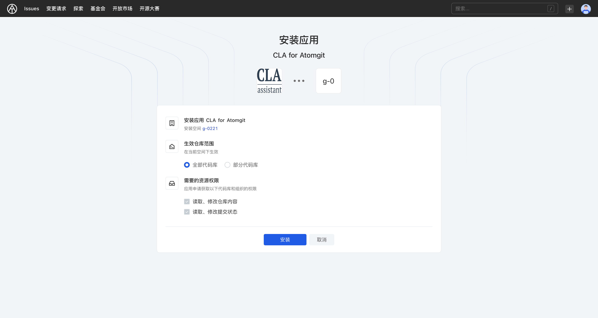
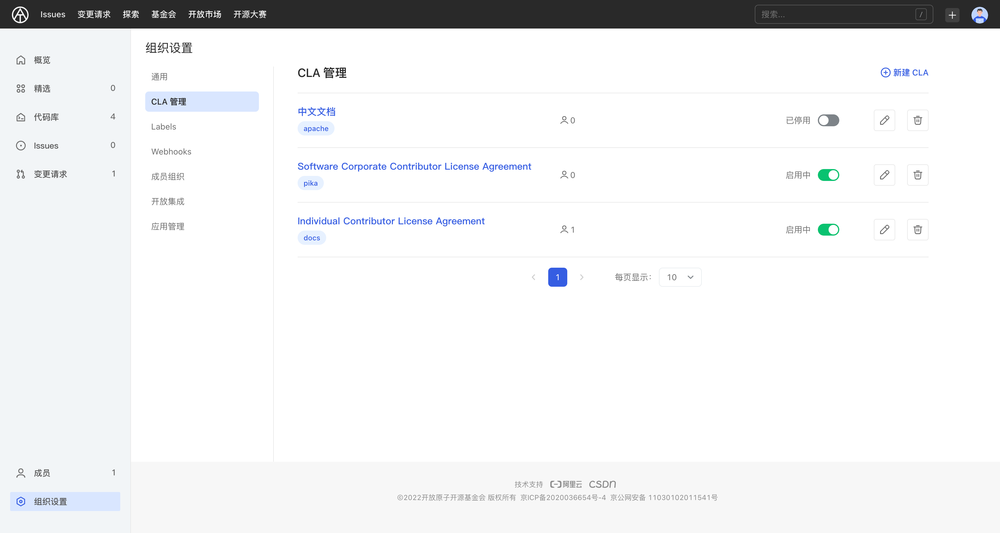
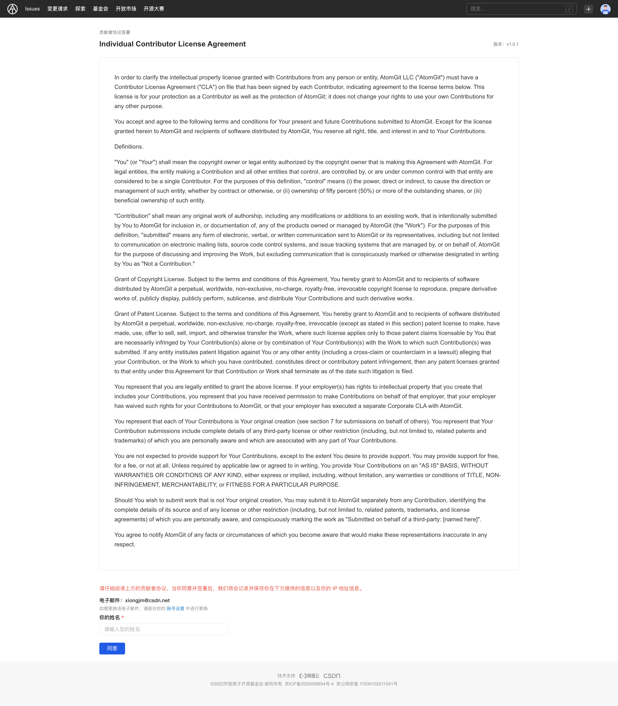
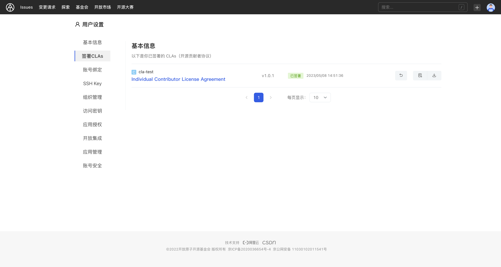

## 贡献者许可协议

AtomGit CLA 应用允许你在你的组织中启用开发者许可协议签署的功能，当启用该应用后，外部开发者尝试向组织的代码库提交变更请求时，CLA 应用将会检查该用户是否已经签署过 CLA 协议，并通过 `CLA-bot` 在将签署信息更新在合并请求的讨论中，或是指引外部贡献者去查看并签署贡献者协议。

### 什么是贡献者许可协议(CLA)？

CLA 是贡献者许可协议(Contributor License Agreement)的缩写。它是许多开源项目要求贡献者签署的一份法律文件，其目的是让项目拥有对贡献内容(如代码和文档)的知识产权，以便项目可以自由地使用、修改和再分发贡献内容。

具体来说:

- 确保项目拥有使用和修改贡献内容的权利，永久免费使用、修改和再分发贡献内容
- 将贡献内容合并到项目中而不会产生法律纠纷，比如避免贡献内容的知识产权问题
- 降低法律纠纷的风险，比如允许对贡献内容重新许可，如更改许可证版本

通过贡献者许可协议，将有效提高对开源项目的治理效率。

## CLA 功能

AtomGit CLA 应用支持的功能包括：

- 自动检查每个变更请求和 commit
- 每次推送都会重新检查变更请求
- 已签署、批准的贡献者列表可以通过 UI 界面进行维护
- 可以通过评论触发变更请求的重新检查

### 安装 CLA

当进入你创建好的组织页面后，单击左下角的【组织设置】按钮，并打开【CLA 管理】页面，默认没有安装 CLA 应用，需要自行前往【开放市场】安装 `AtomGit CLA` 应用。

1. 选择要安装的该应用的空间，并点击【选择】按钮
2. 选择【生效仓库范围】，建议选择【全部代码库】
3. 点击【安装】按钮，完成应用安装后，将会跳转至【组织设置-应用管理】界面

### 添加 CLA

当 CLA 应用安装后，你就可以在 CLA 管理界面中添加 CLA 协议内容了，添加步骤如下：

1. 单击【新建CLA】按钮
2. 输入协议名称
3. 设置协议版本，如果勾选了重新签署，则已经签署旧版本的协议将会失效，用户在提交变更请求后将会收到版本更新的提示
4. 设置 CLA 启用的代码库范围，需要注意的是一个代码库只能关联一个 CLA 协议
5. 设置 CLA 协议的内容
6. 单击【新建】按钮，这样我们就添加了一个新的 CLA 协议

### 签署 CLA

当你尝试向某个已启用 CLA 协议的代码库提交变更请求进行代码贡献时，`CLA-bot`将会提示你去签署相应的贡献者许可协议，在签署协议界面，你将看到以下信息：

- 协议名称
- 协议版本
- 协议内容

同时，你需要提供并确认你的邮箱、个人信息以完成 CLA 的签署过程：

- 你的邮箱信息，可以在【个人设置-账号绑定】中进行更换
- 你的姓名

当你签署完成后，你可以在【个人设置-签署CLAs】页面中查看并管理你已经签署的 CLA 协议内容

