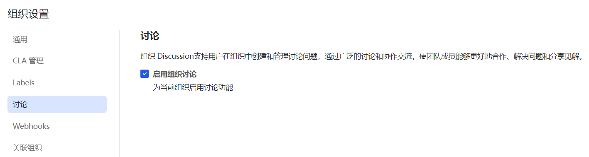
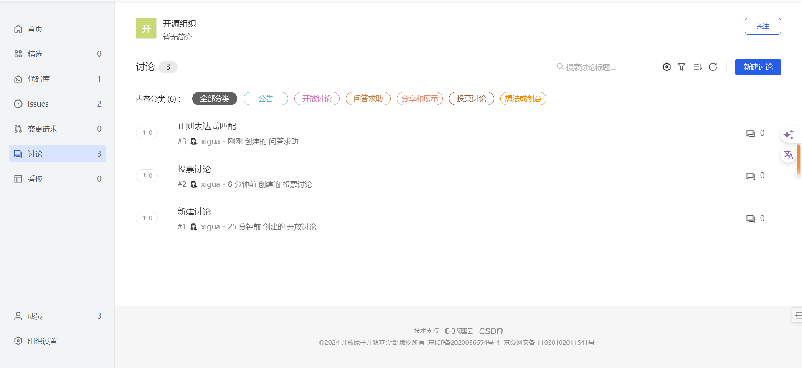
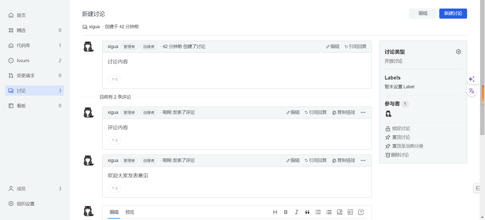
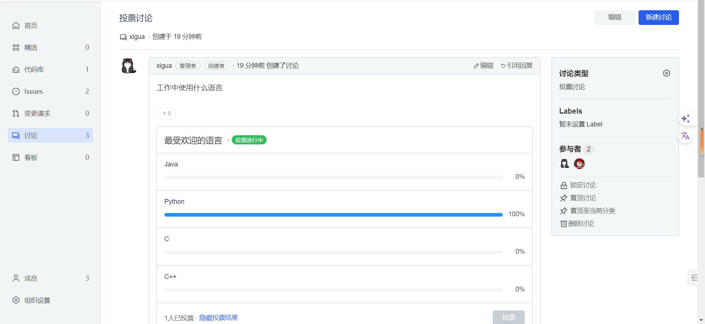
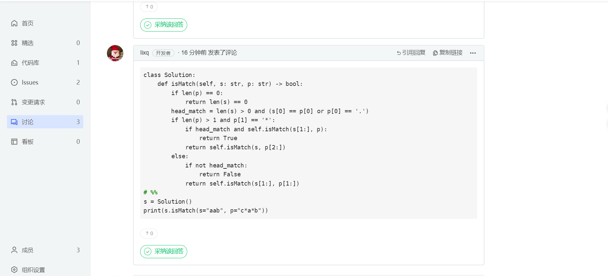
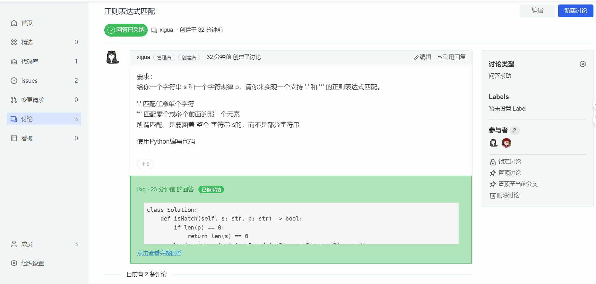

## 讨论

AtomGit 平台的讨论功能，可为开源使用者和开发者提供一个交流、讨论技术问题的平台。该功能将帮助用户解决开发过程中遇到的问题，促进技术交流和知识分享。

### 开启讨论
进入组织页面后，单击左下角的【组织设置】按钮，进入组织设置页面，点击讨论，勾选【启用组织讨论】，即可开启讨论功能。

### 讨论列表
进入组织页面后，单击左侧的【讨论】按钮，进入讨论列表页面，该页面展示了组织内所有讨论的列表，包括讨论的标题、创建者、创建时间、讨论类型、评论个数。

### 创建讨论
1. 单击左侧的【讨论】按钮，进入讨论列表页面
2. 单击【新建讨论】按钮，选择讨论类型
3. 输入讨论标题和内容，点击新建讨论

### 讨论详情
进入讨论列表页面后，单击讨论的讨论标题，即可进入投票讨论详情页面，该页面展示了讨论的标题、创建时间、创建者、讨论内容、评论内容、等信息。

### 投票讨论详情
进入讨论列表页面后，单击类型为讨论类型的讨论标题，即可进入投票投票讨论详情页面，该页面除展示了讨论的标题、创建时间、创建者、评论内容等信息，讨论内容还显示投票的选项和投票的结果。

### 问答求助讨论详情
问答求助讨论的评论有【采纳该回答】按钮，点击该按钮，即可采纳该回答。

采纳回答后讨论标题下会显示 【回答已采纳】标识，内容会增加显示采纳的部分内容，可点击定位到采纳的回答。

### 发表评论
进入讨论详情页面后，单击【发表评论】按钮，即可发表评论。

### 锁定讨论

当讨论被锁定后，将只允许组织成员进行讨论，非组织成员将无法提交评论

### 置顶讨论

当讨论被置顶后，该讨论将显示在讨论列表的顶部

### 删除讨论

当讨论被删除后，将无法再查看该讨论

