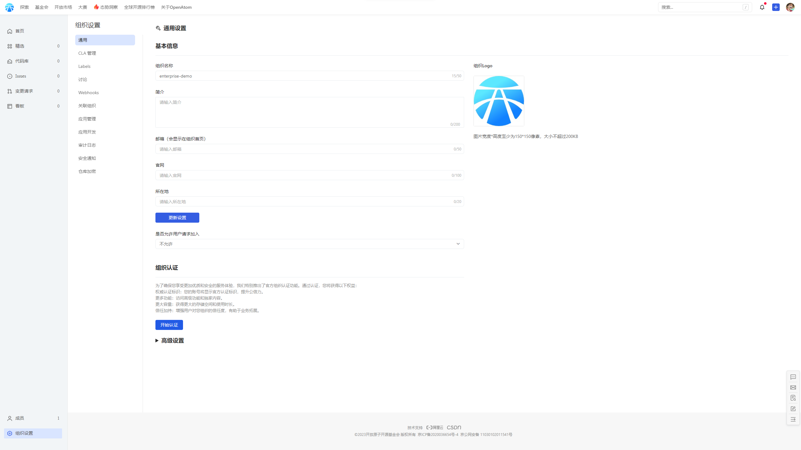
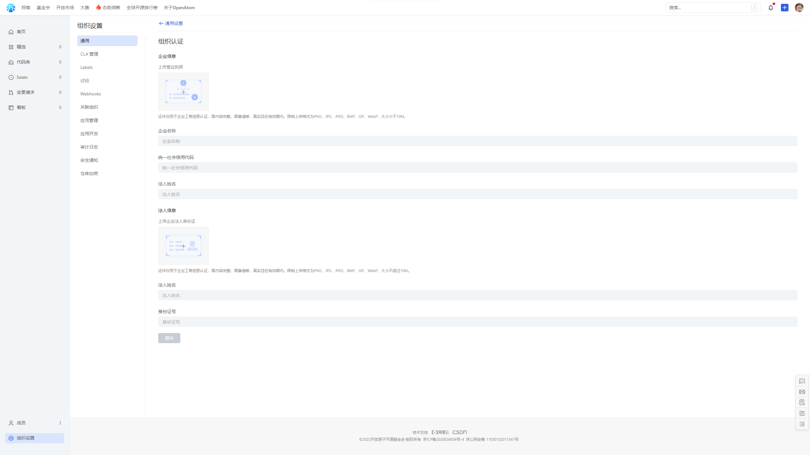
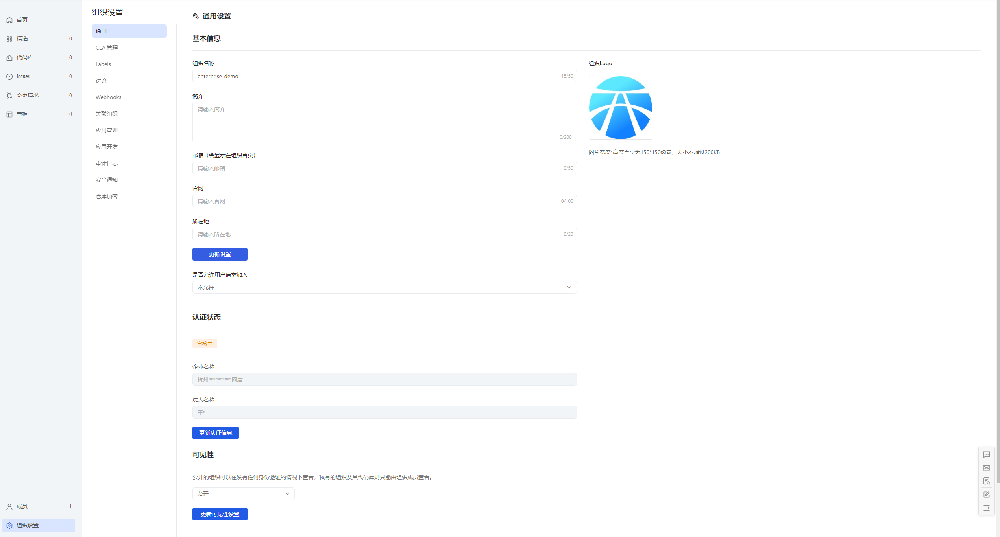
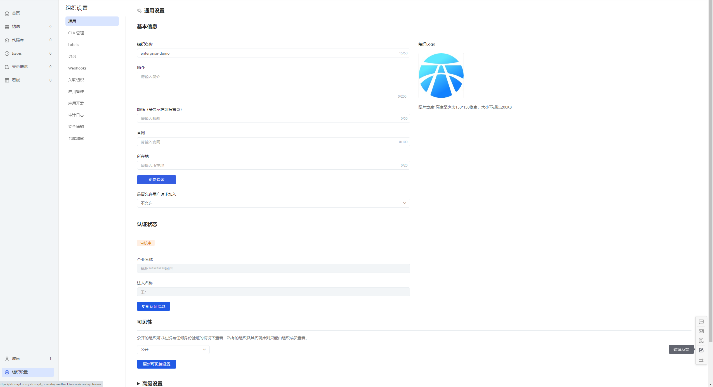

## 企业认证

为了保证用户享受更加优质、安全的服务体验，特此推出官方组织认证功能。AtomGit 创建的组织可以认证为企业，从而享受以下权益：

- **权威认证标识：** 组织会显示官方认证标识，提升公信力；
- **更多功能：** 访问高级功能和独家内容；
- **更大容量：** 获得更大的存储空间和使用时长；
- **信任加持：** 增强用户对您组织的信任度，有助于业务拓展。

### 认证流程

1. 请确保您已拥有有效的 AtomGit 账号并有需要认证的组织。
2. 进入需要认证的组织内，点击组织设置。

3. 在通用设置页面，点击**开始认证**。
4. 先上传**营业执照**照片，支持PNG、JPG、JPEG、BMP、GIF、WebP格式。

5. 再上传**法人身份证**照片，支持PNG、JPG、JPEG、BMP、GIF、WebP格式。
6. 请核**对企业名称**、**统一社会信用代码**、**法人姓名**、**法人身份证号**信息是否正确，然后提交认证申请。
7. AtomGit审核团队将对您的认证申请进行审核，如果通过，将发送认证通过的邮件、 AtomGit 站内信以及短信通知。

### 说明

1、申请后可在组织通用设置页面查看认证状态。

2、如果发现认证信息有误、或者认证失败想重新提交，可在通用设置页点击**更新认证信息**按钮，更新资料。

3、使用过程有任何问题，可点击建议反馈联系我们。

