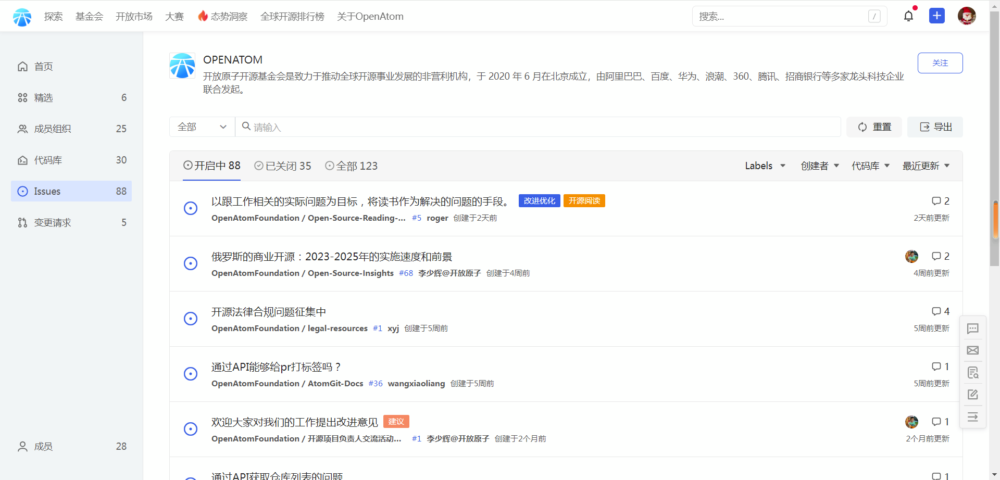

## Issues
组织 Issues 显示了组织内所有仓库的 Issue 列表。通常你能够看到以下信息：

1. **Issue 的标题** ，用于描述这个 Issue 主要讨论的内容是什么
1. **Issue 的状态**，Issue 的状态分为`开启中`、`已关闭`和`全部`三种
2. **Issue 所在代码库**
3. **Issue 创建时间**
4. **Issue 的创建者**
5. **Issue 分配的负责人**
6. **Issue 中讨论的评论数量**
7. **Issue 最近更新时间**

