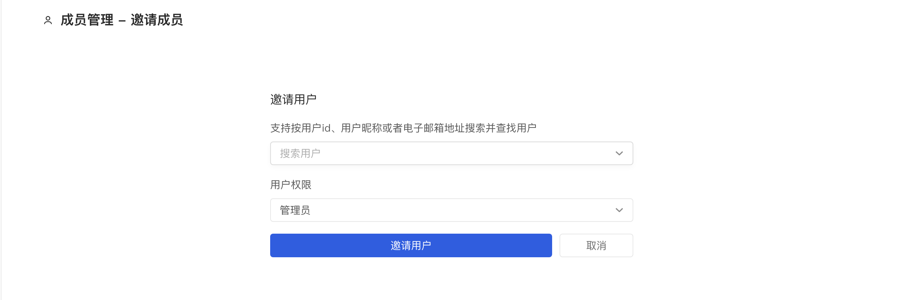

## 邀请用户加入组织

当你的组织创建好之后，你就可以邀请你的协作者加入你的组织了。

### 邀请用户加入组织

当进入你创建好的组织页面后，单击左下角的【组织成员】按钮，跳转至成员列表页面，在这里你可以通过单击蓝色的【邀请成员】按钮邀请用户：

1. 通过用户名搜索你要添加的成员，如果没有账号的话，请先让协作者去注册一个 AtomGit 账号
2. 设置该成员的角色权限，包括`浏览者`、`开发者` 和 `管理员` 等三种角色，不同角色的权限差异请参考 [05 - 组织 / 组织管理](settings)部分
3. 单击下方蓝色的 【邀请用户】 按钮

当提交邀请申请成功后，系统将向被邀请用户发送一封【XX用户邀请你加入XXX组织】的电子邮件，被邀请用户可以通过邮件中的【查看邀请】链接查看你的邀请信息，被邀请用户可以：

- **接受邀请** ， 接受邀请后，被邀请用户将以你邀请时设置的身份加入组织，成为组织的一员，同时你也将收到该用户同意邀请并加入团队的邮件通知
- **拒绝邀请** ， 被邀请用户拒绝加入你的团队，同时你也将收到系统提示该用户拒绝加入组织邀请的邮件通知

> 注：邀请链接的有效期为 7 天，在邀请用户加入团队后，你可以联系用户查看系统发送的邀请通知邮件