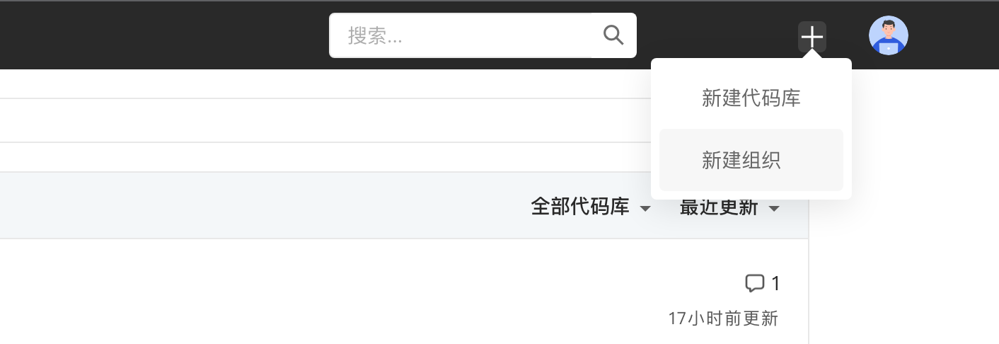
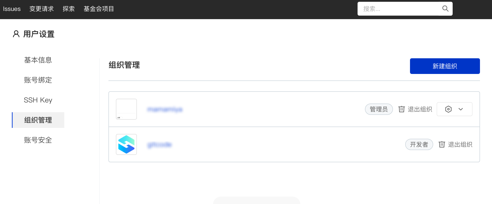
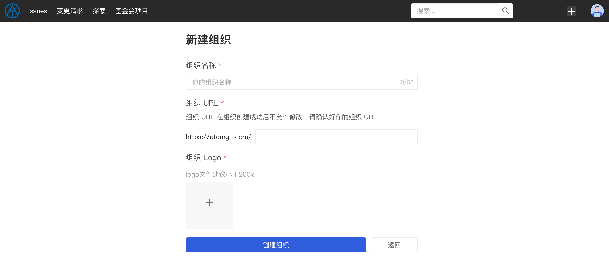
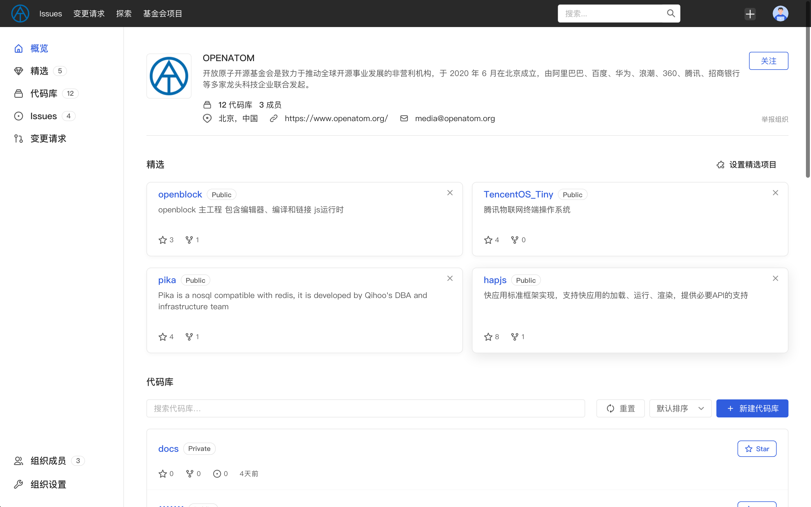

## 组织

AtomGit 为用户提供了更便于协作的【组织】功能，通过组织你可以：

- 将相关的代码库都存放在同一个组织中
- 通过邀请协作者加入组织，一次性授予访问组织下全部代码库的权限

你可以通过顶部导航【我 - 我的组织】来查看和管理你所加入的组织。

### 新建组织

你可以通过单击顶部导航中的 `+` 号并选择**新建组织** 来创建组织，你也可以通过【 我 - 我的组织】进入到组织管理页面，然后单击蓝色的 `新建组织` 按钮创建一个新的组织：

> 注：每个用户最多可以创建 5 个组织（即当你作为 `管理员` 加入的组织达到 5 个之后，你将无法再创建新的组织）

你需要在新建组织页面添加以下信息：

1. **组织名称** ，你的组织名称，该名称只能包含字母数字字符、中文、下划线、连接符-和点、空格等字符，字符长度不超过 50 字符
2. **组织 URL** ，你新建组织的 URL，创建成功后，用户可以通过该 URL 访问你的组织，创建成功后将无法修改，请再提交前确认好你的组织 URL
3. **组织 Logo** ， 为了方便其他用户更好的辨别你的组织，我们建议你上传你的组织 Logo，建议是正方形且大小不超过 200 Kb

单击下方蓝色的【创建组织】按钮，组织创建成功后将跳转至组织首页。你可以在组织设置中继续完善组织相关的信息，包括：

1. 组织简介
2. 联系邮箱
3. 组织官网
4. 组织所在地

### 组织信息

在**组织**页面，将展示以下信息：

- 组织的基本信息，包括：组织 Logo、组织名称、组织简介（如果有填写）、所在地信息（如果有填写）、联系邮箱（如果有填写）、组织官网（如果有填写）
- 组织的基本统计信息，包括：组织代码库数量、组织成员数量
- 组织的精选项目（如果有设置）及精选项目列表，如果你是组织`管理员`的话，你还可以设置精选项目及其排序
- 组织的代码库列表，如果你是组织成员的话，你将能够看到组织的私密代码库（如果有）
- 组织的成员列表，如果你是组织`管理员`的话，你还可以在组织成员列表中调整成员权限或移除成员
- 组织设置，如果你是组织`管理员`的话，将允许你对组织进行设置，包括组织基本信息的设置和删除组织操作（删除组织将无法找回，删除需谨慎）

#### 关注组织

除了浏览组织信息、查看组织代码库和组织成员外，你还可以关注组织，已关注的组织和用户将会出现在你个人主页的关注页面中。
