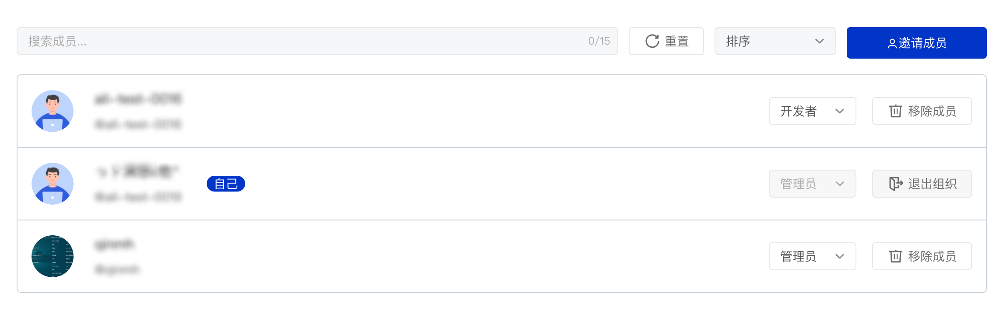

## 组织管理

在组织中，不同角色可以进行的操作不一样，组织的角色分为以下 3 类：

- 管理员：可以读取、克隆、推送到组织中的代码库，可以新建组织代码库，可以添加组织成员权限，可以设置组织基本信息，可以删除组织
- 开发者：可以读取、克隆、推送到组织中的代码库，可以退出组织
- 浏览者：可以读取、克隆组织中的代码库，可以退出组织

> 注：不同角色对代码库的权限请参考 [02 - 代码库权限 / 权限说明](../permission) 部分

### 组织成员及其权限

不同角色及其权限如下：

| 权限 | 浏览者 | 开发者 | 管理员 | 备注 | 
| -- | -- | -- | -- | -- |
| 查看组织 | ✓ | ✓	| ✓	| 私密组织非组织成员不可查看 |
| 组织基本信息设置 | | | ✓	| 包括组织基本信息、logo等设置 |
| 组织可见性设置 | | | ✓	| 更改组织可见性，私密组织/公开组织 |
| 删除组织	| | | ✓	| |	
| 设置组织精选项目 | | | ✓ | |
| 移除组织精选项目 | | | ✓ | |
| 组织精选项目排序 | | | ✓ | |
| 新建组织代码库 | | | ✓ | |
| 浏览组织成员 | ✓ | ✓ | ✓ | |
| 退出组织 | ✓ | ✓ | ✓ | |
| 邀请组织成员 | | | ✓ | |
| 移除组织成员 | | | ✓ | |
| 设置成员权限 | | | ✓ | |

### 删除组织

`管理员`可以删除组织，删除该组织同时会删除组织中所有的代码库，包括已归档代码库及其相关资源。

1. 进入组织页面
2. 单击【组织设置】进入组织设置页
3. 单击【高级设置】展开【删除组织】部分
4. 单击【删除组织】按钮
5. 按照提示输入确认信息，并提交【删除组织】

> 注：已删除的组织将无法恢复，在删除之前系统将会二次确认，请谨慎操作！

### 退出组织

用户也可以退出组织，退出组织的步骤为：

1. 进入组织页面
2. 单击【组织成员】进入组织成员列表页
3. 找到自己的用户信息，并单击右侧的【退出组织】按钮

> **注：以下情况将导致你无法退出团队**
> 1. 当你是团队中的唯一成员时，你将无法退出团队
> 1. 当你是团队中仅剩唯一的 `管理员` 时，你将无法退出团队