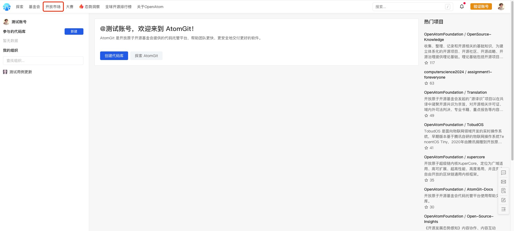
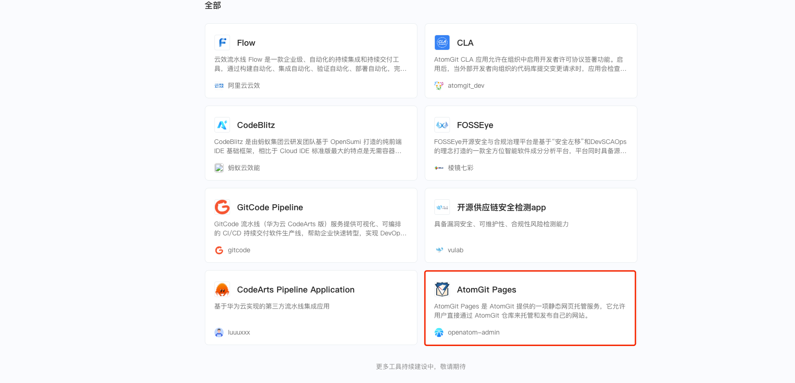
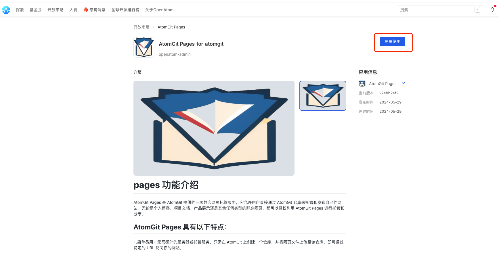
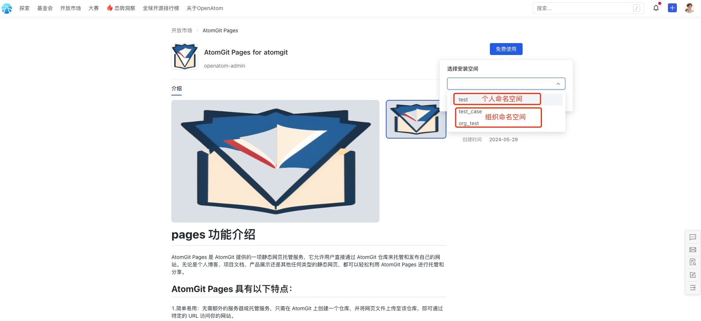
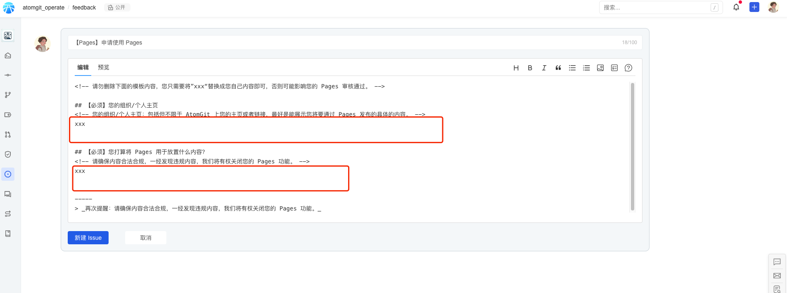
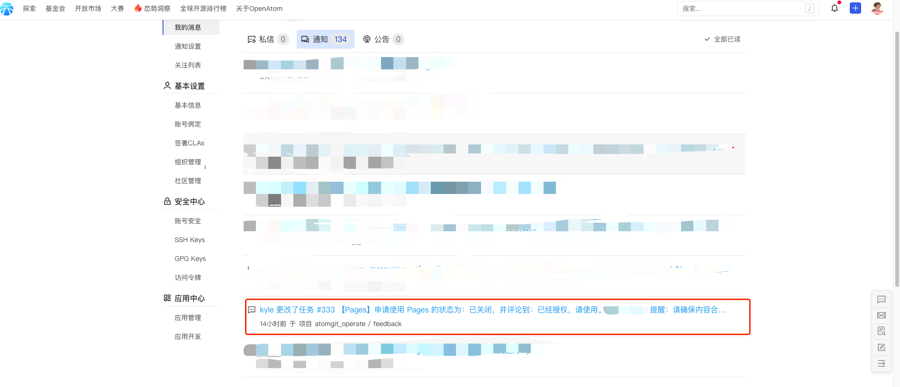
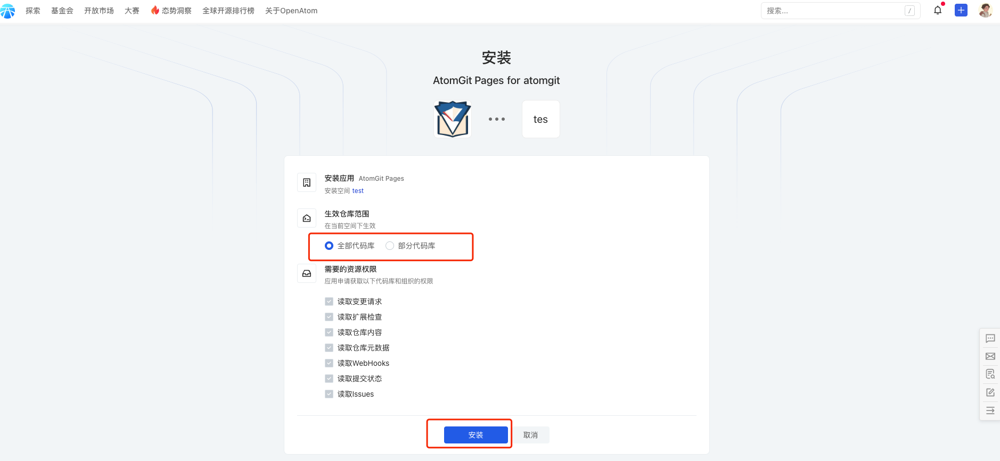
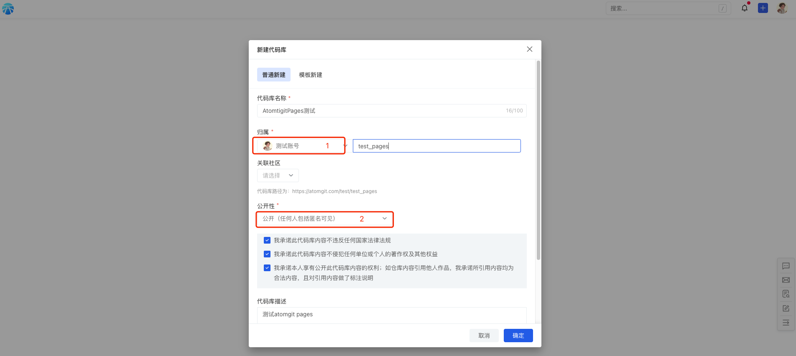
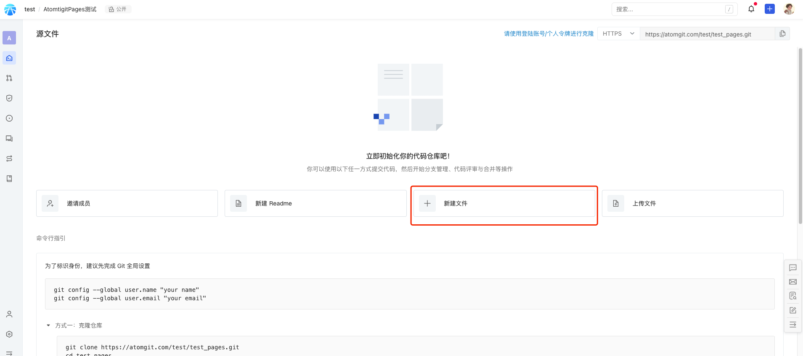
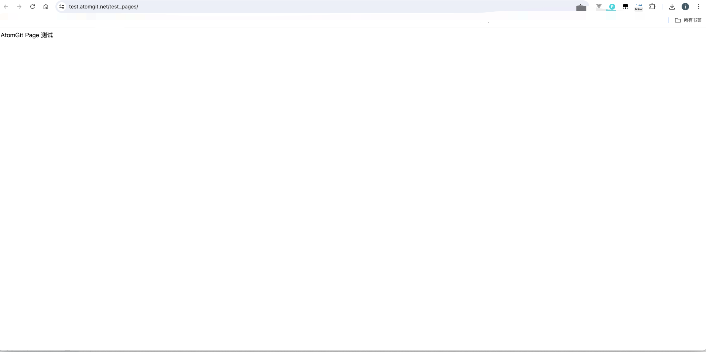

## AtomGit Pages

AtomGit Pages 是一个免费的静态网页托管服务，您可以使用 AtomGit Pages 托管博客、项目官网等静态网页。目前 AtomGit Pages 支持 Jekyll、Hugo、Hexo编译后的静态资源。

### 使用前须知
1. 需要使用AtomGit Pages的仓库必须为公开仓库。
2. 仓库必须有 index.html 才可以正常访问。
3. 静态网页的样式可以自己写，也可以拿一些静态模版来修改，Pages服务本身不提供任何形式的模版，但我们后续会陆续增加例子，供大家参考使用。
4. AtomGit Pages目前还不支持不带二级目录的pages。
5. AtomGit Pages仓库从公开仓库变为私有仓库，会删除pages服务已经部署过的静态页面以及相关仓库pages配置，后续需要使用，需要将仓库改为公开仓库，并重新配置pages部署的分支才能使用。

### 常见问题
1. 如何创建一个首页访问地址不带二级目录的 pages，如test.atomgit.net？

   答：AtomGit Pages目前还不支持不带二级目录的pages。

2. 当项目部署完成后存在一些资源访问404？

   答：当项目部署完成后存在一些资源访问404时，需要查看项目相关配置是否正确，如：https://atomgit.com/test/test_pages ，生成的pages url 为 https://test.atomgit.net/test_pages/ ，而访问的资源404，如 https://test.atomgit.net/style.css 。这是因为相应配置文件的相对路径存在问题导致的，生成的资源 url 应该为 https://test.atomgit.net/test_pages/style.css 才对。对于不同的静态资源生成器，配置如下：

   - Hugo 配置文件config.toml的baseURL修改如下:

     baseURL = "https://test.atomgit.net/test_pages"

   - Hexo 配置文件_config.yml的url和root修改如下：

     url: https://test.atomgit.net/test_pages 

     root: /test_pages

   - Jekyll 配置文件_config.yml的 baseurl修改如下：

     baseurl: "/test_pages" # the subpath of your site, e.g. /test_pages  

### AtomGit Pages搭建教程
1.首先点击主页的[开放市场](https://atomgit.com/marketplace)，跳转到应用市场如下：

2.找到Atomgit Pages的应用：

3.点击免费使用，

4.选择Aotmgit Pages应用要安装的命名空间

>注：如果选择个人命名空间，则个人命名空间下的仓库有使用Atomgit Pages的能力，如果选择组织命名空间，则选择的组织命名空间下有使用Atomgit Pages的能力。

5.此时会自动跳转到安装页面，需要按照issue模板填写申请信息：

>注：请按照模板如实填写您的申请信息，以便运营人员更加快速处理您的申请。

6.运营人员审核完毕以后，您会在站内信-通知中看到此条issue的动态，内容如下：

7.Aotmgit Pages应用安装的申请审核通过以后，重复上面步骤2-4，会跳转到应用安装页面，如下：

>注：生效范围如果选择为全部代码库，则此命名空间下所有代码库都有Atomgit Pages相关能力，如果选择为部分代码库，则只有选择的代码库有Atomgit Pages相关能力

8.Aotmgit Pages应用安装完毕以后，去对应的命名空间下创建pages仓库，如下：

>注：新建仓库时候注意截图中1处：命名空间为您在步骤7中选择安装的命名空间，注意截图中2处：仓库必须为公开的仓库，Atomgit Pages才能部署成功。

9.创建pages仓库完成以后，点击仓库主页的新建文件，如下：

>注：pages的首页文件名必须为：index.html

10.配置仓库需要部署的pages分支，如下：

>注：按照截图中的标注的1、2、3进行操作，至此，静态网页已经部署成功，点击4处的链接，访问提供的地址：https://test.atomgit.net/test_pages/ 即可查看自己的pages页面，如下：

#### Atomgit官方还提供详细的部署教程和demo，请点击[这里](https://openatom.atomgit.com/explore/journalism/detail/313608476846854144)