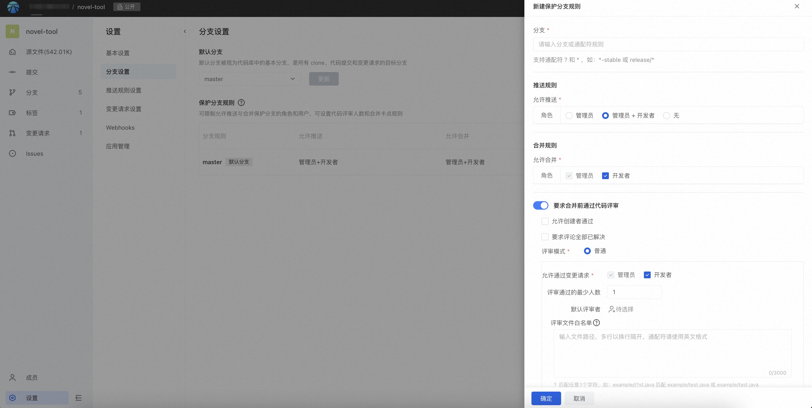

本文介绍代码库的分支设置功能说明。


#### 1.默认分支

默认分支作为 Clone、创建分支、合并请求、代码浏览的基础分支存在，同时可防护分支被误删除。作为代码库管理员可以按团队开发习惯修改默认分支，下拉选择需要修改的分支。

#### 2.保护分支

保护分支定义：限制删除分支，限制 Force Push 强制推送。

代码库管理员设置合适规则的分支进行保护，被设置成保护分支即不允许任何人删除分支和强制推送，前者主要是对重要分支保护防止误删除，后者是避免强制推送的操作会使 Commit 无法追溯。

#### 新建保护分支规则


分支选择：支持两种形态

- 填写具体分支完整名称
- 分支通配符规则（目前只支持 ? 和 *），当匹配多个分支时展示所有匹配的分支。

>如果一个保护分支存在多个规则，以哪个为主？
生效逻辑：如果代码库的某个分支可匹配多个保护分支规则，则包含特定分支名称的规则具有最高优先级；如果某个分支存在多个通配符规则匹配，则最早创建的分支规则将具有更高的优先级。

如：代码库中有分支master、master-1、master-prod-1，有规则顺序如下：master-*、master-1、master-prod-*，匹配规则如下：
|  分支   |  可匹配规则  |  使用的匹配规则  | 
|  ----  | ----  |  ----  |  
|  master-1   |  master-*，master-1  |  master-1  | 
|  master-2   |  master-*  |  master-*  | 
|  master-prod-1   |  master-* ，master-prod-*  | master-* | 


##### 推送规则
展示可以直接 Push 到该保护分支的角色或人员。
默认允许管理者和开发者。一旦勾选取消某种角色，意味着该角色不允许进行直接推送。

无：不允许任何人支持进行推送。

可以设置允许推送的人员：可在代码库的成员中进行选择，但生效的前提是该选择的用户有代码库的写入权限；

##### 合并规则
即允许点击变更请求中的合并操作的角色或人员。

默认允许管理者和开发者。一旦勾选取消某种角色，意味着该角色不允许进行合并操作。


##### 针对代码评审可以进行规则限制

允许创建者通过：是 / 否

代码评审的评论已经全部解决：是 / 否

普通评审模式，可设置评审通过的人数要求、允许通过的角色限制、默认评审人。例如：

>最少评审通过人数：1
允许通过合并请求：管理员 + 开发者
默认评审者：如果没填人，该项不展示，限制最多20位

###### 评审文件白名单
在规范的情况下，变更请求必须至少有一个评审人，但是有时候只是提交几个不敏感的文件，需要人工介入评审的必要性不大，希望能够针对这类文件直接支持合并，提高工作效率。

代码工程中大部分文件需要走评审卡点，小部分不重要的文件改动没必要每次都需要人工评审，但是为了保证合入的稳定性，合入过程通常需要走CI自动化检查后再合并，所以仍然不允许直接推送目标分支，而是要走评审流程。

这类需求可以使用评审文件白名单去解决。

当设置了评审文件白名单后，当评审涉及该文件时：
- 若变更请求仅包含该白名单内的文件——变更请求不受「评审通过最少人数」限制，但其他条件如评论要求全部解决仍然生效；

- 若变更请求部分包含该白名单内的文件——变更请求对应保护分支全部规则均生效；

###### 评审文件白名单书写规则
文件白名单使用以下规则匹配文件路径：
```
？匹配一个字符

* 匹配零个或多个字符

** 匹配路径中的零个或多个目录
```

示例如下：
```
# 匹配 atomgit/test.java ，同时也匹配 atomgit/tast.java 或 atomgit/txst.java；
atomgit/t?st.java

# 匹配 atomgit 目录下所有以 .java 结尾的文件； 
atomgit/*.java 

# 匹配 atomgit 目录下所有名为 test.java 的文件；
atomgit/**/test.java 

# 匹配 org/springframework目录下以 .java 结尾的文件；
org/springframework/**/*.java 

# 匹配 org/springframework/servlet/bla.java，同时也匹配 org/springframework/testing/servlet/bla.java 或 org/servlet/bla.java
org/**/servlet/bla.java 
```