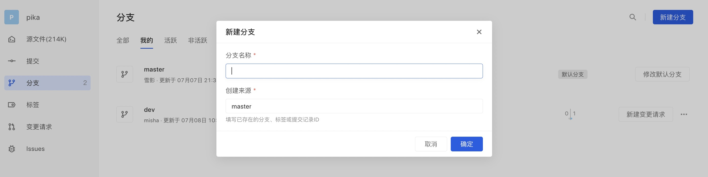
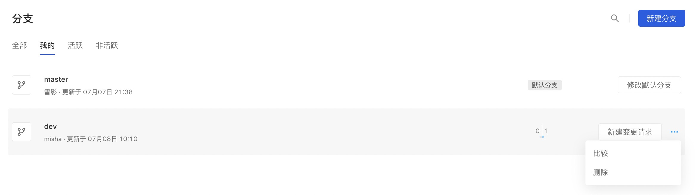
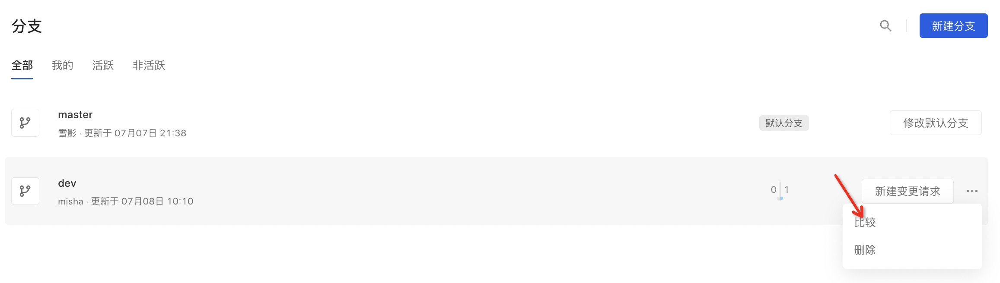
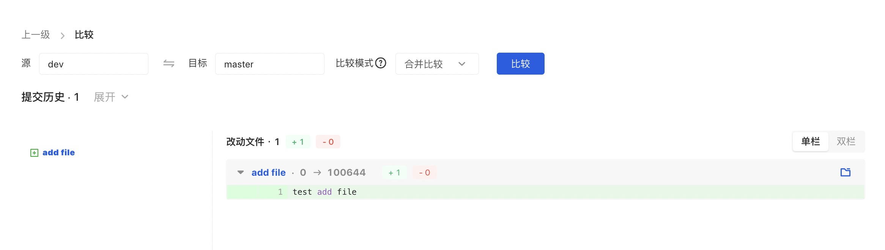

分支是为了将修改记录分叉备份保存，不受其他分支的影响，所以在同一个代码库里可以同时进行多个修改。创建仓库时，会自动创建 Master 分支作为默认分支，后续研发成员可以创建新的分支，开发完成后将其合并至默认分支。

AtomGit 的分支划分为三种：我的、活跃、非活跃

”我的“：我创建的 + 我更新的，便于用户进行分支管理。

活跃：近三个月有push的分支，便于用户进行分支的查看及开发。

非活跃：近三个月内无push的分支，便于用户进行分支及时清理。

#### 新建分支

新建分支支持两种方式：Web 端创建及本地创建。

1.Web 端创建

在分支列表中点击右上角的新建分支按钮，展现分支创建弹窗。

填写分支信息并确认后即可完成分支创建。

2.本地端创建

在 master 或其他分支下（本地分支），输入命令`git checkout -b slave`新建一个分支。输入命令`git push origin slave`把分支推送到远程仓库。

#### 删除分支

##### 普通分支
开发人员可在分支后点击更多展现删除入口，可点击删除分支。

##### 保护分支

不支持删除，需要取消保护后才可删除。

##### 默认分支

不支持删除，需取消默认后才可删除。

#### 分支比较
点击更多操作展现比较入口，展现比较弹层，可进行分支间的对比。

