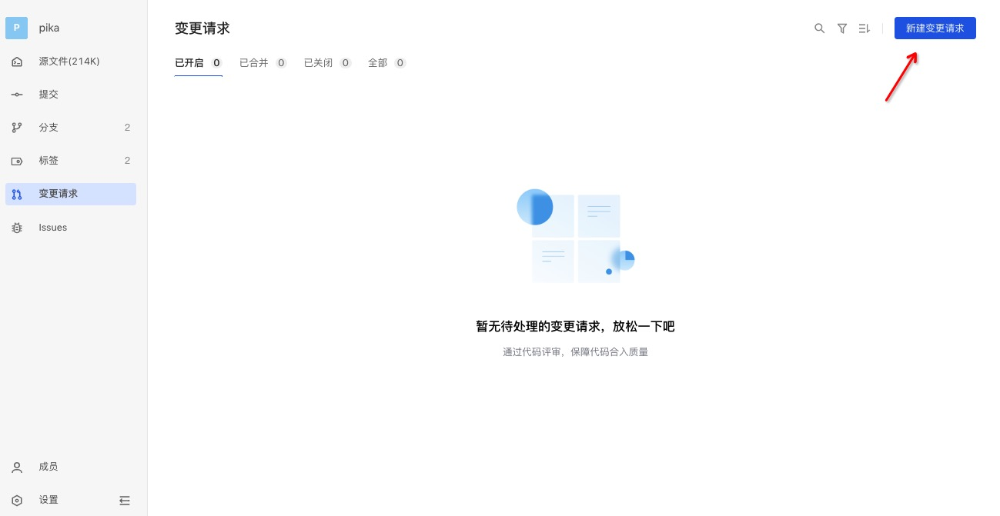
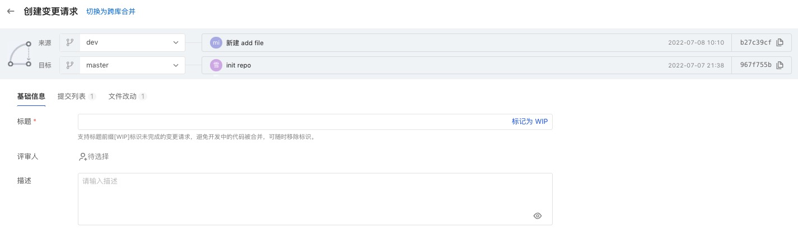
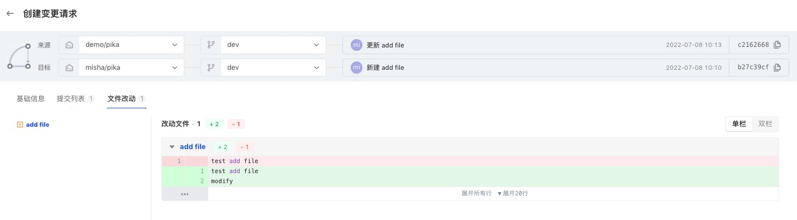
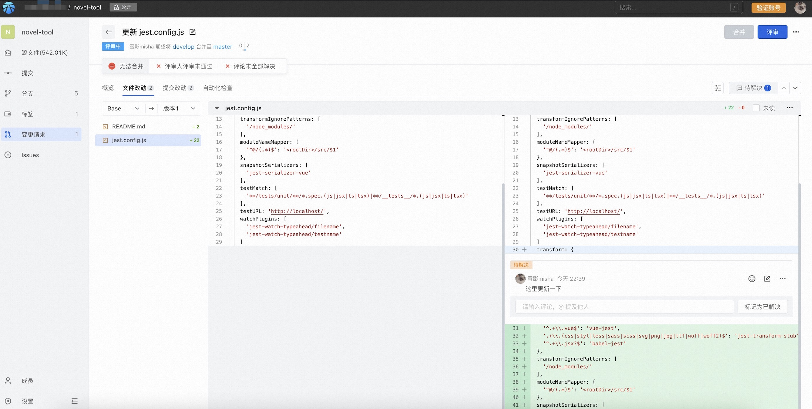
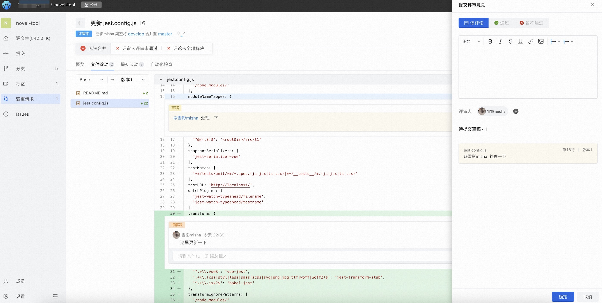
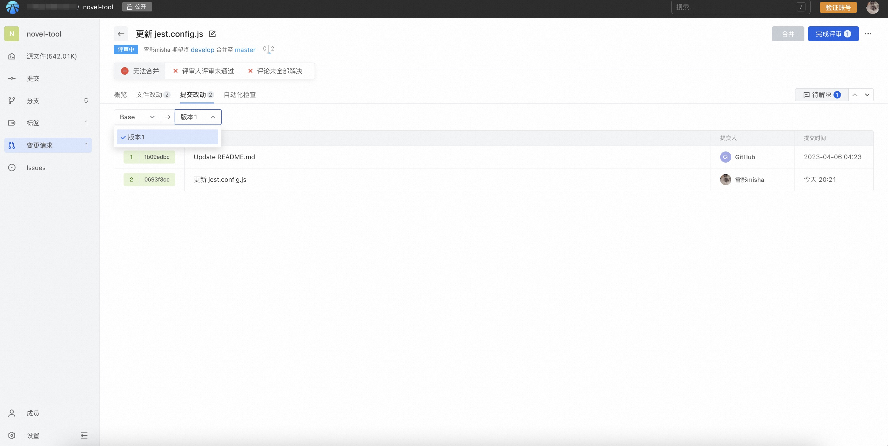
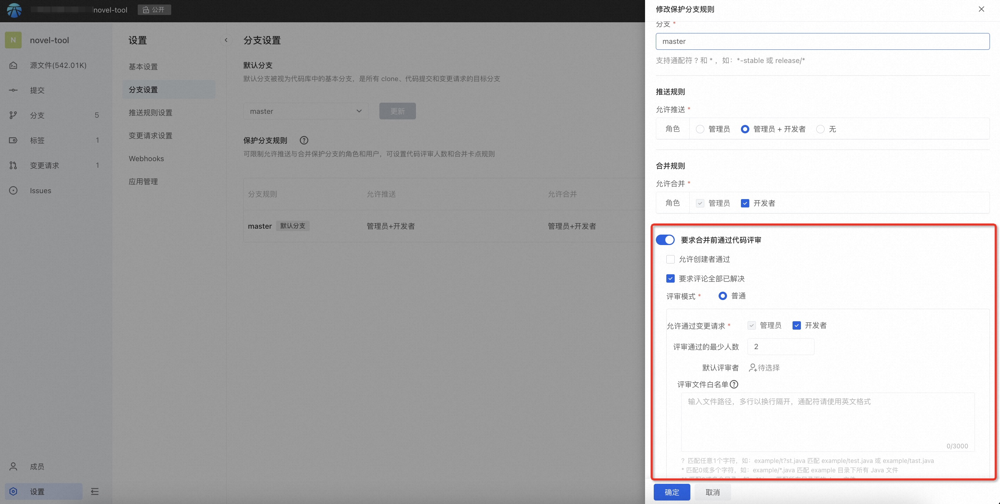
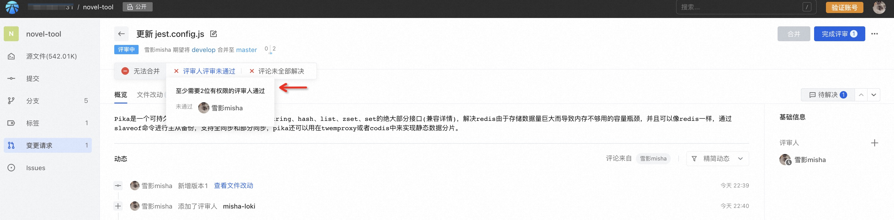
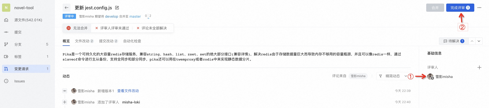
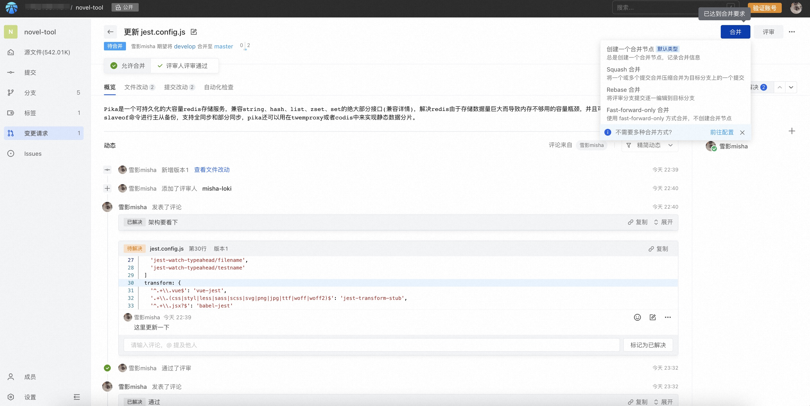

代码评审是提升编码质量，保障合入代码安全性的一个重要手段。同时，在共建协作场景中，通过发起一个变更请求，请求他人合并自己贡献的代码，也是非常常见的操作。
那么，如何在 AtomGit 中使用变更请求来贡献代码呢？

## 新建变更请求
进入代码库的变更请求列表页，点击新建变更请求。


若设置默认评审人（详见分支设置）则在评审人部分自动将默认评审人填写在评审人列表中。


申请变更，需要确定一个来源和目标。
- 在同库拉分支的开发模式下，在同一个仓库中，选择来源分支和目标分支；


- 在跨库 Fork 的开发模式下，对于根库和派生库，选择来源分支和目标分支；

对于有派生关系的库，可以通过顶部的「切换为跨库合并」展开选择库的入口。

当源和目标比较后存在差异时，可以创建变更请求。此时可以预览变更的提交列表和文件改动内容，确认无误后填写变更请求基础信息，完成创建。

> 支持标记 [WIP] 识别草稿状态的变更请求，此时不会通知评审人前来评审，也无法通过评审。直到删除标题上的 [WIP] 标识后正常可评审。

## 查看变更请求详情
创建完成后进入变更请求详情：
可见页面有4个菜单：
- 概览
- 文件改动
- 提交改动
- 自动化检查

#### （1）概览
包括变更请求相关的状态、描述等基础信息、评审人信息、时间线动态和事件记录，以及是否已达到合并状态的提示；


#### （2）文件改动
呈现代码文件的变更内容对比，支持按版本进行选择查看，以追溯代码变更历史过程。
点击文件名展开查看变更文件内容：

###### 评论
在查看代码时，可针对代码行进行评论：

评论支持两种模式：
- 立即发出：立即发布，有读权限的人均可见
- 草稿评论：将作为草稿，仅自己可见，评审结束后需要通过右上角「完成评审」按钮统一发出：


所有评论可以展开待解决事项面板统一查看，点击评论的蓝色链接，可以直接跳转到评论对应位置：


评论本身携带解决状态，创建后默认为未解决，由评审发起人处理完问题后通知评审人确认，确认无误后评审人可解决评论。
此外，库管理员可以对解决状态进行修改。

> 评论是否已解决可以作为变更请求是否能合并的卡点条件：管理员可以进入库设置，将保护分支设置评审的评论必须全部解决才能合并，设置后若还有评论未解决，则无法合并。


此外，还可设置代码查看视图：


###### 代码冲突解决
当合并的分支存在代码冲突时，系统会自动卡点，无法进行合并操作。平台提供了冲突解决的建议：
```
//步骤1 fetch并切换到源分支
git fetch origin
git checkout sourceBranch
//步骤2 合并目标分支
git merge origin/master 
//步骤3 解决冲突并push
```


#### （3）提交改动
呈现提交在各个版本的变化过程（即range-diff），可以基于此视图了解每次推送后提交的变化情况，如提交被删除、新增或者修改了提交本身的内容，如message、顺序等。


#### （4）自动化检查
可通过三方应用扩展的自动化检查结果视图。


## 评审人评审代码
评审人数的限制也可以在保护分支中进行设置，通过数量小于设定数目时则不允许合并。
* 库管理员进入代码库设置
* 选择分支设置-保护分支规则
* 按需选择适合自己的评审条件



设置完成后在向该保护分支合并的评审请求，都将遵守该合并条件，如不满足则不允许合并：


如需评审代码，需要将用户加入评审人，加入后对方则可以针对评审发表评审意见，包括评论、通过或者不通过该变更请求。


评审人可点击右上角完成评审，提交自己的评审意见：


## 合并评审
在所有合并前必须满足的条件都达标后，有合并权限的用户可进行合并操作。
合并人点击右上角「合并」按钮，即可选择合并方式完成合并。
合并默认支持四种方式，具体参见[变更请求设置](pr-config)，按需选择。
