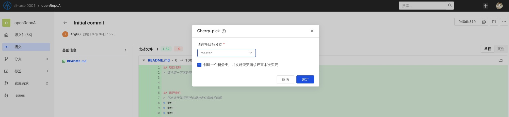
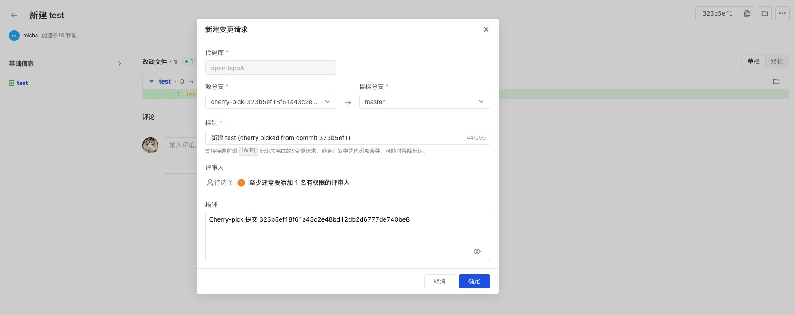
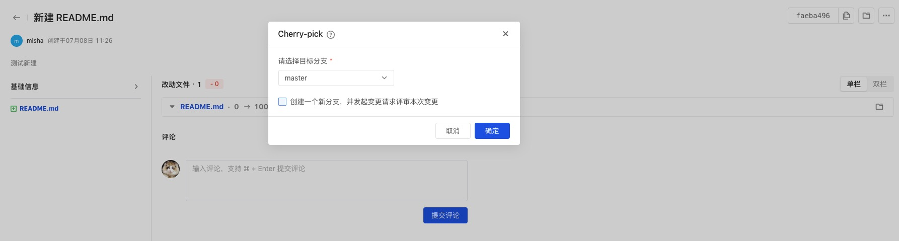
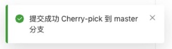

git cherry-pick 命令的作用，就是将指定的提交（commit）应用于其他分支。

点击提交名展开提交详情，点击右上角「...」对当前提交进行 cherry-pick：

在弹窗内选择期望提交的目标分支：

建议勾选创建新分支并通过变更请求的方式评审后合并代码，保证合入过程合规且可追溯：

若不选择使用变更请求，则不勾选即可，直接将当前提交推送到目标分支上，完成 cherry-pick：

