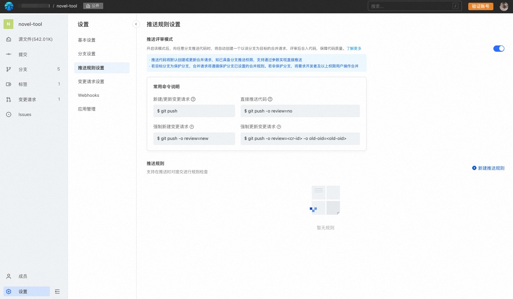

## 推送评审模式
平台支持推送评审模式，该模式下执行 git push 将自动创建评审，并且能够支持对提交进行评审。

### 推送评审模式及其优势

##### 推送评审模式，可以为用户带来全新、高效的代码评审体验 #####

从开发者的角度，发起代码评审不再需要创建新分支，也不必在开发完成后切换至浏览器来创建代码评审，直接执行git push即可一键发起评审；

从管理者的角度，可以设置让开发人员向仓库push代码时，不再直接更新分支的代码，而是自动创建代码评审，通过评审的方式，保障代码质量；

推送评审模式与现有分支模式对比：
|     | 分支开发模式  |推送评审模式  | 
|  ----  | ----  |----  |
| 提交代码  | 在特性分支中提交 |直接在主干上提交 |
|发起代码评审| 网页端操作 |执行git push |
|更新代码评审| 更新特性分支 |继续执行git push |
|贡献代码所需权限| 开发者及以上角色 |浏览者及以上权限 |
|代码质量| 仅保护分支受管控 |所有分支的 push 均受管控 |

##### 在代码库设置中开启推送评审模式后，具有以下优势 #####

* 向仓库贡献代码，发起代码评审，不再需要创建新的分支，直接在主干上进行修改并提交即可，避免了冗余的分支管理成本；

* git push不再直接推送分支内容，而是创建/更新代码评审；

* 如果代码需要修补，提交后继续执行git push，已发起的评审会自动更新；

* 向仓库贡献代码不再需要授予开发者权限，拥有仓库的浏览者权限即可贡献代码，而且贡献的代码需要经过评审才能正式合入代码库。因此可以将直接写库的权限最小化到少数管理者手中，而大部分开发者仅需要读权限即可，降低了代码库被意外修改的风险；

* 支持指定push option来控制具体的推送行为；


## 开启方式
在仓库设置 - 推送规则设置中，可以看到推送评审模式的开关，点击此开关即可开启/关闭推送评审模式的功能：


> 重要
> 开启推送评审模式后，会改变git push的行为，请先知悉并理解后再开启推送评审模式：
> * 开启推送评审模式后，执行git push不再直接更新远端的代码（即便拥有仓库的开发者权限），而是自动创建/更新代码评审；
> * 仓库的浏览者，可以通过git push发起评审，但请放心此时代码还未合入分支，需要根据分支评审和合并要求通过后才可手动合入；
> * 由于git push并不直接更新代码而是创建评审，因此不会触发推送事件的 webhook；
> * 用户可以在网页端以评审的方式新建，编辑或删除文件；

## 使用推送评审模式进行协作
下面，用几个实际的例子，说明如何使用推送评审模式进行开发协作。

### 自动创建评审
假设我们现在接到了一个开发任务，需要开发一个新的特性，使用传统的分支模式，我们需要检出一个分支，并在分支上进行开发，推送分支后再发起特性分支至主干的评审。在使用推送评审模式后，这个过程被简化为只需要两步：

* 在主干上进行开发
* git push

下面我们来具体看看。
在示例仓库中，我们在master分支上开发，并创建了一个提交27e76f58。

```
$ git log
commit 27e76f582ca7207a695dd8762b66ef443adcc572 (HEAD -> master)
Author: Code User <code.user@example.com>
Date:   Tue Oct 11 10:16:18 2022 +0800

    feat: new feature

    Signed-off-by: Code User <code.user@example.com>

commit 44094ec92eb122deab5a0367552bd081540c4353 (origin/master, origin/HEAD)
Author: Code User <code.user@example.com>
Date:   Tue Oct 11 10:09:39 2022 +0800

    Initial commit
```
然后，将改动推送至远端，执行git push：
```
$ git push
枚举对象中: 4, 完成.
对象计数中: 100% (4/4), 完成.
使用 12 个线程进行压缩
压缩对象中: 100% (2/2), 完成.
写入对象中: 100% (3/3), 310 字节 | 310.00 KiB/s, 完成.
总共 3（差异 0），复用 0（差异 0），包复用 0
remote: +-----------------------------------------------------------------------------------+
remote: | The following tips are provided by Code:                                        |
remote: +-----------------------------------------------------------------------------------+
remote: | change request #31620 has been created, please visit:                              |
remote: | https://xxx.com/demo/change_request/31620       |
remote: +-----------------------------------------------------------------------------------+
To https://xxx.com/demo.git
 * [new reference]         master -> refs/change-requests/31620/head
```
可以看到，开启了推送评审模式后，git push 没有直接更新远端的代码，而是创建了一个代码评审，ID 是31620。

此代码评审的源为本地最新的提交，目标则是当前的分支。

我们可以通过代码评审的详情来确认：


通过这种方式，不再需要创建特性分支，也不必切换至浏览器创建评审，简化了创建代码评审的步骤。

同时，git push不再直接更新代码，而是必须经过评审后才能合入，保障代码质量。

### 自动更新评审
在代码评审的过程中，往往需要根据评审者的意见，多次反复修改代码，才能最终达到代码的准入标准。那么，在修改了代码后，相应的代码评审要如何更新呢？这可以通过再次执行`git push`来完成。下面我们来看看实际的例子。

我们在27e76f58的基础上，根据评审意见修改了一些代码，并增加了一个提交e00db452。

```
$ git log
commit e00db4522f2d6ca5b42377ca76c7b3a7e12db8a5 (HEAD -> master)
Author: Code User <code.user@example.com>
Date:   Tue Oct 11 11:09:42 2022 +0800

    feat: fix comment

    Signed-off-by: Code User <code.user@example.com>

commit 27e76f582ca7207a695dd8762b66ef443adcc572
Author: Code User <code.user@example.com>
Date:   Tue Oct 11 10:16:18 2022 +0800

    feat: new feature

    Signed-off-by: Code User <code.user@example.com>

commit 44094ec92eb122deab5a0367552bd081540c4353 (origin/master, origin/HEAD)
Author: Code User <code.user@example.com>
Date:   Tue Oct 11 10:09:39 2022 +0800

    Initial commit
```

然后，再次执行`git push`：
```
$ git push
枚举对象中: 4, 完成.
对象计数中: 100% (4/4), 完成.
使用 12 个线程进行压缩
压缩对象中: 100% (2/2), 完成.
写入对象中: 100% (3/3), 340 字节 | 340.00 KiB/s, 完成.
总共 3（差异 0），复用 0（差异 0），包复用 0
remote: +-----------------------------------------------------------------------------------+
remote: | The following tips are provided by Code:                                        |
remote: +-----------------------------------------------------------------------------------+
remote: | change request #31620 has been updated, please visit:                              |
remote: | https://xxx.com/demo/change_request/31620       |
remote: +-----------------------------------------------------------------------------------+
To https://xxx.com/demo.git
   27e76f582c..e00db4522f  master -> refs/change-requests/31620/head
```
提示信息中可以看出，这次推送更新了 ID为31620的代码评审。

查看评审详情，我们看到代码评审的源版本已经变为了e00db4522，并且提交历史也变为了2。


如果代码仍然需要修改，重复以上流程即可。

### 创建新的评审
重复执行`git push`命令，会自动更新已经存在的评审。如果我们并不想更新评审，而是想要创建一个新的评审，那要如何操作呢？这可以通过在 push 命令中添加`push option`来实现。具体来说，执行` git push -o review=new`，就可以创建新的代码评审。

在本地改动一些代码，再次执行`git push -o review=new`，成功创建了 ID 为31626的代码评审。

```
$ git push -o review=new
枚举对象中: 4, 完成.
对象计数中: 100% (4/4), 完成.
使用 12 个线程进行压缩
压缩对象中: 100% (2/2), 完成.
写入对象中: 100% (3/3), 361 字节 | 361.00 KiB/s, 完成.
总共 3（差异 0），复用 0（差异 0），包复用 0
remote: +-----------------------------------------------------------------------------------+
remote: | The following tips are provided by Code:                                        |
remote: +-----------------------------------------------------------------------------------+
remote: | change request #31626 has been created, please visit:                              |
remote: | https://xxx.com/demo/change_request/31626       |
remote: +-----------------------------------------------------------------------------------+
To https://xxx.com/demo.git
 * [new reference]         master -> refs/change-requests/31626/head
```
需要注意的是，如果推送时已经存在源与目标完全相同的评审，那么将无法创建新的评审。
```
$ git push -o review=new
总共 0（差异 0），复用 0（差异 0），包复用 0
remote: +-----------------------------------------------------------------------------------+
remote: | The following tips are provided by Code:                                        |
remote: +-----------------------------------------------------------------------------------+
remote: | change request create failed. There exists a same change request in progress:       |
remote: | https://xxx.com/demo/change_request/31620       |
remote: +-----------------------------------------------------------------------------------+
To https://xxx.com/demo.git
 ! [remote rejected]       master -> master (create CR failed)
error: 无法推送一些引用到 'https://xxx.com/demo.git'
```

### 更新指定的评审
在同时有多个开启的代码评审的情况下，执行`git push`时，会因无法判断想要更新哪一个评审而失败。
```
$ git push
枚举对象中: 5, 完成.
对象计数中: 100% (5/5), 完成.
使用 12 个线程进行压缩
压缩对象中: 100% (2/2), 完成.
写入对象中: 100% (3/3), 294 字节 | 294.00 KiB/s, 完成.
总共 3（差异 1），复用 0（差异 0），包复用 0
remote: +-------------------------------------------------------------------------------------------------+
remote: | The following tips are provided by Code:                                                      |
remote: +-------------------------------------------------------------------------------------------------+
remote: | You need to manually specify the change request to update because there are already              |
remote: | multiple change requests that you created earlier for the same target branch:                    |
remote: |                                                                                                 |
remote: | * [ID: 31626] https://xxx.com/demo/change_request/31626       |
remote: | * [ID: 31620] https://xxx.com/demo/change_request/31620       |
remote: |                                                                                                 |
remote: | Then, update specific change request based on it's ID (CR-ID):                                   |
remote: |     git push -o review=<CR-ID>                                                                  |
remote: |                                                                                                 |
remote: | Or you can create a new one:                                                                    |
remote: |     git push -o review=new                                                                      |
remote: +-------------------------------------------------------------------------------------------------+
To https://xxx.com/demo.git
 ! [remote rejected]       master -> master (unable to determine which mr to update)
error: 无法推送一些引用到 'https://xxx.com/demo.git'
```
给出的提示信息中显示，存在指向同一目标分支的两个评审，ID分别为31626以及31620，因此无法判断想要更新的是哪一个评审。此时有两种解决方式：

* 使用 -o review=new，创建一个新的代码评审。
* 使用 -o review={MR-ID}，显式的给出想要更新的评审的ID。

第一种方式在创建新的评审一节中已经演示过了，我们来看如何更新指定的评审。

假如此时我们要更新31626这个评审，那么具体的命令为： `git push -o review=31626`。
```
$ git push -o review=31626
枚举对象中: 5, 完成.
对象计数中: 100% (5/5), 完成.
使用 12 个线程进行压缩
压缩对象中: 100% (2/2), 完成.
写入对象中: 100% (3/3), 303 字节 | 303.00 KiB/s, 完成.
总共 3（差异 1），复用 0（差异 0），包复用 0
remote: +-----------------------------------------------------------------------------------+
remote: | The following tips are provided by Code:                                        |
remote: +-----------------------------------------------------------------------------------+
remote: | change request #31626 has been updated, please visit:                              |
remote: | https://xxx.com/demo/change_request/31626       |
remote: +-----------------------------------------------------------------------------------+
To https://xxx.com/demo.git
   0ba010f2ff..037578c634  master -> refs/change-requests/31626/head
```
这样，就更新了ID为31626的代码评审。

### 更新评审的冲突解决
有时，我们想要更新代码评审时，会发现评审可能已经被其他用户更新了。此时，为了避免其他用户的更新被覆盖，更新会失败。假设此时我们要更新31644这个评审，执行：`git push -o review=31644`
```
$ git push -o review=31644
枚举对象中: 4, 完成.
对象计数中: 100% (4/4), 完成.
使用 12 个线程进行压缩
压缩对象中: 100% (2/2), 完成.
写入对象中: 100% (3/3), 326 字节 | 326.00 KiB/s, 完成.
总共 3（差异 0），复用 0（差异 0），包复用 0
remote: +--------------------------------------------+
remote: | The following tips are provided by Code: |
remote: +--------------------------------------------+
remote: | CR is diverged with this push              |
remote: +--------------------------------------------+
To https://xxx.com/demo.git
 ! [remote rejected]       master -> master (CR is diverged with this push)
error: 无法推送一些引用到 'https://xxx/demo.git'
```
提示信息中此次push会引起评审的冲突，更新失败了。此时我们有两种选择：

1. 拉取其他用户的更新，在本地解决后再更新评审。
2. 强制刷新评审。

先来看第一种方式。拉取更新在本地解决后再更新评审。

首先，我们需要执行 `git fetch origin refs/change-requests/{mr-id}/head`，这里mr-id为31644，所以我们需要执行的命令是：`git fetch origin refs/change-requests/31644/head`
```
$ git fetch origin refs/change-requests/31644/head
来自 https://xxx.com/demo
 * branch                  refs/change-requests/31644/head -> FETCH_HEAD
```
然后，我们rebase本地的改动到评审对应的引用上。执行`git rebase FETCH_HEAD`。rebase操作可能会出现冲突，请根据实际情况解决。
```
$ git rebase FETCH_HEAD
成功变基并更新 refs/heads/master。
```
这样，本地就拥有了远端的代码，然后重新执行push。
```
$ git push -o review=31644
枚举对象中: 4, 完成.
对象计数中: 100% (4/4), 完成.
使用 12 个线程进行压缩
压缩对象中: 100% (2/2), 完成.
写入对象中: 100% (3/3), 331 字节 | 331.00 KiB/s, 完成.
总共 3（差异 0），复用 0（差异 0），包复用 0
remote: +-----------------------------------------------------------------------------------+
remote: | The following tips are provided by Code:                                        |
remote: +-----------------------------------------------------------------------------------+
remote: | change request #31644 has been updated, please visit:                              |
remote: | https://xxx.com/demo/change_request/31644       |
remote: +-----------------------------------------------------------------------------------+
To https://xxx.com/demo.git
   a4a2cad45c..8da076fb44  master -> refs/change-requests/31644/head
```
这样，就更新了31644这个代码评审。

### 强制刷新评审
有时，我们不想合并其他用户的改动，想要把评审强制刷新成本地的版本，这个时候应该如何操作呢？

此时，我们需要知道两个值。

一个是代码评审的ID，即代码评审URL的最后一段数字。例如，代码评审的URL是 https://xxxx.com/demo/change_request/31644，那么这个评审的ID即为31644。

另一个是代码评审的源版本。在代码评审的详情页可获得。这里对应的源版本即为8da076fb。


然后，可以执行` git push -o review={mr-id} -o old-oid={old-oid}`，对应这个例子，命令为`git push -o review=31644 -o old-oid=8da076fb`。

这样，就将31644这个评审刷新成了本地的版本。这个过程中，其他用户的修改会被覆盖，所以只有在明确的想要强制刷新版本时，再执行这个命令，以免丢失其他用户的修改。
```
$ git push -o review=31644 -o old-oid=8da076fb
总共 0（差异 0），复用 0（差异 0），包复用 0
remote: +-----------------------------------------------------------------------------------+
remote: | The following tips are provided by Code:                                        |
remote: +-----------------------------------------------------------------------------------+
remote: | change request #31644 has been updated, please visit:                              |
remote: | https://xxx.com/demo/change_request/31644       |
remote: +-----------------------------------------------------------------------------------+
To https://xxx.com/demo.git
   8da076fb44..8da076fb44  master -> refs/change-requests/31644/head
```
### 跳过评审，直接更新代码
有时，我们可能仅仅做了一些微小的提交，例如改了代码注释中的错别字，想要跳过代码评审，应该如何操作呢？此时，我们可以使用` git push -o review=no`命令来跳过创建代码评审。命令的行为与未开启推送评审模式时执行git push一致。
>需要注意的是，需有相应分支的推送权限才可以使用review=no直接推送代码。

### 一些其他的说明
更新评审需要是评审者或是评审的作者，否则更新会失败。
```
remote: +---------------------------------------------------------------------+
remote: | The following tips are provided by Code:                          |
remote: +---------------------------------------------------------------------+
remote: | change request #31644 update failed.                                 |
remote: | You need to be the author or reviewer to update this change request. |
remote: +---------------------------------------------------------------------+
```
