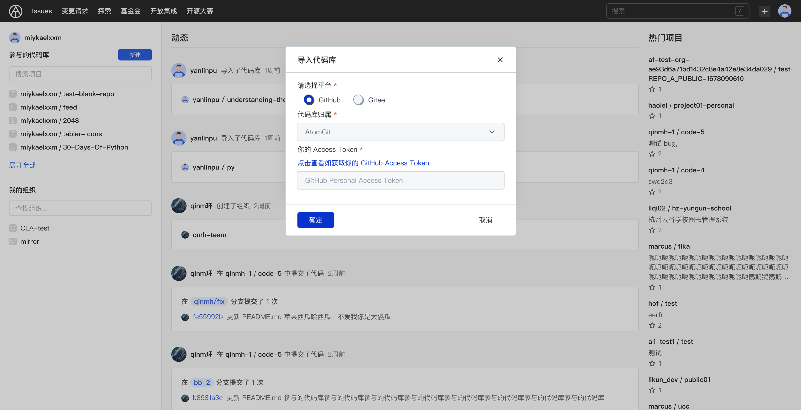
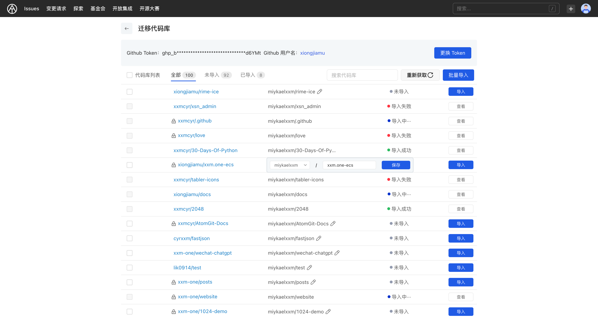

## 迁移代码库

AtomGit 提供了 代码库的迁移功能，允许用户通过个人访问密钥（PAT）来导入 GitHub、Gitee 的代码库数据，目前支持基本信息和 git 仓库的导入。

## 准备个人访问密钥

使用 AtomGit 的代码库迁移功能,需要先准备对应代码库托管平台的个人访问密钥(Personal Access Token)。通过该密钥,AtomGit 可以获取 GitHub、Gitee 等平台的代码库信息。

- 生成 GitHub 的个人访问密钥:
  1. 登录 GitHub,打开【Settings】
  2. 选择左侧导航中的【Developer settings】
  3. 选择【Personal access tokens】
  4. 点击【Generate new token】按钮
  5. 填写 Token 描述,选择 repo 权限,点击【Generate token】按钮
  6. 复制生成的 Token,并妥善保管
- 申请 Gitee 的私人令牌:
  1. 登录 Gitee,打开【个人中心】
  2. 选择左侧导航中的【私人令牌】
  3. 填写令牌名和有效期,选择 repo 权限,点击【创建令牌】按钮
  4. 复制生成的令牌,并妥善保管

> 建议个人访问密钥的权限设置为代码库的只读权限,且必须包含 repo 权限,否则将无法获取到代码库信息。

## 迁移代码库

1. 打开 AtomGit,点击右上角的 "+" 号,选择【导入代码库】
2. 选择要从哪个平台迁移代码库,目前支持 GitHub 和 Gitee
3. 选择代码库迁移后属于的命名空间,包括用户自己的和组织的命名空间
4. 输入对应平台的个人访问密钥,点击【确定】

> 选择的命名空间只是默认的归属,在导入界面可以修改每个代码库的归属。

### 导入代码库

在完成以上步骤后,会进入待导入代码库列表页面,该页面将显示:

- 使用的 Token 信息和对应平台的用户名
- 全部代码库列表,包括私有的、所在组织的代码库和作为协作者参与的代码库
- 代码库导入状态:未导入、导入中、导入成功
- 原平台的代码库地址和导入后的 AtomGit 地址
- 支持的操作:
  - 更换 Token
  - 批量导入
  - 单个导入
  - 搜索代码库
  - 重新获取代码库列表

> 可以在这个页面导入单个或多个代码库,修改每个代码库的归属,查看已经导入的代码库等。

## 常见问题

1. 想更换代码库的归属应该怎么做?

- 未导入的代码库:
   1. 找到代码库
   2. 点击修改归属
   3. 选择新的归属,保存
   4. 点击【导入】按钮
- 已导入的代码库:
   1. 进入代码库设置,删除代码库
   2. 返回待导入代码库列表,修改归属
   3. 选择归属命名空间
   4. 点击【导入】按钮

2. 上次使用的 Token 忘了,需要重新生成吗?

不需要,AtomGit 会默认使用上次的 Token。只要该 Token 未被删除且仍在有效期,可以继续使用。

3. 导入后可以在 GitHub/Gitee 删除 Token 吗?

可以删除,但不建议。除了导入代码库,AtomGit 每天会使用该 Token 从原平台同步更新已经导入的代码库。如果删除 Token,已导入的代码库将无法同步更新。如果不需要同步更新,可以删除 Token。