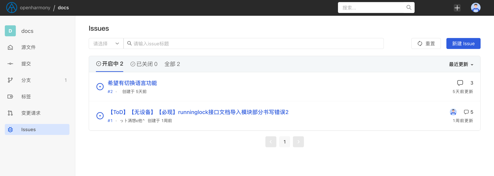
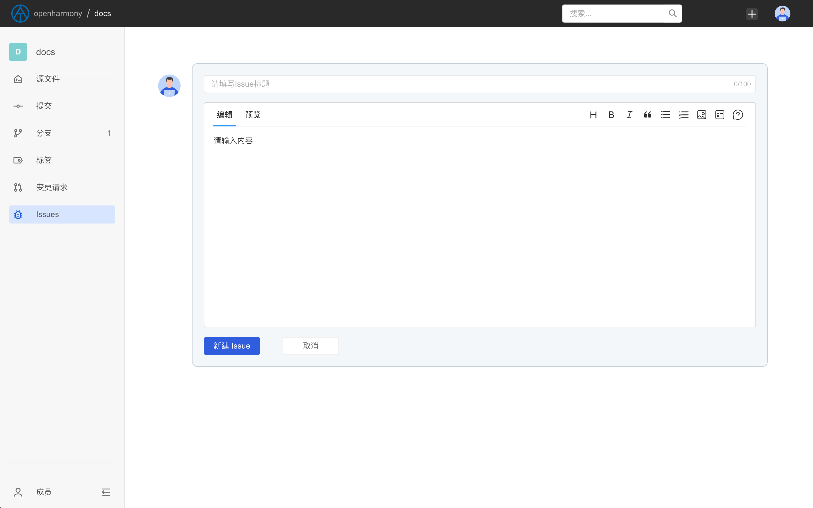
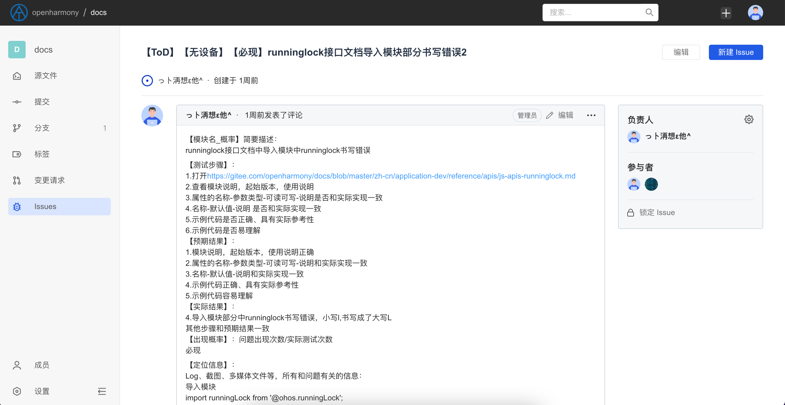
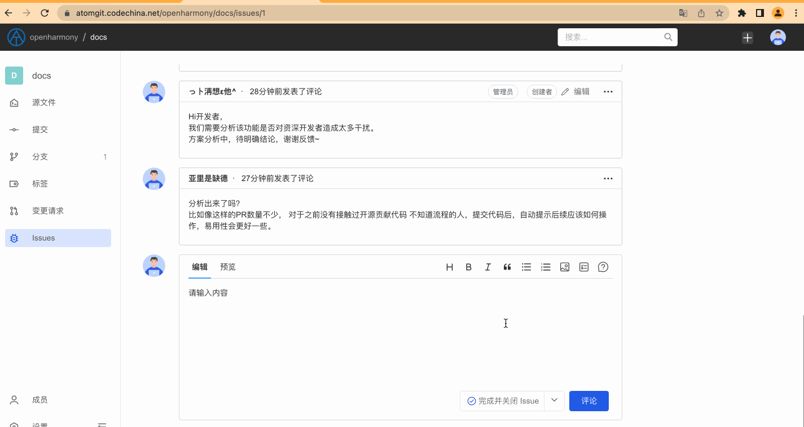

## Issue

AtomGit 提供用于反馈跟踪 bug、记录新的想法/需求的 Issue 功能，通过 Issue，你可以：

- 与社区用户交流讨论
- 反馈和跟踪代码库中的 bug
- 记录新的想法
- 跟踪新需求的状态

总之，与代码库相关的一切问题，我们建议你都通过 Issue 来讨论和记录。

### 了解 Issue

当你进入到某个代码库（任意公开可访问的代码库均可）后，你可以单击左侧的 Issue 按钮，查看代码库的 Issue 列表，通常你能够看到以下信息：

1. **Issue 的标题** ，用于描述这个 Issue 主要讨论的内容是什么
1. **Issue 的状态**，Issue 的状态分为`开启中`和`已关闭`两种
1. **Issue 创建时间**
1. **Issue 的创建者**
1. **Issue 分配的负责人**
1. **Issue 中讨论的评论数量**
1. **Issue 最近更新时间**

### 新建 Issue

你可以在公开可访问的代码库或你有权限的私密代码库中提交 Issue，创建 Issue 时，你需要提供以下信息：

1. Issue 标题
2. Issue 的详细说明，这部分越详细越好，如果是 bug 反馈，最好能够提供详细的上下文信息，以便项目成员定位问题

当 Issue 创建成功后，系统将会跳转至 Issue 详情页。

### 分配 Issue

当 Issue 提交后，项目成员可以对 Issue 进行分配负责人的操作，Issue 可分配的负责人包括 Issue 的参与者（创建者和参与 Issue 讨论的用户）和代码库成员（包括`浏览者`、`开发者`和 `管理员` 三类角色）

### 锁定 Issue

当 Issue 被锁定后，将只允许代码库成员进行讨论，非代码库成员将无法提交评论

### 关闭 Issue

当 Issue 分配的负责人认为 Issue 可以关闭的时候，可以通过页面最下方的关闭按钮进行关闭，通常关闭 Issue 的情形有两种:

1. **跳过并关闭 Issue**， 这将意味着负责人认为该 Issue 的问题可以不用继续关注，可能是个无效的 bug 或者是不符合项目规划的需求等
2. **完成并关闭 Issue**， 这意味着负责人已经将该 Issue 中反馈的问题处理完成

拥有关闭 Issue 权限的人员包括 Issue 的创建者、 当前分配的负责人和代码库成员。