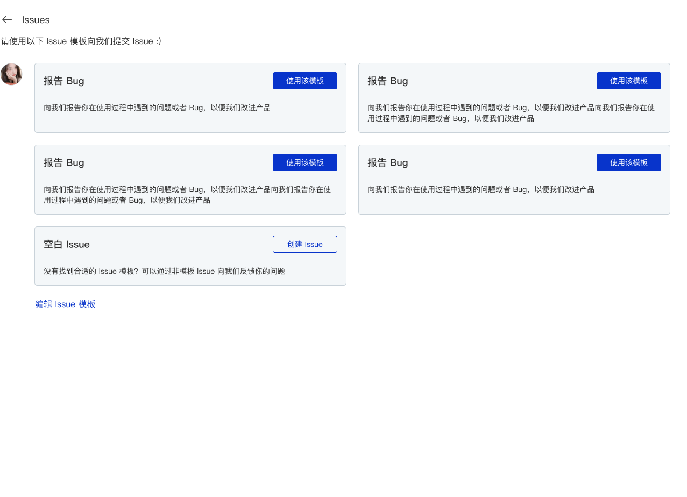

## Issue 模板

AtomGit 提供了 Issue 模板功能，当开启了 Issue 模板功能后，用户在向你的代码库提交 Issue 时，将从你指定的 Issue 模板中去创建相应的 Issue，方便对用户反馈的问题进行更好的分类处理。



### 开启 Issue 模板

当你的代码库主分支中的如下路径中存在 *.md 格式的文件时，就可以开启 Issue 模板功能

- `.atomgit/ISSUE_TEMPLATE/` 目录
- `.github/ISSUE_TEMPLATE/` 目录


### 配置 Issue 模板

当配置 Issue 模板时，你可以参考以下步骤：

1. 创建 `.atomgit/ISSUE_TEMPLATE` 或 `.github/ISSUE_TEMPLATE` 目录
2. 新建 `test.md` 文件
3. 在新建的 markdown 文件中配置 front-matter 信息，包括 ISSUE 模板的介绍、ISSUE 标题、指定负责人、指定 Label 等
4. 在新建的 markdown 文件中添加正文内容，该内容会作为用户新建 Issue 时预设的内容填充到描述中

#### Front-matter 介绍

目前我们支持以下几种 markdown 的 front-matter 配置：

|   字段  | 说明    |   备注    |
|   --  | -- |  --   |
|   name  |   模板名称	|   含中文使用双引号    |
|   about   |   模板解释说明    |	含中文使用双引号    |
|   titile	|   Issue 预设标题  |   含中文使用双引号    |
|   labels	|   Issue 的 labels，支持多个   |	多个需要使用中括号，当含有不存在的 labels 时，在创建 Issue 时不显示该 label |
|   assignees   |	Issue 默认指派人    |	指派人 ID，不需要 @ 符号    |

### Issue 模板示例

以下是一个简单的 Issue 模板示例，你可以根据你自己代码库的需要进行调整：

```markdown
---
name: "Bug 报告"
about: "向我们报告你在使用过程中遇到的问题或者 Bug，以便我们改进产品"
title: "【BUG】:"
labels: ["BUG","产品优化"]
assignees: 'xiongjiamu'
---

### BUG 类型

<!-- 
请在这里描述你所遇到的 BUG 类型，以便我们更快定位问题，比如 UI、功能、体验等 
-->

### 复现步骤

<!-- 
请在这里描述你遇到该 BUG 时的页面及步骤
-->
```

上面这个模板表示的是一个用于【向我们报告你在使用过程中遇到的问题或者 Bug，以便我们改进产品】的【Bug 报告】Issue 模板，在使用该模板创建时，会创建一个标题默认以 （【BUG】:）开头、默认指派给【xiongjiamu】、Labels 是【BUG，产品优化】的 Issue。