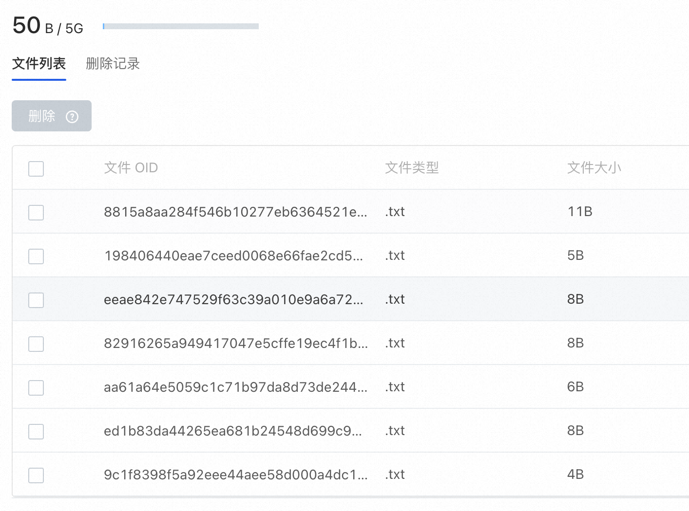

# 大文件存储（Git LFS)
AtomGit 平台支持 Git LFS 来管理仓库中的大文件。
## Git LFS的安装
Git LFS 作为开源服务，源码及安装方式请参考：[https://git-lfs.com/](https://git-lfs.com/)
## Git LFS的使用
### 初始化
安装好 Git LFS 后，执行`git lfs install`初始化 git 钩子
```shell
$ git lfs install
Updated git hooks.
Git LFS initialized.
```
### 将文件加入LFS管理
假如想要将 png 文件使用 LFS 管理，在仓库中执行：`git lfs track "*.png"`，之后正常使用 git 进行提交和推送。png 类型的文件会自动使用LFS管理，不需要额外的操作。

需要注意的是，执行`git lfs track`只影响之后加入仓库的文件，不会影响仓库中已存在的历史文件。

如果需要将历史的文件加入 LFS 管理，需要执行迁移操作。
### 查看LFS管理的文件
执行 `git lfs ls-file` 查看使用LFS管理的文件
```shell
$ git lfs ls-files
2da026638a * <文件1>
3176f6f797 * <文件2>
```
也可以在 `设置 - 大文件存储` 中，查看并管理仓库中的大文件


## 历史文件的迁移
> 迁移操作会改写仓库的历史，请慎重操作。


如果想要将仓库中的历史文件使用 LFS 管理，需要执行迁移操作。例如，我们想要将 master 分支中的 png 文件使用LFS管理，那么执行：
```shell
git lfs migrate import --include-ref=master --include="*.png"
```

会看到类似的输出，说明迁移已经完成：
```shell
migrate: Sorting commits: ..., done.
migrate: Rewriting commits: 100% (2/2), done.
  master 2d2c813aac4b2247e4b79b3721cca45580f15282 -> 5634c182663a24617bd26d0d82a3966686687173
migrate: Updating refs: ..., done.
migrate: checkout: ..., done.
```

之后执行 `git push --force` 将改动推送到远端。

## 支持超大文件推送
默认情况下，使用 Git LFS 推送大文件时，单文件大小不可以超过5GB。
如果有单文件超过5GB的需要，可以通过`xlfs`扩展插件来完成。

### 安装和配置
从 [xlfs Release](https://atomgit.com/OpenAtomFoundation/xlfs/tags?tab=release) 页下载对应平台的二进制程序，将可执行文件的路径加入到`PATH`中，执行`xlfs version`来验证是否正确安装

```shell
$ xlfs version
xlfs version 1.0.0
git-lfs version 2.13.3 (GitHub; darwin amd64; go 1.16.2; git a5e65851)
```

安装完成后，在仓库内执行`git config lfs.customtransfer.xlfs.path xlfs`，即可启用 Git LFS 对超过5GB文件的支持。
