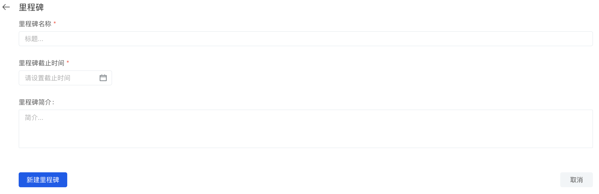
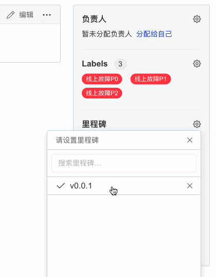

## 里程碑

与[标记](label)类似，里程碑也是一个用与管理 issue 和变更请求的工具。截止日期的引入，可以让你更好的跟踪和查看 issue 和变更请求的进度。

**敏捷 Sprint**

里程碑可用于敏捷 Sprint，跟踪所有与特定冲刺有关的 issue 及变更请求：

1. 设置里程碑的截止日期，以代表敏捷冲刺的结束时间
1. 将里程碑标题设置为敏捷 sprint 的名称，例如`#1 sprint` 
1. 在 issue、变更请求中将其关联到所需的里程碑，将其添加到敏捷 Sprint中

**发布（Release）**

里程碑也可以用与发布：

1. 设置里程碑的截止日期设置为计划要发布的日期
1. 将里程碑标题设置为您的发行版，例如`v1.0.2` 
1. 在 issue、变更请求中将其关联到所需的里程碑，将其添加到发行版中

### 新建里程碑

> 注：你至少需要是代码库或组织的`管理员`才可以使用新建、编辑、删除里程碑等功能

1. 打开代码库的 Issue 页
1. 点击【里程碑】按钮
1. 点击【新建里程碑】按钮，填写里程碑的相关信息
    - 里程碑名称
    - 截止时间，里程碑结束的日期
    - 里程碑简介，描述里程碑的基本信息
1. 点击【新建里程碑】保存并新建里程碑

### 关联里程碑

在 issue 页面，你可以通过右侧【里程碑】的设置按钮来为 issue 关联里程碑。

> 注：你至少需要是代码库或组织的`开发者`权限才可以使用关联里程碑、移除里程碑等功能

