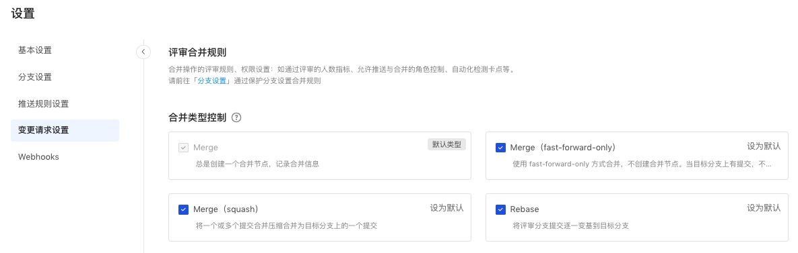

### 评审设置

#### 评审规则设置

合并操作的评审规则、权限设置：在「设置」-「分支设置」中设置保护分支规则，参见 [保护分支规则](branch)。

### 合并类型设置

开发者可以创建分支到目标分支的变更请求。管理员可以根据团队的 WorkFlow 及规范，来对代码库维度上的变更请求进行规范化的配置。

当设置某个合并类型为默认时，进行变更操作不选择合并类型则会按照默认类型进行合并；如果取消某种合并类型，则在合并时下拉选择不会出现未勾选则合并类型。

合并方式具体说明：
#### 1、 merge(--no-ff)

默认的合并方式。总是创建一个合并请求，合并提交能记录代码的合并时间、合并人信息，并在主干（first parent）上隐藏评审分支开发细节。

#### 2、 Merge （fast-forward-only）

使用 fast-forward-only 方式合并，不创建合并节点。当目标分支上有提交，不能使用 fast-forward 时，默认合并类型为合并（创建合并节点）。

#### 3、 Rebase

通过 Rebase 的方式合并到目标分支，不产生 Merge 节点，不生成 Merge Commit。将保留合并前源分支上的 Commit 记录（作者信息及提交信息，但 CommitId 可能会发生变化）。

#### 4、 Squash

将评审中的所有提交合并为一个并在目标分支上保留干净的历史记录。Squash 合并允许你将评审中的一系列提交压缩成一次提交，并且可以自定义压缩节点的提交信息。

在使用 Feature 分支开发时，有时你希望提交改动，但开发过程中的提交信息不一定包含重要信息，因此你不希望将它们包含在目标分支中。这样，集成分支的历史记录通过有意义的提交消息保持清晰，并且在必要时更容易还原（Revert）。

