代码评审是提升编码质量，保障合入代码安全性的一个重要手段。同时，在共建协作场景中，通过发起一个变更请求，请求他人合并自己贡献的代码，也是非常常见的操作。
那么，如何在 AtomGit 中使用变更请求来贡献代码呢？

### 新建变更请求
进入代码库的变更请求列表页，点击新建变更请求。
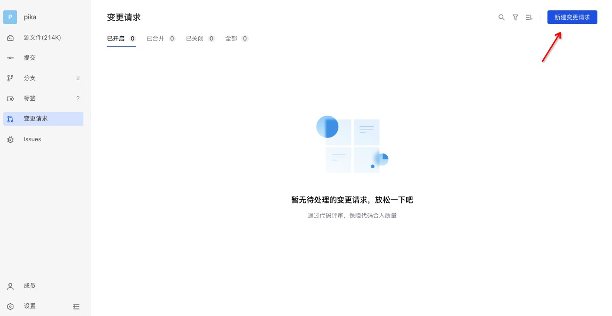

若设置默认评审人（详见分支设置）则在评审人部分自动将默认评审人填写在评审人列表中。
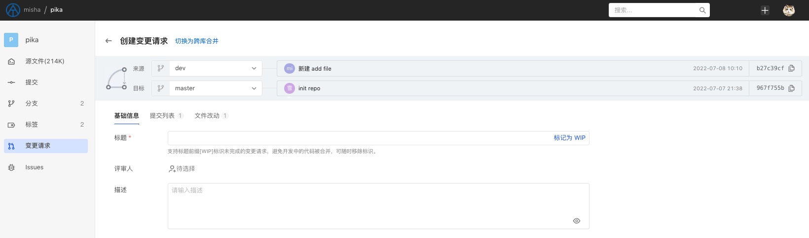

申请变更，需要确定一个来源和目标。
- 在同库拉分支的开发模式下，在同一个仓库中，选择来源分支和目标分支；
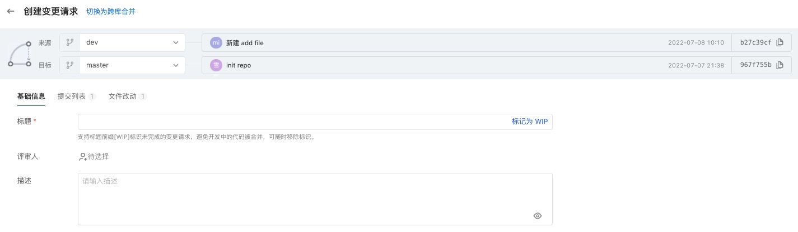

- 在跨库 Fork 的开发模式下，对于根库和派生库，选择来源分支和目标分支；
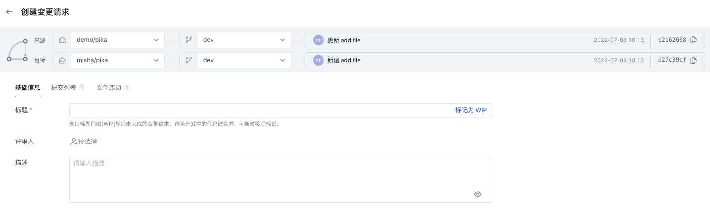
对于有派生关系的库，可以通过顶部的「切换为跨库合并」展开选择库的入口。

当源和目标比较后存在差异时，可以创建变更请求。此时可以预览变更的提交列表和文件改动内容，确认无误后填写变更请求基础信息，完成创建。
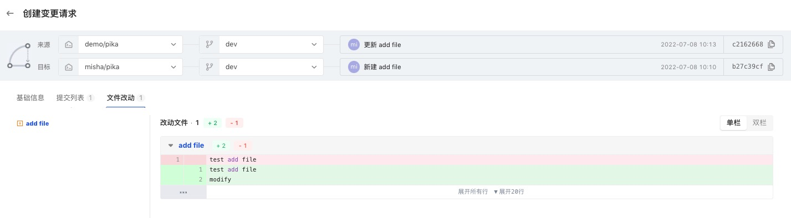
> 支持标记 [WIP] 识别草稿状态的变更请求，此时不会通知评审人前来评审，也无法通过评审。直到删除标题上的 [WIP] 标识后正常可评审。

### 变更请求详情
创建完成后进入变更请求详情：
左侧栏分为3部分：
- 全局概览：包括变更请求相关的基础信息、评审人信息、时间线动态和事件记录，以及是否已达到合并状态的提示；
- 提交历史：变更包含的提交列表
- 变更的文件列表
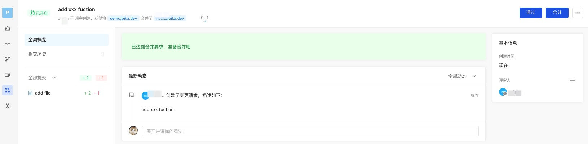

点击文件名展开变更文件详情：
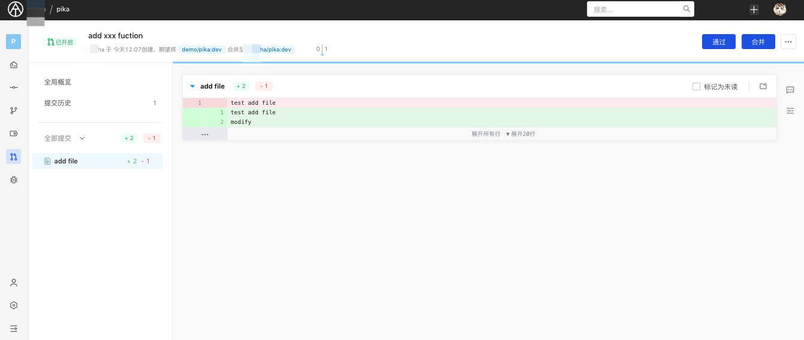

#### 评论
可针对代码行进行评论：
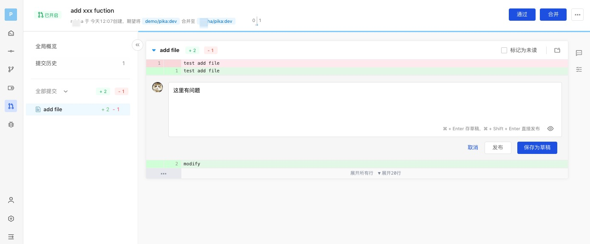
评论支持两种模式：
- 直接评论：立即发布，有读权限的人均可见
- 草稿评论：将作为草稿，仅自己可见，完成评审后需要统一提交：
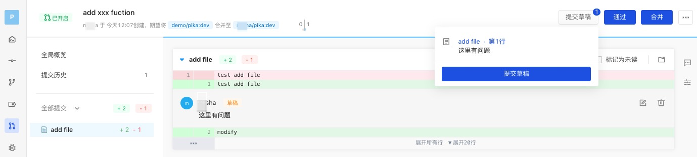

所有评论可以通过展开侧边栏统一查看，点击行评论的蓝色链接，可以直接跳转到评论对应位置：
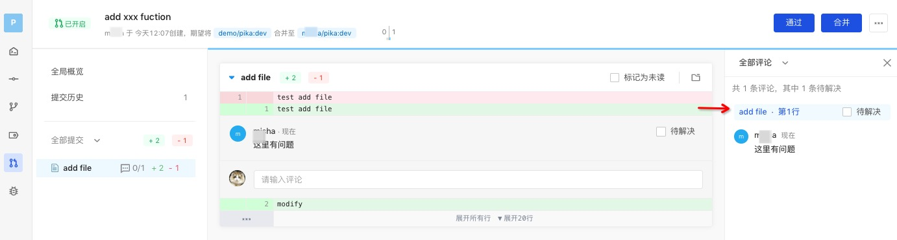

评论本身携带解决状态，创建后默认为未解决，由评审发起人处理完问题后通知评审人确认，确认无误后评审人可解决评论。
此外，库管理员可以对解决状态进行修改。

> 评论是否已解决可以作为变更请求是否能合并的卡点条件，如果库设置里的保护分支里设置了评审的评论必须全部解决才能合并，那如果还有评论未解决，就无法合并。

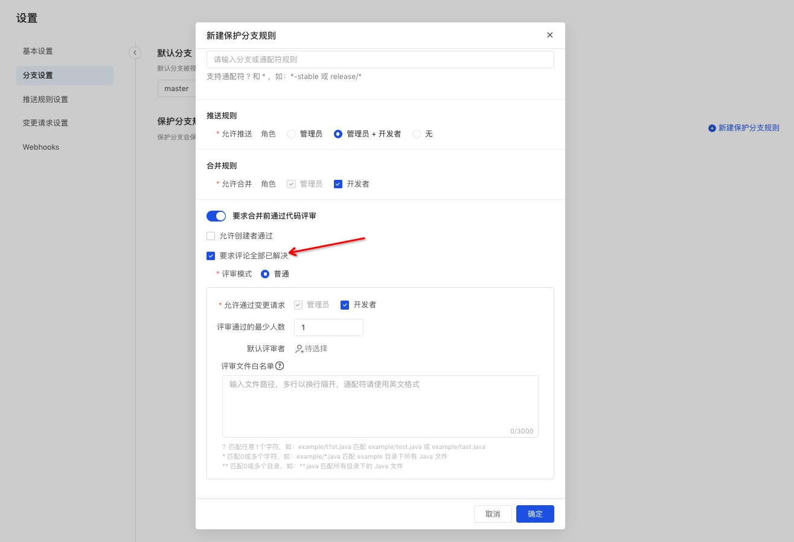

此外，还可设置代码查看视图：
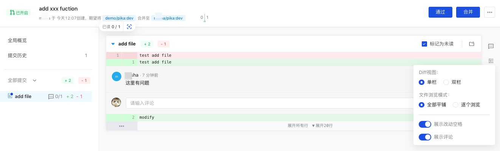

#### 代码冲突解决
当合并的分支存在代码冲突时，系统会自动卡点，无法进行合并操作。平台提供了冲突解决的建议：
```
//步骤1 fetch并切换到源分支
git fetch origin
git checkout sourceBranch
//步骤2 合并目标分支
git merge origin/master 
//步骤3 解决冲突并push
```

#### 评审人卡点
在设置评审人通过数目时，通过数量小于设定数目时则进行卡点。

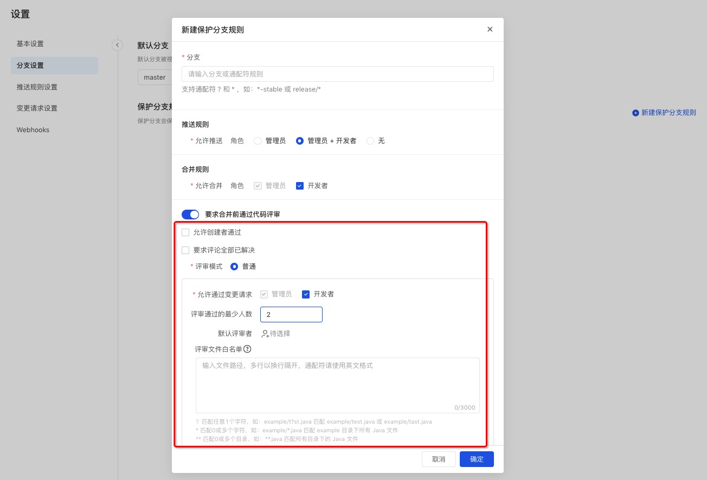
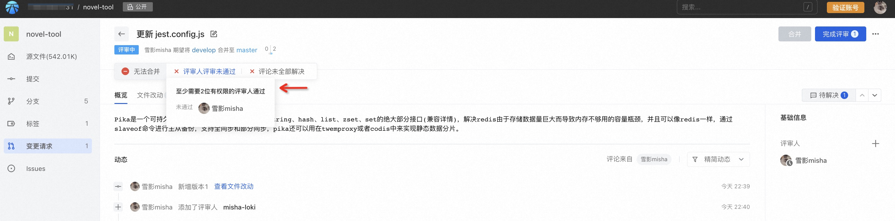

### 通过合并请求
有权限通过的评审人展现「通过」按钮，点击后通过合并请求。

### 合并分支
在所有卡点都通过后，可进行合并操作。
合并默认支持四种方式，具体参见[变更请求设置](pr-config)。
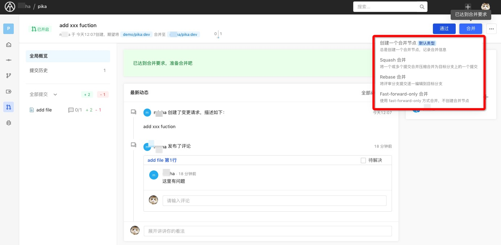