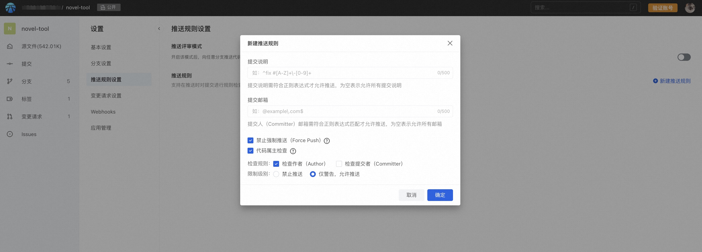

为了规范开发者提交格式，平台提供推送规则检查服务，支持自定义检查规则，对未推送的提交进行检查。

## 创建推送规则
作为库管理员，点击左下角「设置」进入代码库设置页面，找到「推送规则设置」：

点击新建推送规则，设置规则参数：
：
> 当前仅支持针对全库所有分支启用检查规则。

### 提交注释

即 Commit message，规则请使用正则表达式书写，提交注释需符合正则表达式才允许推送，为空表示允许所有提交注释。

### 提交邮箱

即 git config 设置的邮箱，规则请使用正则表达式书写，提交作者邮箱需符合正则表达式匹配才允许推送，为空表示允许所有邮箱。

### 禁止强制推送（Force Push）

强制推送即强制用本地代码覆盖远程仓库的代码，由于会直接覆盖远程的提交，特别是在版本冲突的情况下，可能造成代码和提交记录丢失，需谨慎使用。

为了避免由于强制推送导致的代码丢失问题，可以通过开启禁止强制推送对操作进行限制。

当开启禁止强制推送，推送的本地代码和远端存在分叉时，无法通过 git push -f 的方式强行推送本地代码，避免服务端代码被覆盖。

> 当已开启禁止强制推送，但是本地代码和远端服务器代码无分叉时，此时即使使用 git push -f 命令进行推送，效果也和 git push 一致，可以推送成功。

### 代码属主检查

在开始使用 git 进行版本管理之前，我们需要先进行用户配置。
> git config --global user.name "你的名字"
git config --global user.email "你的邮箱"

也许你每天都在用，但是清楚提交记录的作者（Author）与提交者（Committer）的区别吗？

Git 本身允许重写历史，或代表其他人提交代码。通常，我们在使用 git log 查看历史提交记录时，所展示的便是作者 Author。我们常用 Author 来作为代码统计的归属依据。从这个角度上来说，作者 Author 与代码贡献者直接挂钩。因此，在统计代码贡献等场景下需要规范提交代码属主和服务端当前登录用户的对应关系。

通常情况下，提交者 Committer 并不对用户暴露。只有指定git log --format（例如format=fuller）时才会展示。提交者代表着这个提交记录 Commit 最终提交的人（提交时git config user.name 及git config user.email）。

在执行 git commit 时，可以通过 --author 来指定这个提交记录的贡献者是谁。在开源社区也有这样的例子，虽然我并没有使用你的代码，但我使用了你的创意，仍然以你作为作者，以示对原创的尊重。

通常第一次生成的 Commit，Author 和 Committer 是同一个人。但是，如果另一个人用git cherry-pick,git rebase,git commit --amend,git filter-branch,git format-patch之类的命令重写这个 Commit，本质都是新生成了一个Commit，那么新生成的 Commit 的 Author 还是原来的，但 Committer 会变成执行这个操作的用户的名字和邮箱。

因此简单地理解 Author 是第一作者，Committer 是生成 Commit 的人。

平台支持针对 Author 和 Committer 对当前登录用户已验证的邮箱做检查，若邮箱信息无法匹配，可以警告或限制其推送，以保证代码贡献属主的准确性，避免由于无法匹配用户导致的贡献量计算失真。

###  推送时检查
假设规则设置如下：

#### 页面操作
当提交时注释不符合已设置的规则时，提交将被拒绝：

当提交邮箱不符合规则时，提交也会被拒绝：

合并时同理。

###  命令行操作
当提交注释不符合规则时：

当提交邮箱不符合规则时：
