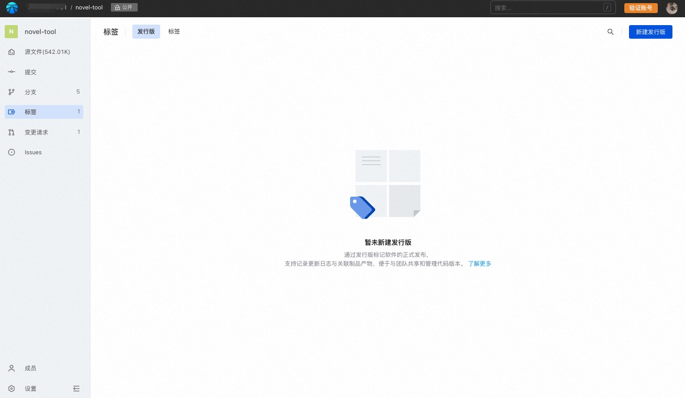
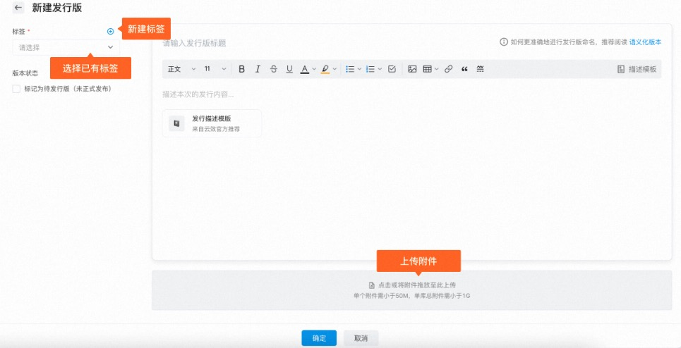
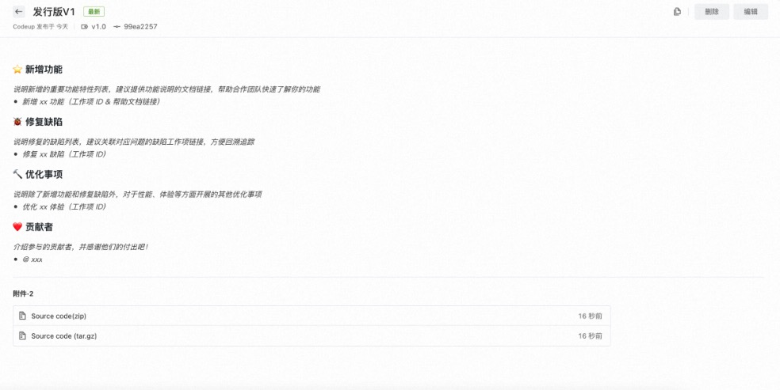
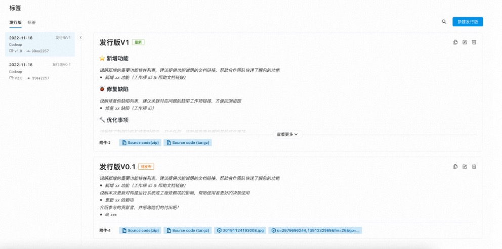

## 管理发行版
发行版（Release）是基于代码库标签的发布日志，通过创建发行版本，支持记录更新日志与关联制品产物，可以更好地与团队共享和管理代码版本。

### 新建发行版
1. 代码库开发者及以上角色，进入代码库详情页，点击左侧导航>标签，选择发行版。

2. 点击右上角按钮，新建发行版。

发行版内容包括：

* 标签：发行版需要基于标签创建，可选择已有标签或新建标签；

* 版本状态：支持设置为待发行版，该标记表示未正式发布生产可用，是一个预览；

* 发行版标题：写法建议参见[语义化版本](https://semver.org/lang/zh-CN/)；

* 发行版描述：描述发行版的具体内容，云效提供了建议模板，可供参考；

* 附件：发行版的附件信息；

> 同一个发行版最多支持10个附件，单个附件大小需小于50M,单库总附件需小于1G。

3. 点击确定，完成创建，进入发行版详情：
创建完成后，会默认生成2个源码压缩包供下载。

4. 点击返回，可查看发行版列表：
