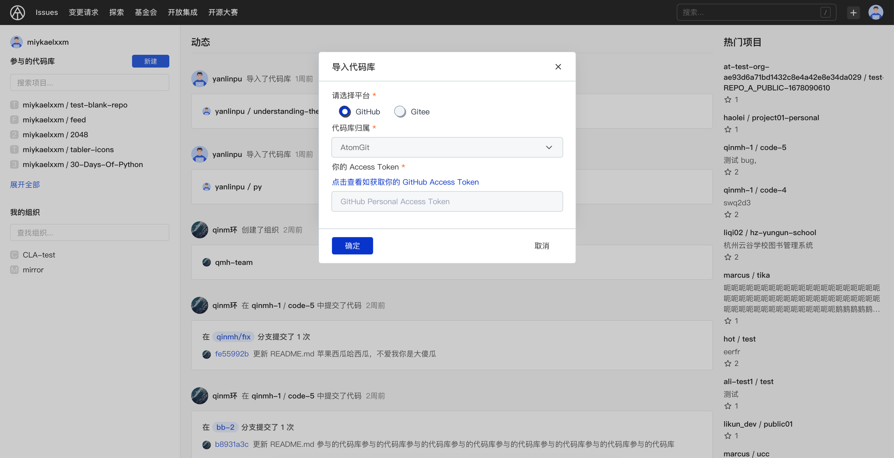
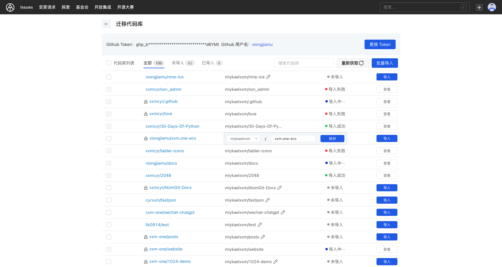

---
id： repo-migrate # 唯一ID
slug： /repo/migrate # URL(最多三级结构，便于seo 和理解，遵循doc/资源/具体说明项 的原则)
sidebar_label： '迁移代码库' # 在sidebar 中的名称
title： '迁移代码库' # 页面标题
tags：
  - repo
  - migrate
  - pat
  - personal access token
hide_title： true
---

## 迁移代码库

AtomGit 提供了 代码库的迁移功能，允许用户通过个人访问密钥（PAT）来导入 GitHub、Gitee 的代码库数据，目前支持基本信息和 git 仓库的导入。

## 准备个人访问密钥

使用 AtomGit 的代码库迁移功能，需要先准备对应代码库托管平台的个人访问密钥(Personal Access Token)。通过该密钥，AtomGit 可以获取 GitHub、Gitee 等平台的代码库信息。

- 生成 GitHub 的个人访问密钥：
  1. 登录 GitHub，打开【Settings】
  2. 选择左侧导航中的【Developer settings】
  3. 选择【Personal access tokens】
  4. 点击【Generate new token】按钮
  5. 填写 Token 描述，选择 repo 权限，点击【Generate token】按钮
  6. 复制生成的 Token，并妥善保管
- 申请 Gitee 的私人令牌：
  1. 登录 Gitee，打开【个人中心】
  2. 选择左侧导航中的【私人令牌】
  3. 填写令牌名和有效期，选择 repo 权限，点击【创建令牌】按钮
  4. 复制生成的令牌，并妥善保管

> 建议个人访问密钥的权限设置为代码库的只读权限，且必须包含 repo 权限，否则将无法获取到代码库信息。

## 迁移代码库

1. 打开 AtomGit，点击右上角的 "+" 号，选择【导入代码库】
2. 选择要从哪个平台迁移代码库，目前支持 GitHub 和 Gitee
3. 选择代码库迁移后属于的命名空间，包括用户自己的和组织的命名空间
4. 输入对应平台的个人访问密钥，点击【确定】

> 选择的命名空间只是默认的归属，在导入界面可以修改每个代码库的归属。

### 导入代码库

在完成以上步骤后，会进入待导入代码库列表页面，该页面将显示：

- 使用的 Token 信息和对应平台的用户名
- 全部代码库列表，包括私有的、所在组织的代码库和作为协作者参与的代码库
- 代码库导入状态：未导入、导入中、导入成功
- 原平台的代码库地址和导入后的 AtomGit 地址
- 支持的操作：
  - 更换 Token
  - 批量导入
  - 单个导入
  - 搜索代码库
  - 重新获取代码库列表

> 可以在这个页面导入单个或多个代码库，修改每个代码库的归属，查看已经导入的代码库等。

## 常见问题

1. 想更换代码库的归属应该怎么做?

- 未导入的代码库：
   1. 找到代码库
   2. 点击修改归属
   3. 选择新的归属，保存
   4. 点击【导入】按钮
- 已导入的代码库：
   1. 进入代码库设置，删除代码库
   2. 返回待导入代码库列表，修改归属
   3. 选择归属命名空间
   4. 点击【导入】按钮

2. 上次使用的 Token 忘了，需要重新生成吗?

不需要，AtomGit 会默认使用上次的 Token。只要该 Token 未被删除且仍在有效期，可以继续使用。

3. 导入后可以在 GitHub/Gitee 删除 Token 吗?

可以删除，但不建议。除了导入代码库，AtomGit 每天会使用该 Token 从原平台同步更新已经导入的代码库。如果删除 Token，已导入的代码库将无法同步更新。如果不需要同步更新，可以删除 Token。