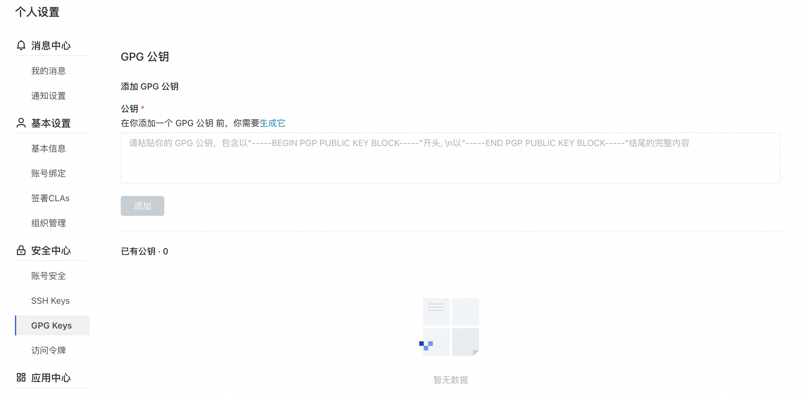
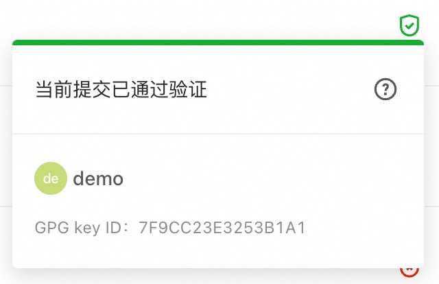
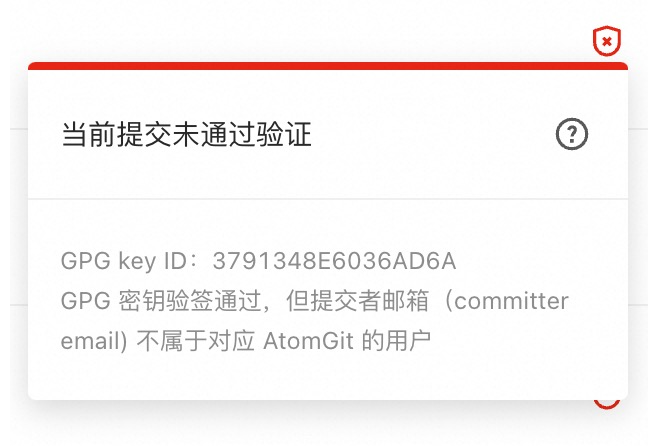

> Git 虽然是密码级安全的，但并不是万无一失的。当有人的用户密码泄露，或者有人想恶意伪造他人的提交，就有可能冒名你信任的人，向你的代码仓库提交恶意代码。你可以使用GPG 在本地签署你的提交记录（commit）或者标签（tag）。 AtomGit 将对这些签名做验证，来确保提交记录或者标签来自受信任的来源。

## AtomGit 如何处理 GPG 签名

AtomGit 使用自己的钥匙链来验证GPG签名，它不访问任何公钥服务器。

对于要由 AtomGit 验证的提交：

- 提交者必须具有 GPG 公钥/私钥对。
- 提交者的公钥必须已上传到其 AtomGit 帐户。
- GPG密钥**必须包含电子邮箱**，并且邮箱必须与提交者在 AtomGit 中**使用的经过验证的邮箱地址**匹配。
- 提交记录**提交者（committer）的邮箱**地址必须与GPG 密钥中验证的邮箱地址匹配。

## GPG 密钥

### GPG 工具安装

默认情况下，macOS或Windows上未安装GPG。 要安装GPG命令行工具，请参见GnuPG的下载页面。

Windows

Windows 推荐下载 [Gpg4win]([Gpg4win](https://gpg4win.org/download.html))

macOS

macOS 推荐下载 [gpgtools](https://gpgtools.org/)

### 查看已存在的密钥对

在你生成新的密钥对之前，可以先检查是否有已存在的密钥对。

支持的 GPG 密钥算法

AtomGit支持几种GPG密钥算法。 如果你尝试添加使用不受支持的算法生成的密钥，则可能会遇到错误：

- RSA
- ElGamal
- DSA

1. 打开终端（macOS或Linux用户） / git bash（Windows用户）。
2. 使用gpg --list-secret-keys --keyid-format LONG命令可以列出同时具有公钥和私钥的GPG密钥。 签名提交或标记需要私钥。

    ``` SHELL
    $ gpg --list-secret-keys --keyid-format LONG
    ```

3. 检查命令输出以查看是否具有GPG密钥对。
  
   a. 如果没有GPG密钥对，或者你不想使用任何已有的密钥来签署提交和标签，则生成一个新的GPG密钥对。

   b. 如果已经存在一个GPG密钥对，并且你想使用它来签署提交和标签，则将**GPG公钥**添加到AtomGit帐户中。

### 生成新的密钥

如果你没有现成的 GPG 密钥对，则可以生成一个新的 GPG 密钥以用于签署提交和标签。

1. 为你的操作系统安装GPG，如果你的操作系统已安装gpg2，请在以下命令中将gpg替换为gpg2。

2. 打开终端（macOS或Linux用户） / git bash（Windows用户）。
  
3. 生成一个 GPG 密钥对。 由于 GPG 有多个版本，因此你可能需要查阅相关的手册页以找到适当的密钥生成命令，你的密钥必须使用RSA。
   a. 如果你使用的是2.1.17或更高版本，请粘贴以下文本以生成GPG密钥对。
``` SHELL
$ gpg --full-generate-key
```
   b. 如果你未使用2.1.17或更高版本，则`gpg --full-generate-key`命令不起作用。 粘贴下面的文本，然后跳到步骤6。
``` SHELL
$ gpg --default-new-key-algo rsa4096 --gen-key
```

4. 在提示符下，指定所需的密钥类型，或按Enter键接受默认的`RSA and RSA`:
``` SHELL
Please select what kind of key you want:
  (1) RSA and RSA (default)
  (2) DSA and Elgamal
  (3) DSA (sign only)
  (4) RSA (sign only)
Your selection? 1
```
5. 输入所需的密钥大小，你的密钥必须至少为4096位：
``` SHELL
RSA keys may be between 1024 and 4096 bits long.
What keysize do you want? (2048) 4096
Requested keysize is 4096 bits
```
6. 输入密钥有效的时间长度，按Enter键指定默认选择，表示该密钥没有过期：
``` SHELL
Please specify how long the key should be valid.
        0 = key does not expire
      <n>  = key expires in n days
      <n>w = key expires in n weeks
      <n>m = key expires in n months
      <n>y = key expires in n years
Key is valid for? (0) 0
Key does not expire at all
```
7. 确认你的选择是否正确。
``` SHELL
Is this correct? (y/N) y
```
8. 输入你的姓名（或昵称），与此密钥关联的邮箱地址（应与你在AtomGit中使用的已验证邮箱地址匹配）和可选注释（按Enter跳过）：
``` SHELL
GnuPG needs to construct a user ID to identify your key.

Real name: AtomGit
Email address: <your_email>
Comment:
You selected this USER-ID:
    "AtomGit <your_email>"

Change (N)ame, (C)omment, (E)mail or (O)kay/(Q)uit? O
```
9. 选择一个强密码，并进行二次确认。
10. 使用`gpg --list-secret-keys --keyid-format LONG`命令可以列出同时具有公钥和私钥的GPG密钥。 签名提交或标记需要私钥。
``` SHELL
$ gpg --list-secret-keys --keyid-format LONG <your_email>
```
用你的邮箱地址替换`<your_email>`。
11. 复制以 sec 开头的GPG密钥ID。 在以下示例中，为30F2B65B9246B6CA：
    
``` SHELL
sec   rsa4096/30F2B65B9246B6CA 2017-08-18 [SC]
      D5E4F29F3275DC0CDA8FFC8730F2B65B9246B6CA
uid                   [ultimate] AtomGit <your_email>
ssb   rsa4096/B7ABC0813E4028C0 2017-08-18 [E]
```

12. 导出该ID的公密（将示例30F2B65B9246B6CA替换上一步中的密钥ID）：
``` SHELL
$ gpg --armor --export 30F2B65B9246B6CA
```
13.  复制你的GPG密钥的公钥，以`-----BEGIN PGP PUBLIC KEY BLOCK-----`开头，并以`-----END PGP PUBLIC KEY BLOCK-----`结尾。
14.  将GPG密钥的公钥添加到你的AtomGit帐户。

## 向你的帐户添加GPG密钥

> 添加密钥后，就无法对其进行编辑，只能将其删除。 如果粘贴无效，则必须删除有问题的密钥并重新添加。

1. 你可以在个人设置（右上角点击头像 -> 个人设置）的 GPG Keys 中添加 GPG 密钥的公钥：
   


2. 导航至 GPG 公钥标签，然后将你的公钥粘贴到"公钥"输入框中。
3. 最后，单击添加键将其添加到AtomGit。 你将能够看到其指纹，相应的邮箱和创建日期。
4. 请确保 GPG 密钥的邮箱验证通过，若未验证通过，请添加该邮箱到你的个人信息，或使用现有的邮箱生成新的 GPG 密钥。

## 将你的GPG密钥与Git关联
如果你使用的 GPG 密钥与你的提交者身份和与 AtomGit 帐户相关联的已验证邮箱地址相匹配，该告诉 Git 使用哪个密钥了。

1. 使用以下命令列出你刚刚创建的私密GPG密钥：
``` SHELL
$ gpg --list-secret-keys --keyid-format LONG <your_email>
```

2. 复制以 sec 开头的 GPG 密钥 ID。 在以下示例中，为30F2B65B9246B6CA：
``` SHELL
sec   rsa4096/30F2B65B9246B6CA 2017-08-18 [SC]
      D5E4F29F3275DC0CDA8FFC8730F2B65B9246B6CA
uid                   [ultimate] AtomGit <your_email>
ssb   rsa4096/B7ABC0813E4028C0 2017-08-18 [E]
```
 
3. 告诉Git使用该密钥对提交进行签名：

``` SHELL
$ git config --global user.signingkey 30F2B65B9246B6CA
```

用你的GPG密钥 ID 替换`30F2B65B9246B6CA`。

通过--global设置的GPG密钥会作为你的默认密钥，若你希望针对某些仓库使用其他的密钥时，可在对应的仓库下，单独设置，如：

``` SHELL
$ git config user.signingkey 30F2B65B9246B6CA
```

1. （可选）如果 Git 使用的是 gpg，并且出现诸如secret key not available或gpg: signing failed: secret key not available的错误，请运行以下命令更改为 gpg2：
``` SHELL
$ git config --global gpg.program gpg2
```

## 签名

### 对提交记录签名

创建GPG密钥并将其添加到你的帐户之后，你可以开始对提交进行签名：

1. 您可以像以前一样提交，唯一的区别是添加了-S标志：
``` SHELL
$ git commit -S -m "My commit msg"
```

或指定密钥ID。在以下示例中，为30F2B65B9246B6CA：
``` SHELL
$ git commit -S30F2B65B9246B6CA -m "My commit msg"
```

用你的GPG密钥ID替换`30F2B65B9246B6CA`。

2. 在询问时输入GPG 密钥的密码（如有）。
3. 推送到 AtomGit 并检查你的提交是否已通过验证。

如果你不想在每次提交时都键入-S标志，则可以告诉Git自动签名您的提交：
``` SHELL
$ git config --global commit.gpgsign true
```

### 对标签签名
除了对提交记录签名外，也可以针对标签进行签名。
1. 你可以通过添加-s 标志来对标签签名：
``` SHELL
$ git tag -s mytag
```
或指定密钥ID。在以下示例中，为30F2B65B9246B6CA：

``` SHELL
$ git tag -s -u 30F2B65B9246B6CA mytag
```
用你的GPG密钥ID替换30F2B65B9246B6CA。

2. 通过运行`git tag -v [tag-name]`来验证已签名的标签。
如果你不想在每次创建标签时都键入-s标志，则可以告诉Git自动签名你的提交：

``` SHELL
$ git config --global tag.gpgSign true
```

### 签名验证
签名验证状态包括两种：

1. 验证通过：



2. 验证不通过：



当显示验证不通过时，可能为以下几种原因之一：
- GPG 公钥验签未通过。
- GPG 公钥验签通过，提交者邮箱（committer email) 属于当前AtomGit用户，但与证书邮箱不一致。
- GPG 公钥验签通过，但提交者邮箱（committer email) 与证书邮箱不一致。
- GPG 公钥验签通过，但证书邮箱不属于当前AtomGit用户已绑定的邮箱。
- GPG 公钥未注册到 AtomGit。

## GPG密钥移除

### 撤销 GPG 密钥
撤销密钥将取消已签名的提交记录及标签的验证。 使用此密钥验证的提交将变为未验证状态。 撤销此密钥后，将来的提交也将保持不变。如果你的密钥已被盗用，则应使用此操作。

撤销 GPG 密钥：

- 在右上角，单击你的头像，然后转到“个人设置”。
- 导航到 GPG Keys。
- 单击要删除的 GPG 公钥旁边的撤消。

### 删除 GPG 密钥
删除密钥不会取消验证已签名的提交或者标签。 使用此密钥验证的提交或者标签将保持验证状态。 删除此密钥后，只有未推送到AtomGit的提交才会保持未验证状态。 要取消验证已签名的提交，你需要从帐户中撤销关联的GPG密钥。

要从你的帐户中删除 GPG 密钥，请执行以下操作：

- 在右上角，单击你的头像，然后转到“个人设置”。
- 导航到 GPG 公钥。
- 单击要删除的 GPG 公钥旁边的删除。
