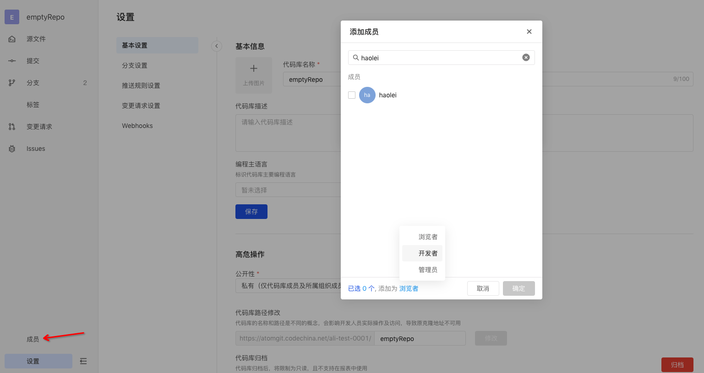

## 成员管理

### 邀请成员

管理员可操作。点击库内左下角成员 Tab 后选择添加成员，检索特定成员（用户名检索）后选择期望授予他的权限，然后点击确定邀请。

- 被邀请用户将收到一封邮件通知，点击邮件中的接受邀请按钮，将被成功邀请进库成员列表；
- 邮件有7天过期时间，过期后邀请失效；
- 若库管理员在成员管理弹窗中“撤销邀请”，邀请链接也将失效；

### 变更成员权限

管理员可操作。选择库中某个成员，点击右方角色下拉列表即可变更成员权限。

### 删除成员

管理员可操作。选择某个成员后点击移除成员，可删除某个成员。