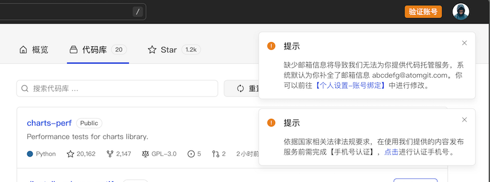

## 账号

在使用 AtomGit 的代码托管服务时，你需要注册一个 AtomGit 的账号，在注册账号时，我们将收集以下信息：

- **手机号**，你的手机号，用于完成国家法律法规要求的前台用户实名认证
- **邮箱账号**，你的邮箱账号，向你提供 Git 代码托管服务所必须的，类似你本地的 `git config user.email`
- **用户名**，你的用户名，向你提供 Git 代码托管服务所必须的，类似你本地的 `git config user.name`

### 第三方账号登录

如果你是通过第三方账号登录 AtomGit 平台，你仍需要补齐手机号和邮箱账号，其中：

**邮箱账号**，如果你授权时允许 AtomGit 获取了原平台的邮箱信息，我们将使用该邮箱账号；如果授权登录时未获取到邮箱信息，系统将默认为你生成一个 xxxxx@atomgit.com 的邮箱账号，你可以前往「个人设置 - 账号绑定」 中进行修改

**手机号**，授权登录后，系统会提示你进行「认证手机号」操作，如果你未认证号，我们将无法为你提供包括创建代码库、创建 Issue、发表评论等在内的内容发布服务

