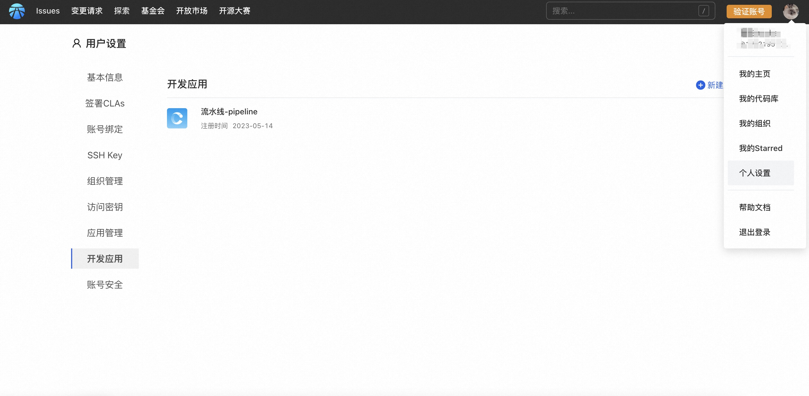
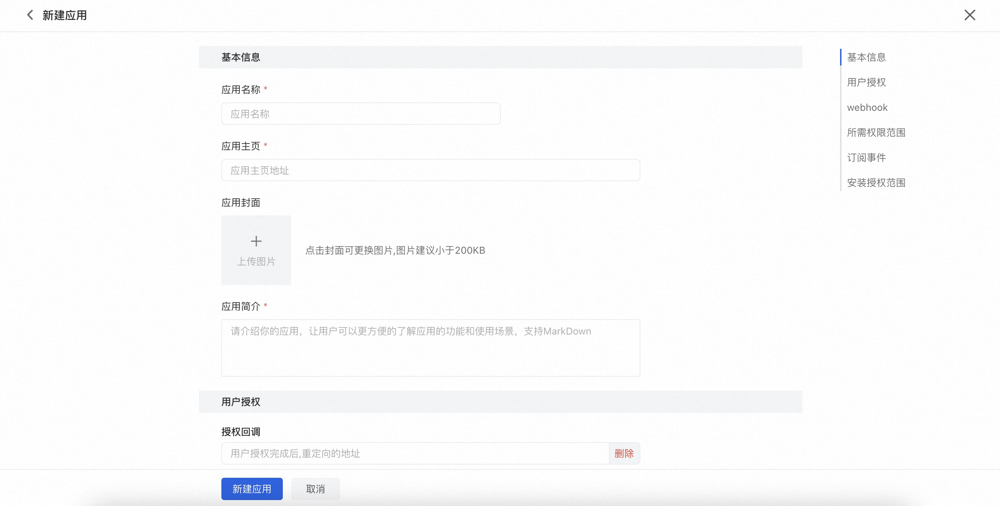
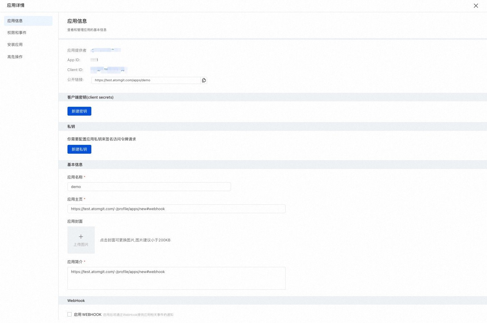
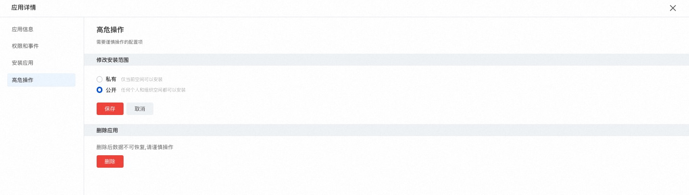
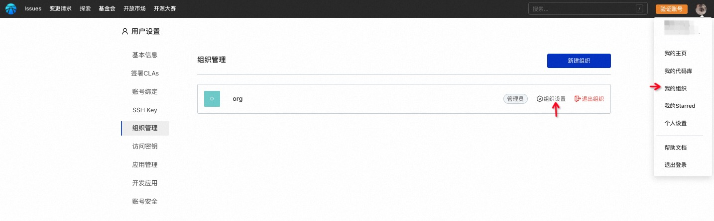
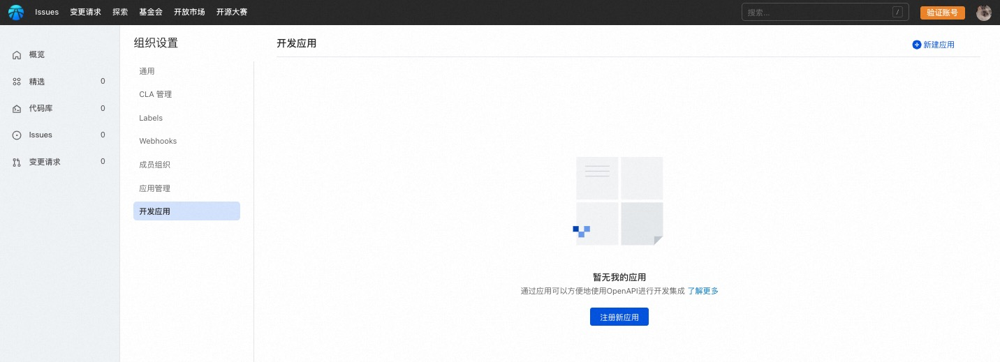

## Develop Applications

The platform supports access to third-party applications and provides authorization for applications. The application can call OpenAPI to obtain authorized platform data, and can freely perform business data processing outside the AtomGit site through the application. It also provides a way to write back the data results and echo the processing results in the submission status and change request status to achieve expansion. Code quality, security inspection and other purposes.

### Application Connect

Applications need to be connected to space, and AtomGit has two types of spaces:

- Personal Space
- Organizational space

#### Personal Space

1. Click on the avatar in the upper right corner, enter "Personal Settings", and select "Develop Application":

2. Click on "New Application" and fill out the application information form:

**Basic information of the application**

Including name, homepage, cover, etc.

**User Authorization Configuration**

The callback configuration for installing authorization and whether Oauth authorization is required will be used for applying for user authorization to obtain corresponding data through OpenAPI.

**WebHook Configuration**
After enabling, notifications of application related events will be provided through WebHook

**Select the required permission range for the application**
The scope of user permissions that the application needs to apply for, including code base permissions, organizational permissions, and user permissions.

**Events that the application needs to subscribe to**
According to the selected permission range and WebHook settings, events that can be subscribed to can be selected accordingly. When the corresponding event occurs, it will be notified to the application, which can be further customized for processing.

**Application installation scope settings**
Including private and public, private applications can only be installed in the current space, while public applications can be installed in any space. When an application is to be launched on the open market, it must be set as a public application.

3. After the application creation is completed, the application details will be entered:

In the application details, you can modify and configure the basic information, permissions, and events of the application.
Before using an application to make OpenAPI calls, it is necessary to create a new client key or private key as needed. How to use OpenAPI through the application can be found in [Application Access Example](demo).

**Installing Applications**
There are two common ways to install applications:

- Install the application through application details and select the desired installation space for installation;
- Install through an open market, see [app market](market).

**High risk operations**
This includes modifying openness and deleting applications.

#### Organizational space

Only allow the organization administrator role to access applications for the organization.

1. Click on the avatar in the upper right corner to enter 'My Organization' and click on the target organization:

2. Enter the organizational settings and select 'Develop Applications':

3. Click on "New Application" to fill in the application information, organize the process of creating a new application in the space, and develop the application in the same personal space without further explanation.
