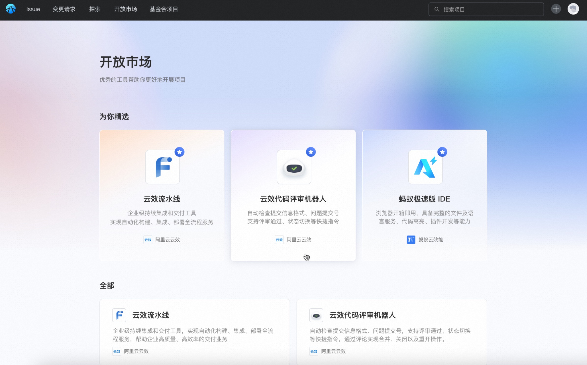
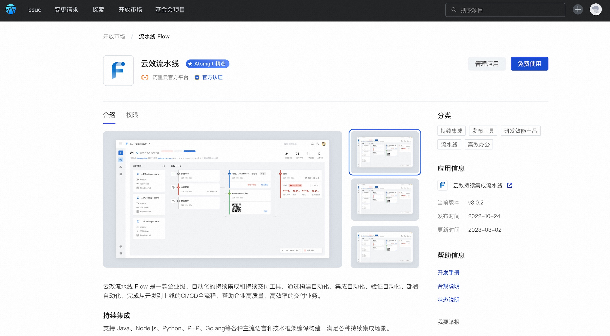
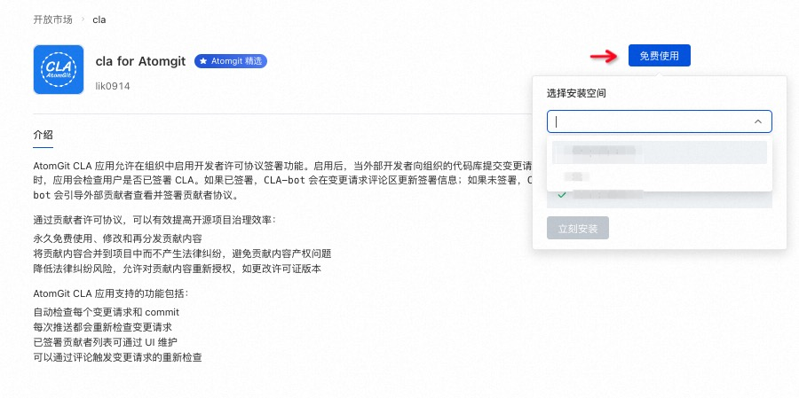
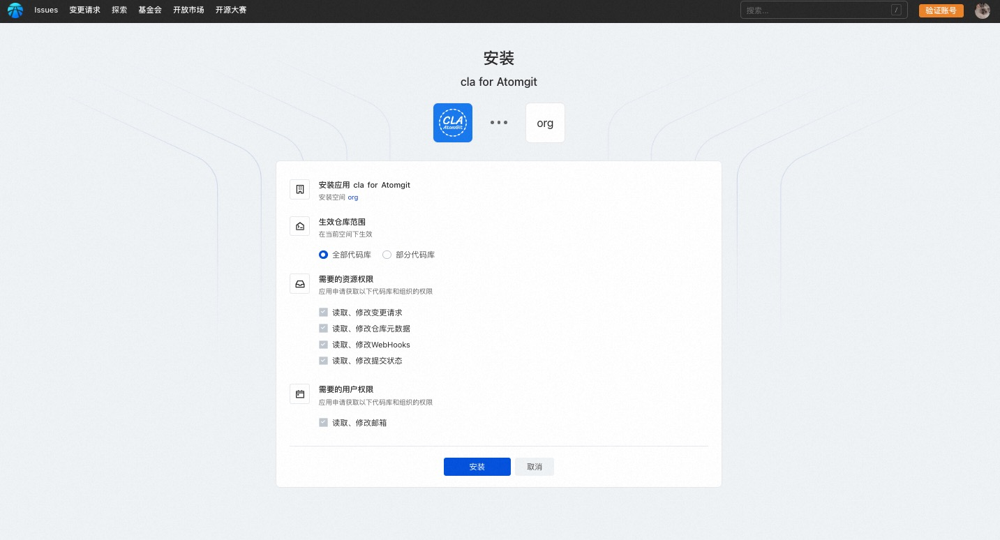
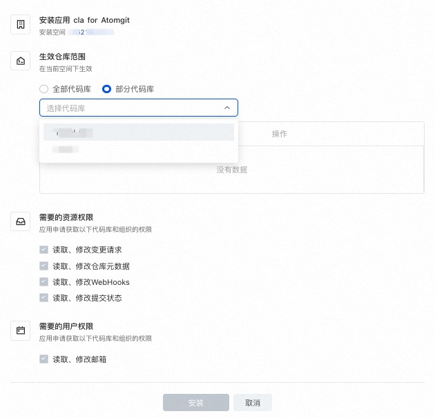
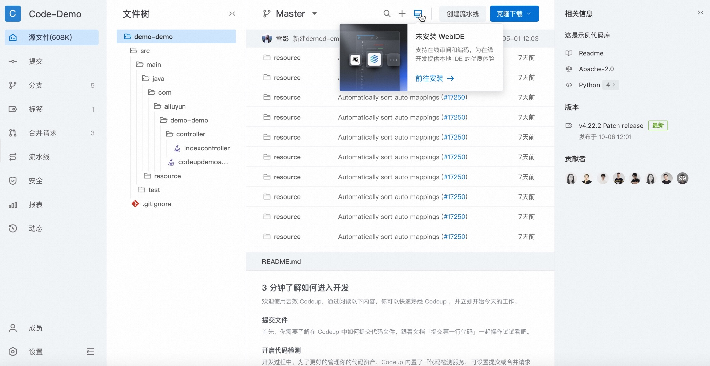
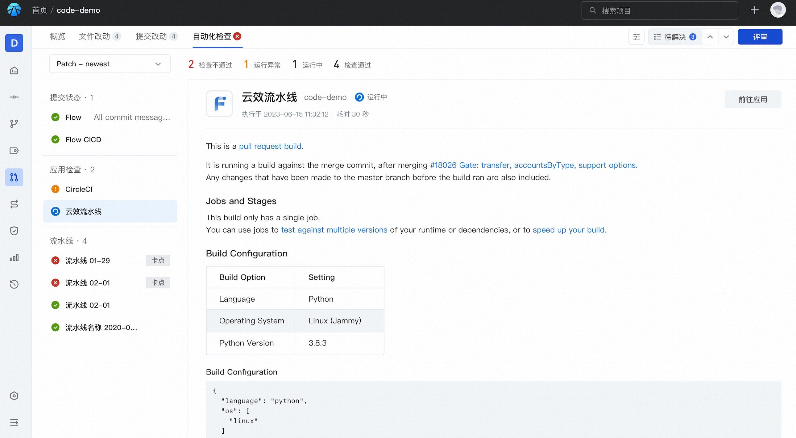

## App Market

The platform provides an open market for users to choose and install applications suitable for their own projects, and will continue to build the richness of market applications.

Click the application card to enter the application details:

### App Install

1. Enter the application details, click "Free to use", and follow the prompts to select the space you want to install:

2. Enter the installation confirmation page and confirm the installation and authorization information:

* Effective warehouse scope: Controls the scope of code base data that the application can obtain.
If you select some code libraries, you need to manually select the libraries that can obtain data and add them to the list:

* Confirmation of resource and user permissions: Declare according to the permissions required when the application is accessed, and complete the application installation after confirmation.

After the installation is completed, it will jump to the callback address filled in by the application. If the application also requires Oauth user authorization, it will jump to the third-party application to enter the Oauth authorization process.

After the application installation authorization is completed, it can operate according to the capabilities provided by the application itself.

* For WebIDE applications, after installation is complete, you can start the online coding service through the WebIDE button in the code library:

* For example, for continuous integration applications, after the installation is completed, the check result status can be written back in the code base for submissions and change requests to assist in code review:

