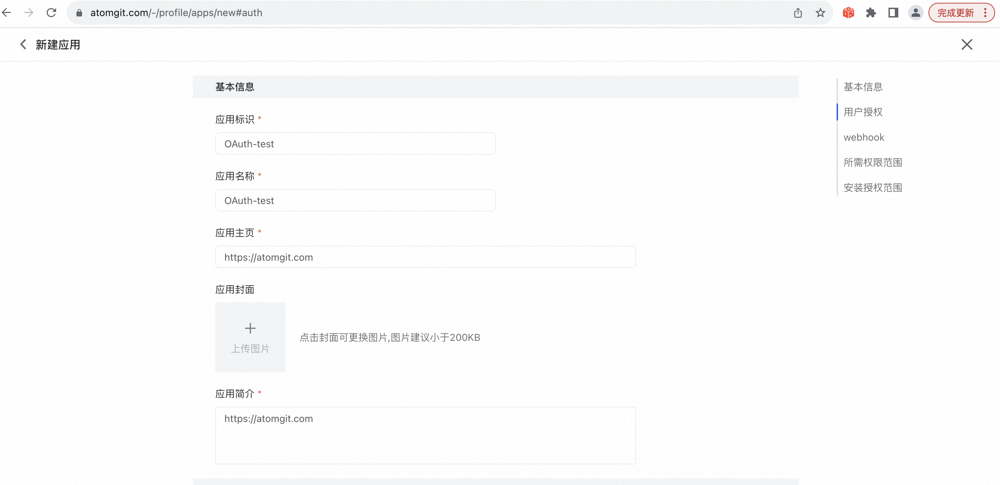
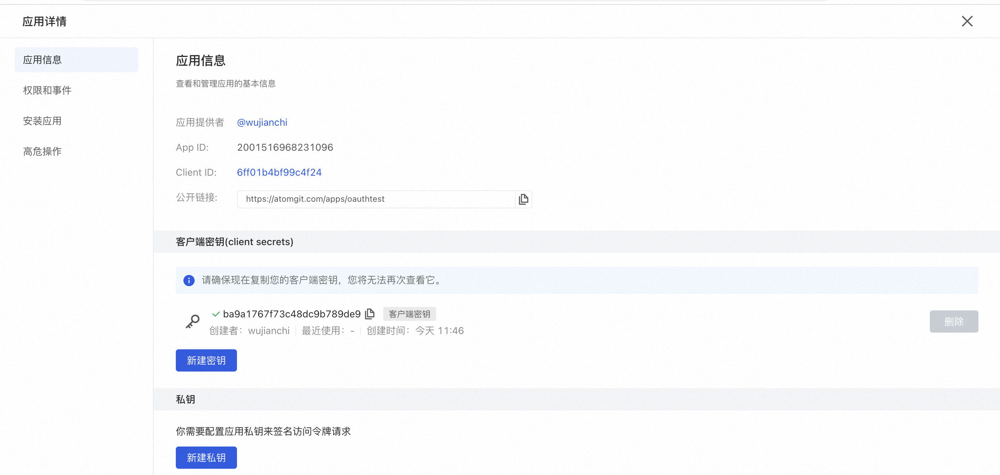

## Create OAuth App

1. Login AtomGit
2. Click your avatar in the upper right corner and select **Personal Settings**
3. On the User Settings menu, select **Application Development**
4. Set up information about your OAuth application

- Application identification
- Application Name
- Application logo
- Application home page
- Application introduction
- Authorization callback URL in user authorization, the redirected address after the user is successfully authorized
- Select the permissions required by the OAuth application in the required permission range, and select user-related permissions in the normal OAuth login scenario.

5. Click the [New Application] button

After creation, you can view the application ID (Client ID) in application details -> application information and click New Client Key to obtain the application key (Secret ID)

Please keep your **[Application Key]** safe. This key will only be displayed once after it is successfully created. It will no longer be displayed after you leave the current page.

