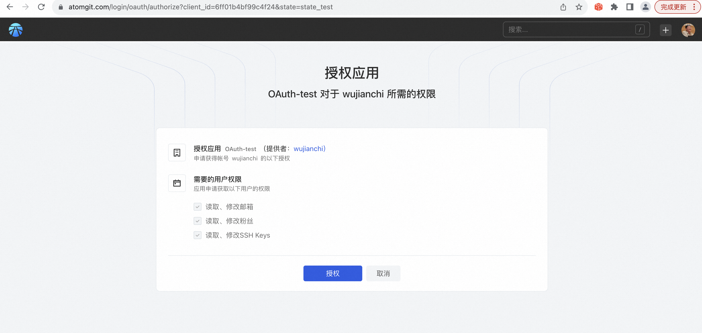

## OAuth2 Get AccessToken

### 1. Authorization code mode

A. The application guides the user to the AtomGit three-party authentication page through the browser or Webview (**GET request**)

```hash
https://atomgit.com/login/oauth/authorize?client_id=xxxxxxx&state=state_test&redirect_uri=xxxx
```

B. The user authorizes the application (Note: If the user is not logged in, it will jump to the login page first, and then jump to the authorization page after the login is completed)


C. The AtomGit authentication server passes the user authorization code to the application server through the callback address {redirect_uri} or directly jumps to the callback address carrying the user authorization code in Webview. Webview can directly obtain the code ({redirect_uri}?code=abc&state=xyz )

D. The application server or Webview uses the access_token API to send a post request to the AtomGit authentication server, passing in the user authorization code, application ID, and application secret (**POST request**) to obtain the access_token.

```bash
curl https://api.atomgit.com/login/oauth/access_token 
-X POST 
-d '{"client_id":"49521b236a3e8937","client_secret":"fc58279a2b1869b6df00cc9342af147792e4dd9a","code":"acdc24186bc7a8485544"}' 
--header "Content-Type: application/json"
```

E. AtomGit authentication server returns access_token, refresh_token, and the application uses access_token to access Open API and use user data.

F. When the access_token expires (valid for 8 hours), you can re-obtain the access_token through the following refresh_token method (**POST request**)

```
curl https://api.atomgit.com/login/oauth/access_token 
-X POST 
-d '{"client_id":"Iv1.49521b236a3e8937","client_secret":"fc58279a2b1869b6df00cc9342af147792e4dd9a","grant_type":"refresh_token","refresh_token":"refresh_2ff47923f2f454fd9b104729ec807d6e"}' 
--header "Content-Type: application/json"
```
