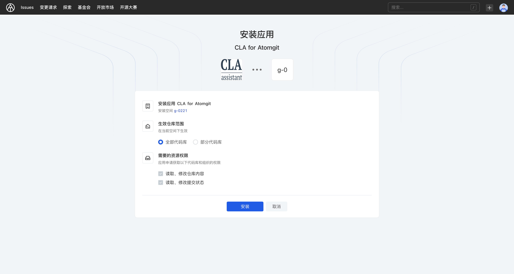
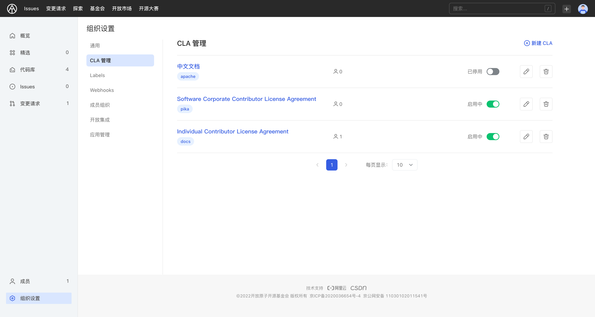
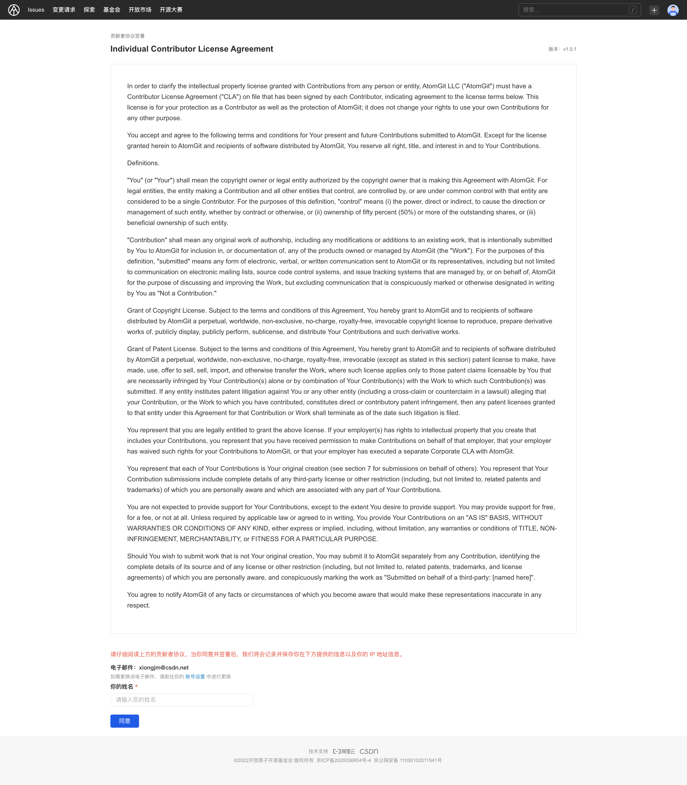
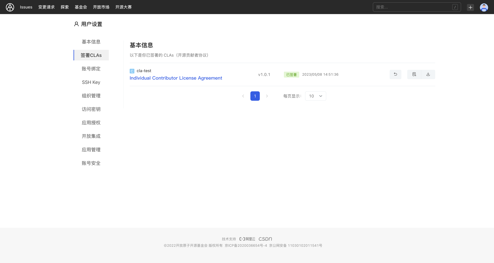

## Contributor License Agreement

The CLA(stands for Contributor License Agreement) app allows you to enable Developer License Agreement signing in your organization. When enabled, when an external developer submits a change request to the organization's code base, the application checks whether the user has signed the CLA. If signed, `CLA-bot` will update the signing information in the change request comment area; if not signed, `CLA-bot` will guide external contributors to view and sign the contributor agreement.

### What is CLA？

CLA stands for **Contributor License Agreement**. A legal document that many open source projects require contributors to sign in order to give the project the intellectual property rights to the contributed content (such as code and documentation) so that they can be freely used, modified, and redistributed.

In detail,CLA allows repo:

- Free to use, modify and redistribute contributed content forever
- Incorporate contributed content into the project without causing legal disputes and avoiding property rights issues of contributed content
- Reduce the risk of legal disputes and allow relicensing of contributed content, such as changing license versions

CLA can effectively improve the efficiency of open source project governance.

## Features

AtomGit CLA App supports：

- Automatically check every change request and commit
- Change requests are rechecked with every push
- List of signed contributors can be maintained via UI
- Rechecking of change requests can be triggered via comments

### Install CLA App

Enter the organization settings and open the CLA management page. The CLA application is not installed by default. You need to go to the open market to install the AtomGit CLA application.

1. Select the space to be installed and click [Select]
2. Select the effective warehouse scope. It is recommended to select all code libraries.
3. Click [Install] and jump to the [Organization Settings-Application Management] interface after completion.

### Add CLA

After the CLA application is installed, CLA content can be added in the CLA management interface:

1. Click [New CLA]
2. Enter the protocol name
3. Set the agreement version. If you check Re-sign, the old version of the agreement that has been signed will become invalid. You will receive a version update prompt after submitting the change request.
4. Set the scope of the code base enabled by CLA. A code base can only be associated with one CLA agreement.
5. Set CLA agreement content
6. Click [New] to add a new CLA agreement

### Sign CLA

When attempting to contribute by submitting a change request to a CLA-enabled repository, `CLA-bot` will prompt you to sign the appropriate Contributor License Agreement. In the signing interface, you will see:

- Protocol name
- Protocol version
- Agreement

At the same time, you need to provide and confirm your email address and personal information to complete the signature:

- Email (can be changed in Personal Settings-Account Binding)
- Name

After the signing is completed, you can view and manage the signed CLA agreement content on the [Personal Settings-Sign CLAs] page.

