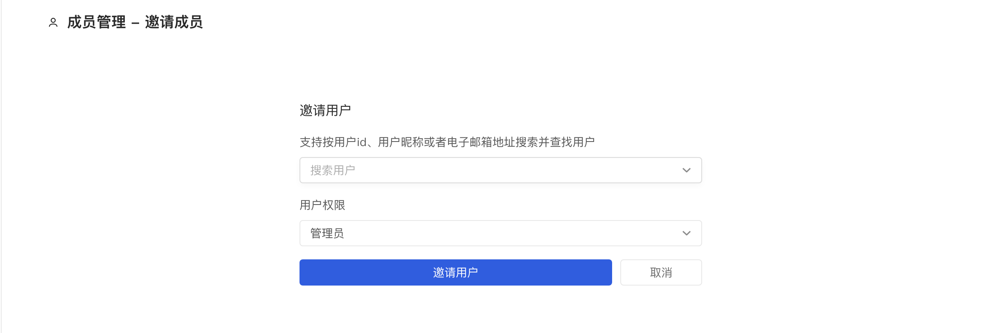

## Invite users

Once your organization is created, you can invite your collaborators to join your organization.

### Instructions

After entering the organization page you created, click the [Members] button in the lower left corner to jump to the member list page, where you can invite users by clicking the blue [Invite Members] button:

1. Search for the member you want to add by username. If there is no account, please ask the collaborator to register an AtomGit account first.
2. Set role permissions for this member，include `viewer`、`developer` 和 `maintainer` ，to know more about the differences between these permissions,view [05 - org/management](settings)
3. Click the blue [Invite User] button below

When the invitation application is submitted successfully, the system will send an email [XX user invites you to join XXX organization] to the invited user. The invited user can check your invitation information through the [View Invitation] link in the email. The invited user Users can:

- **Accept Invitation**, after accepting the invitation, the invited user will join the organization and become a member of the organization with the identity you set when inviting. At the same time, you will also receive an email notification that the user agrees to the invitation and joins the team.
- **Reject invitation**, if the invited user refuses to join your team, you will also receive an email notification prompting the user to refuse the invitation to join the organization.

> Note: The invitation link is valid for 7 days. After inviting the user to join the team, you can contact the user to check the invitation notification email sent by the system.
