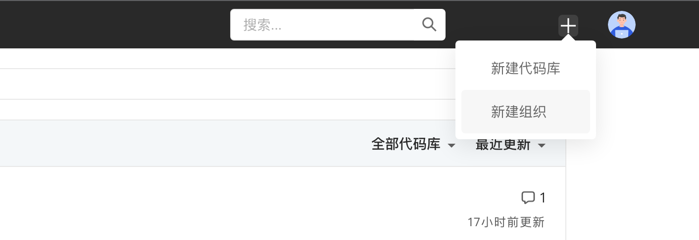
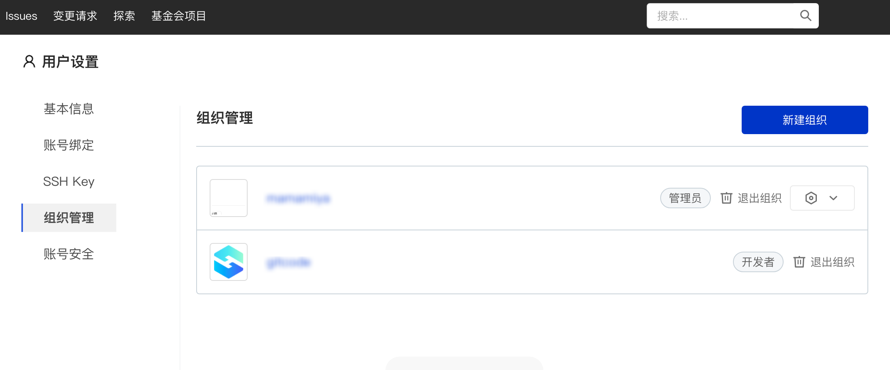
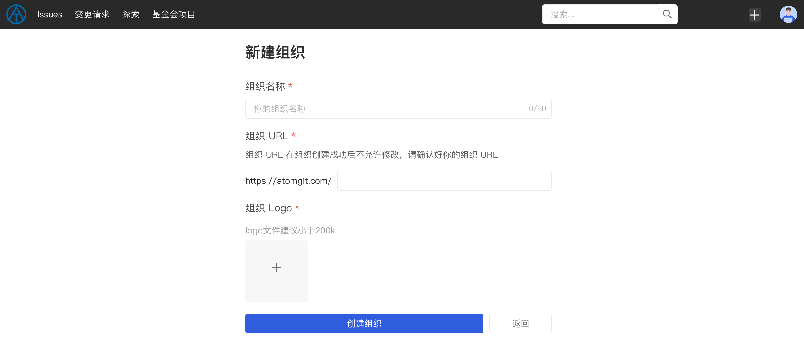
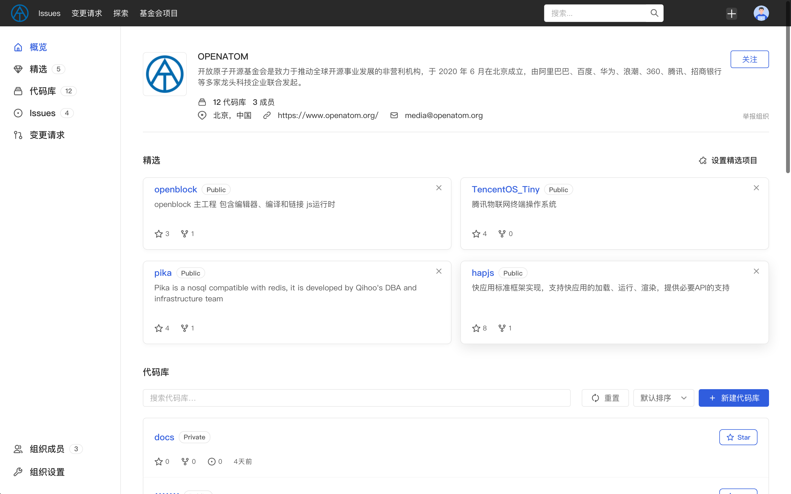

## Organization

AtomGit provides users with feature [organization] that is more convenient for collaboration. By organization, you can：

- Keep related repositories in the same organization
- Invite collaborators to join the organization and grant access to all repositories under the organization at once

You can view and manage the organizations you have joined through the top navigation [My - My Organization].

### Create Organization

You can create an organization by clicking the `+` sign in the top navigation and selecting **New Organization**. You can also enter the organization management page through [Me - My Organization], and then click the blue `New The Organization` button creates a new organization:

> Note: Each user can create up to 5 organizations (that is, when the number of organizations you join as an `administrator' reaches 5, you will no longer be able to create new organizations)

You need to add the following information on the new organization page:

1. **Organization Name**, your organization name. The name can only contain alphanumeric characters, Chinese, underscores, connectors, dots, spaces and other characters. The character length should not exceed 50 characters.
2. **Organization URL**, the URL of your new organization. After the creation is successful, users can access your organization through this URL. After the creation is successful, it cannot be modified. Please confirm your organization URL before submitting.
3. **Organization Logo**, in order to facilitate other users to better identify your organization, we recommend that you upload your organization Logo. It is recommended that it be square and the size should not exceed 200 Kb.

Click the blue [Create Organization] button below. After the organization is successfully created, you will be redirected to the organization homepage. You can continue to complete organization-related information in the organization settings, including:

1. Introduction to the organization
2. Contact email
3. Organization official website
4. Organization location

### Organization Info

On the **Organization** page, the following information will be displayed:

- Basic information of the organization, including: organization logo, organization name, organization profile (if filled in), location information (if filled in), contact email (if filled in), organization official website (if filled in)
- Basic statistical information of the organization, including: number of organization code bases, number of organization members
- The organization's selected items (if set) and the list of selected items. If you are the organization's administrator, you can also set the selected items and their order.
- A list of the organization's repositories. If you are a member of the organization, you will be able to see the organization's private repositories (if any)
- The organization's member list. If you are the organization's administrator, you can also adjust member permissions or remove members in the organization's member list.
- Organization settings, if you are an organization `administrator`, you will be allowed to set up the organization, including setting up the basic information of the organization and deleting the organization (deleting the organization will not be retrieved, so be careful when deleting)

#### Follow the organization

In addition to browsing organization information, viewing the organization's code base and organization members, you can also follow the organization. The organizations and users you have followed will appear on the follow page of your personal homepage.
