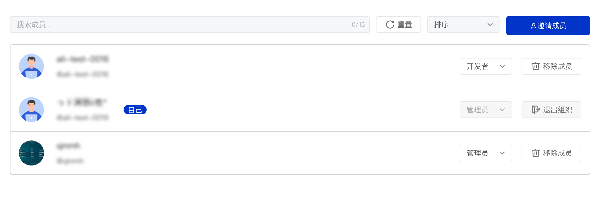

## Organization Setting

In an organization, different roles can perform different operations. Organizational roles are divided into the following three categories:

- Maintainer: can read, clone, and push to the code base in the organization, can create a new organization code base, can add organization member permissions, can set the organization's basic information, and can delete the organization.
- Developer: can read, clone, push to the code base in the organization, and can exit the organization
- Viewer: can read and clone the code base in the organization, and can exit the organization

> Note: for the permissions of different roles on the repository, see  [02 - Repo Permission](../permission)

### Members and Permissions

| Permission | viewer | developer | maintainer | remark |
| -- | -- | -- | -- | -- |
| View organization | ✓ | ✓ | ✓ | Private organizations cannot be viewed by non-members of the organization |
| Organization basic settings | | | ✓ | Including basic information, logo and other settings |
| visibility settings | | | ✓ | Change organization visibility, private/public |
| Delete | | | ✓ | |
| Set pinned repo | | | ✓ | |
| Remove pinned repo | | | ✓ | |
| Sort pinned repo | | | ✓ | |
| Create a new organization repo | | | ✓ | |
| View members | ✓ | ✓ | ✓ | |
| Quit | ✓ | ✓ | ✓ | |
| Invite members | | | ✓ | |
| Remove members | | | ✓ | |
| Set member permissions | | | ✓ | |

### Delete Organization

`Maintainer` can delete the organization. Deleting the organization will also delete all code libraries in the organization, including archived code libraries and their related resources.

1. Enter the organization page
2. Click [Organization Settings] to enter the organization settings page
3. Click [Advanced Settings] to expand the [Delete Organization] section
4. Click the [Delete Organization] button
5. Follow the prompts to enter the confirmation information and submit [Delete Organization]

> Note: Deleted organizations cannot be recovered. The system will confirm twice before deleting. Please operate with caution!

### Quit Organization

Users can also exit the organization. The steps to exit the organization are:

1. Enter the organization page
2. Click [Organization Member] to enter the organization member list page
3. Find your user information and click the [Exit Organization] button on the right

> **Note: The following situations will prevent you from leaving the team**
>
> 1. When you are the only member of the team, you will not be able to leave the team
> 1. When you are the only `Maintainer` left in the team, you will not be able to exit the team
