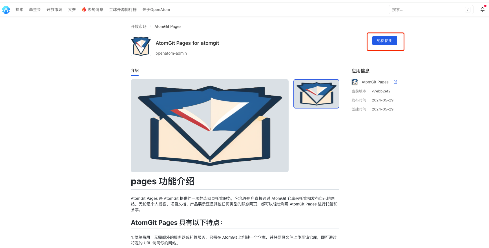

## AtomGit Pages

AtomGit Pages is a free static web hosting service that you can use to host blogs, project websites, and other static web pages. Currently, AtomGit Pages supports compiled static resources such as Vue, React, Jekyll, Hugo, Hexo, and more.

### Usage Precautions
1. Repositories that need to use AtomGit Pages must be public repositories.
2. The root directory of the repository must have an index.html file to be accessible.
3. You can write the style of the static web page yourself, or modify some static templates. The Pages service itself does not provide any templates, but we will gradually add examples for your reference.
4. AtomGit Pages currently does not support pages without a subdirectory.
5. If an AtomGit Pages repository changes from a public to a private repository, the static pages deployed by the Pages service and the related repository pages configuration will be deleted. To use it again, you will need to change the repository back to a public repository and reconfigure the branch for pages deployment.
### Common Issues
1. How to create a homepage access address without a subdirectory, such as test.atomgit.net?
  
    Answer: AtomGit Pages currently does not support pages without subdirectories.

2. When the project is deployed, some resources return a 404 error when accessed?
  
    Answer: If some resources return a 404 error after the project is deployed, you need to check if the project's configuration is correct. For example, if the generated pages URL is https://test.atomgit.net/test_pages/ and the resource being accessed results in a 404 error, such as https://test.atomgit.net/style.css, this is likely due to an issue with the relative paths in the corresponding configuration file. The correct resource URL should be https://test.atomgit.net/test_pages/style.css. For different static resource generators, the configurations should be as follows:
    
    - For Hugo, modify the baseURL in the config.toml file as follows:
    
      baseURL = "https://test.atomgit.net/test_pages"
    
    - For Hexo, modify the url and root in the _config.yml file as follows:
    
      url: https://test.atomgit.net/test_pages
    
      root: /test_pages
    
    - For Jekyll, modify the baseurl in the _config.yml file as follows:
    
      baseurl: "/test_pages" # the subpath of your site, e.g. /test_pages
### Deployment Guide
1. First, click on the [Marketplaces](https://atomgit.com/marketplace) on the homepage to navigate to the app marketplace as shown below：

   

2. Find the AtomGit Pages application：

   

3. click Free use ：

   

4. Select the namespace where you want to install the AtomGit Pages application：

   
   >Attention: If you choose a personal namespace, repositories under the personal namespace will have the ability to use AtomGit Pages. If you choose an organization namespace, the selected organization namespace will have the ability to use AtomGit Pages.

5. After selecting the namespace where you want to install the application, click "Free Trial," and you will be automatically redirected to the issue application page (to apply for the installation of the AtomGit Pages App). You need to fill in the application information according to the issue template provided：
   
   
   >Attention: Please fill in your application information truthfully according to the template, so that the operational staff can process your application more quickly.
6. After the operational staff has completed the review, you will see the dynamics of this issue in the My Message - Notification, with the following content：
   
7. Once the application for installing the AtomGit Pages app has been approved, repeat steps 2-4 above, and you will be directed to the application installation page, as shown below：
   
    >Attention: If the effective scope is set to "All repositories," all repositories under this namespace will have AtomGit Pages capabilities. If set to "Selected repositories," only the selected repositories will have AtomGit Pages capabilities.
8. Once the AtomGit Pages application is installed, create a pages repository in the corresponding namespace as follows：
   
    >Attention: When creating a new repository, note the following: 1. The namespace should be the one you selected for installation in step 7. 2. The repository must be public for AtomGit Pages to deploy successfully, as indicated in the screenshot.
9.  Once you have completed creating the pages repository, click on "New File" on the repository's homepage as shown below：
    
    >Attention: The home page file for pages must be named index.html.
    
10. Configure the branch that the repository needs to deploy for pages, as follows：
    

    >Attention: Follow the steps 1, 2, and 3 as indicated in the screenshot. By now, the static web page has been successfully deployed. Click on the link at 4 to access the provided address: https://test.atomgit.net/test_pages/ to view your pages page, as shown below：

    

### Official Examples
AtomGit also provides detailed deployment tutorials and demos. Please click [here](https://openatom.atomgit.com/explore/journalism/detail/313608476846854144).