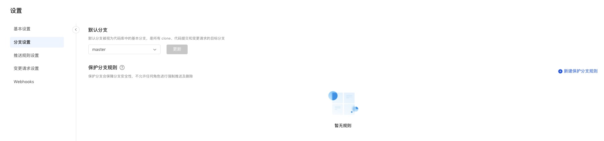
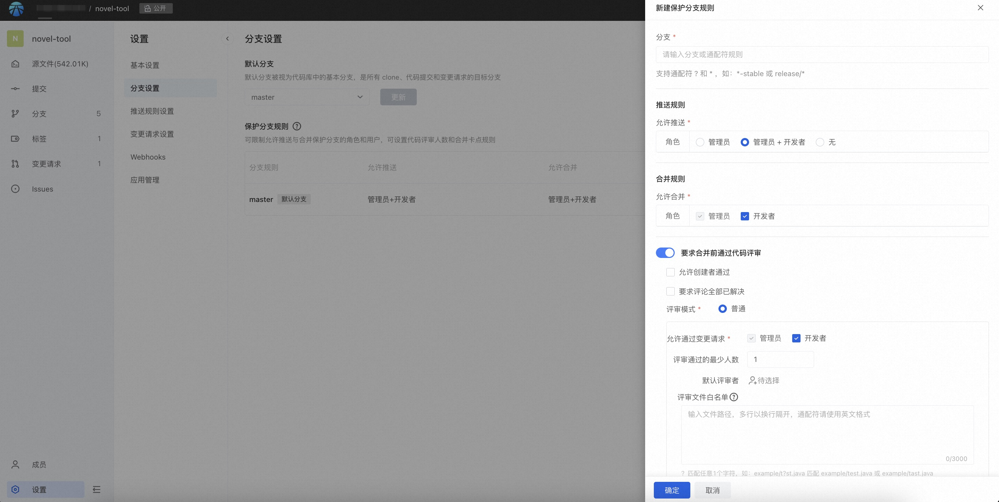

This article introduces the branch setting function description of the code base.


#### 1.Default branch

The default branch exists as the base branch for Clone, branch creation, merge requests, and code browsing, and can also protect branches from being accidentally deleted. As a code base administrator, you can modify the default branch according to team development habits, and select the branch that needs to be modified by pulling down.

#### 2. Protect branches

Protect branch definition: limit deletion of branches, limit Force Push.

The code base administrator sets branches with appropriate rules for protection. If the protected branch is set, no one is allowed to delete the branch and force push. The former is mainly to protect important branches from accidental deletion, and the latter is to avoid the force push operation that will cause Commit Cannot be traced back.

#### Create a new protected branch rule



Branch selection: supports two forms

- Fill in the complete name of the specific branch
- Branch wildcard rules (currently only supports ? and *), when matching multiple branches, display all matching branches.

>If there are multiple rules for a protection branch, which one is dominant?
Effective logic: If a branch of the code base can match multiple protection branch rules, the rule containing the specific branch name will have the highest priority; if there are multiple wildcard rule matches for a branch, the earliest created branch rule will have a higher priority. High priority.

For example: there are branches master, master-1, master-prod-1 in the code base, and the order of rules is as follows: master-*, master-1, master-prod-*, and the matching rules are as follows:

|  Branch   |  Rules  |  Rules used  |
|  ----  | ----  |  ----  |  
|  master-1   |  master-*，master-1  |  master-1  |
|  master-2   |  master-*  |  master-*  |
|  master-prod-1   |  master-*，master-prod-*  | master-* |

##### Push rules

Shows the roles or people who can push directly to this protected branch.
Administrators and developers are allowed by default. Once you check to cancel a certain role, it means that the role is not allowed to push directly.

None: Does not allow anyone to support pushing.

You can set the people allowed to push: you can select among the members of the code base, but the prerequisite for the selection to take effect is that the selected user has write permissions to the code base;

##### Merge rules

That is, the role or person who is allowed to click the merge action in the change request.

Administrators and developers are allowed by default. Once you check to cancel a certain role, it means that the role is not allowed to be merged.

##### Rules can be restricted for code review

Allow creator to pass: Yes/No

Code review comments have all been resolved: Yes / No

In the normal review mode, you can set the number of people who pass the review, the role restrictions that are allowed to pass, and the default reviewer. For example:

>Minimum number of people passing the review: 1
Allow merge requests via: Admin + Developer
Default reviewer: If no one is filled in, the item will not be displayed. The maximum number is 20.

###### Review document whitelist

Under normal circumstances, change requests must have at least one reviewer, but sometimes only a few insensitive files are submitted, and there is little need for manual intervention in the review. We hope to directly support merging of such files to improve work efficiency. .

Most of the files in the code project need to go through review checkpoints. A small number of unimportant file changes do not need manual review every time. However, in order to ensure the stability of the merge, the merge process usually requires CI automated inspection before merging. Therefore, it is still not allowed to push the target branch directly, but must go through the review process.

Such needs can be solved using the review document whitelist.

After setting the review file whitelist, when the review involves the file:

- If the change request only contains files in the whitelist - the change request is not subject to the "minimum number of people who can pass the review", but other conditions such as all comment requirements are still in effect;

- If the change request contains files in the whitelist - all rules of the protection branch corresponding to the change request will take effect;

###### Review document whitelist writing rules

File whitelisting matches file paths using the following rules:

```
? match a character

* matches zero or more characters

** Match zero or more directories in the path
```

Examples are as follows:

```
# match atomgit/test.java ，match = atomgit/tast.java or atomgit/txst.java；
atomgit/t?st.java

# match all files ending with .java in the atomgit directory; 
atomgit/*.java 

# match all files named test.java in the atomgit directory;
atomgit/**/test.java 

# match files ending with .java in the org/springframework directory;
org/springframework/**/*.java 

# match org/springframework/servlet/bla.java，and match org/springframework/testing/servlet/bla.java or org/servlet/bla.java
org/**/servlet/bla.java 
```
