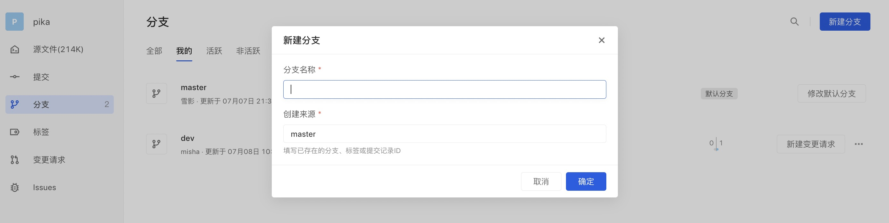
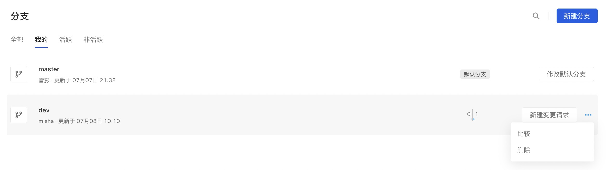
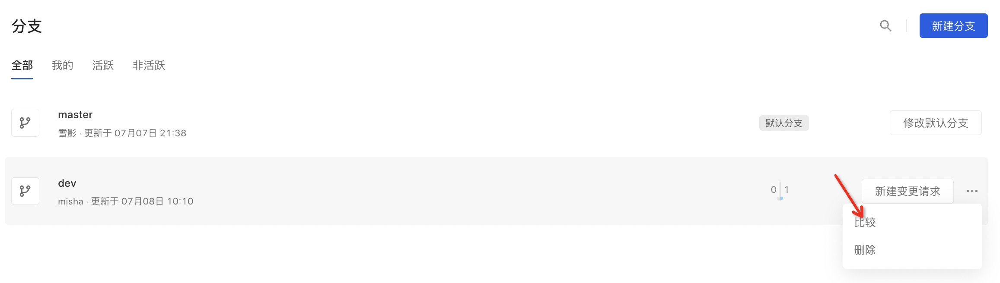
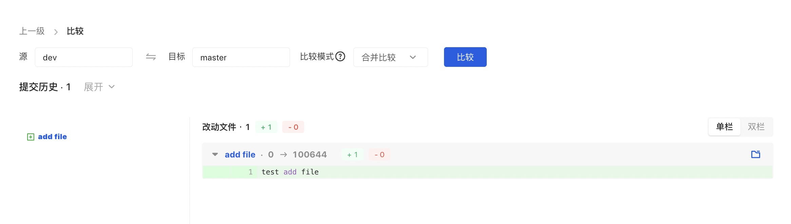

Branches are used to backup and save modification records without being affected by other branches, so multiple modifications can be made simultaneously in the same code base. When creating a warehouse, the Master branch will be automatically created as the default branch. Subsequent R&D members can create new branches and merge them into the default branch after development is completed.

AtomGit branches has three types: mine, active, and inactive

mine：What I created + what I updated makes it easier for users to manage branches.

active： branches that have commits in the past three months, making it easier for users to view and develop branches.

inactive：branches that have'nt been pushed in the past three months, allow users to clean up branches in a timely manner.

#### Create Branch

There are two ways to create a new branch: creation on the Web and local creation.

1. create in web

Click the New Branch button in the upper right corner of the branch list to display the branch creation pop-up window.

After filling in the branch information and confirming, the branch creation can be completed.

2.create locally

Under master or other branches (local branches), enter the command `git checkout -b slave` to create a new branch. Enter the command `git push origin slave` to push the branch to the remote repository.

#### Delete branch

##### Ordinary branch

developers can click "show more" after the branch name to get the entrance of 'delete', click "delete" to delete the branch.

##### Protected branch

Deletion is not supported and protection must be canceled before deletion.

##### Default branch

Deletion is not supported and must be canceled before deletion.

#### Branch comparison

click "show more" after the branch name to get the entrance of 'compare', click "compare" to start compare.

