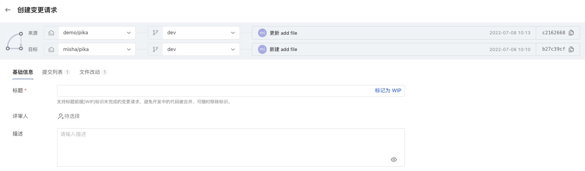

Code review is an important way to improve coding quality and ensure the security of incorporated code. At the same time, in a co-construction collaboration scenario, it is also a very common operation to request others to merge their contributed code by initiating a change request.

So, how do you make change requests to contribute code in AtomGit?

## Create Change Request

Go to the change request list page of the code base and click "New Change Request".


If a default reviewer is set (see branch settings for details), the default reviewer will be automatically filled in the reviewer list in the reviewer section.


To apply for a change, you need to identify a source and target。

- In the development mode of the same Kula branch, in the same warehouse, select the source branch and the target branch;


- In the cross-library Fork development mode, for the root library and derived libraries, select the source branch and target branch;

For repos with derived relationships, you can expand the entrance to the selected library through "Switch to cross-library merge" at the top.

A change request can be created when there are differences after comparing the source and target. At this time, you can preview the change submission list and file modification content. After confirming that they are correct, fill in the basic information of the change request and complete the creation.

> The support flag [WIP] identifies change requests with draft status, where reviewers will not be notified for review and will not pass review. It will be reviewable until the [WIP] mark on the title is removed.

## View Change Request Detail

After creation, enter the change request details:
This page has 4 menus:

- Overview
- File changes
- Commit changes
- Automated checks

#### （1）Overview

Including basic information such as status and description related to the change request, reviewer information, timeline dynamics and event records, as well as prompts on whether the merge status has been reached;


#### （2）File changes

Presents the comparison of changes in code files, and supports selection and viewing by version to trace the history of code changes.
Click on the file name to expand and view the contents of the changed file:


###### Comment

When viewing code, you can comment on lines of code:

Comments support two modes:

- Issue immediately: Publish immediately, visible to everyone with read permissions
- Draft comments: will be regarded as drafts and only visible to you. After the review is completed, you need to send them out through the "Complete Review" button in the upper right corner:


All comments can be viewed in a unified manner by expanding the pending items panel. Clicking on the blue link of a comment will jump directly to the corresponding location of the comment:


The comment itself carries a resolution status, which defaults to unresolved after creation. The review initiator will notify the reviewer for confirmation after handling the issue. After confirmation, the reviewer can resolve the review.
Additionally, library administrators can modify the resolution status.

> Whether the comments have been resolved can be used as a checkpoint condition for whether the change request can be merged: the administrator can enter the library settings and set the protected branch. All the reviewed comments must be resolved before they can be merged. After setting, if there are still unresolved comments, they cannot be merged.


In addition, you can set the code viewing view:


###### Code conflict resolution

When the merged branches have code conflicts, the system will automatically get stuck and the merge operation cannot be performed. The platform provides suggestions for conflict resolution:

```
//Step 1 fetch and switch to the source branch
git fetch origin
git checkout sourceBranch
//Step 2 Merge target branch
git merge origin/master 
//Step 3 Resolve conflicts and push
```

#### （3）Commit changes

Presents the change process of submissions in each version (i.e. range-diff). Based on this view, you can understand the changes in submissions after each push, such as the submission being deleted, adding or modifying the content of the submission itself, such as message, order, etc.


#### （4）Automated checks

Automated inspection results view that can be extended through third-party applications.

## Reviewer reviews code

The limit on the number of reviewers can also be set in the protection branch. When the number of passes is less than the set number, merging is not allowed.

- Library administrator enters code library settings
- Select Branch Settings - Protect Branch Rules
-Choose the review conditions that suit you as needed


After the setting is completed, review requests that are merged into the protected branch will comply with the merge conditions. If they are not met, the merge will not be allowed:


If you need to review the code, you need to add the user as a reviewer. After joining, the other party can comment on the review, including commenting, passing or not passing the change request.


Reviewers can click on the upper right corner to complete the review and submit their own review opinions:


## Merge review

After all conditions that must be met before merging are met, users with merge permissions can perform the merge operation.
The merging person can click the "Merge" button in the upper right corner to select the merging method to complete the merging.
Merging supports four methods by default. For details, see [Change Request Settings](pr-config) and select as needed.

