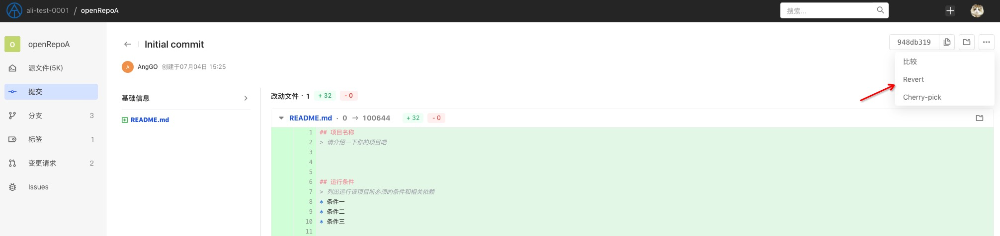
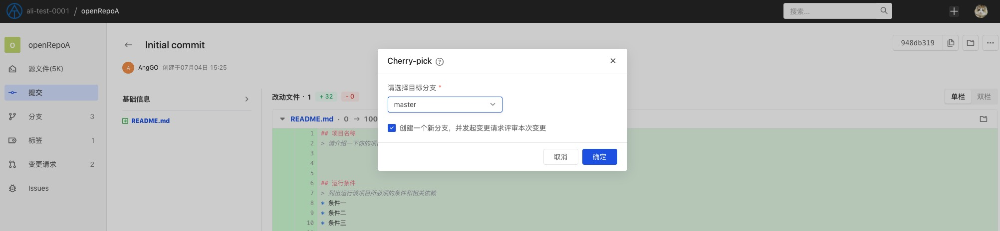
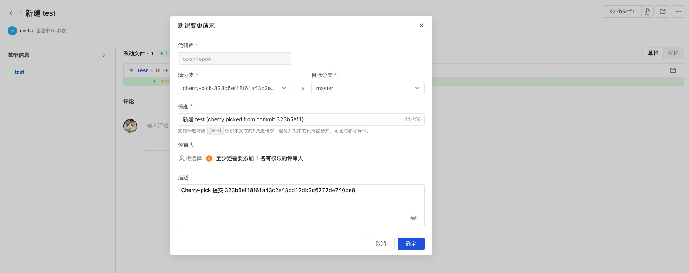
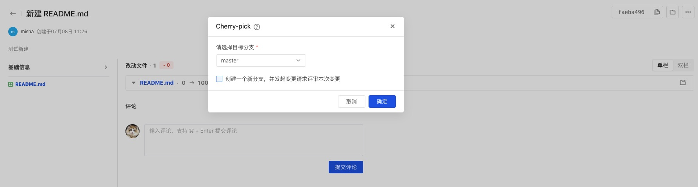
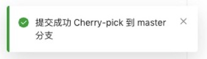

The `git cherry-pick` command can apply the specified commit to other branches.

Click the submission name to expand the submission details, and click "..." in the upper right corner to cherry-pick the current submission:

In the pop-up window, select the target branch you want to submit:

It is recommended to check the box to create a new branch and merge the code after reviewing it through a change request to ensure that the merge process is compliant and traceable:

If you do not choose to use change requests, just leave it unchecked and directly push the current submission to the target branch to complete cherry-pick:

