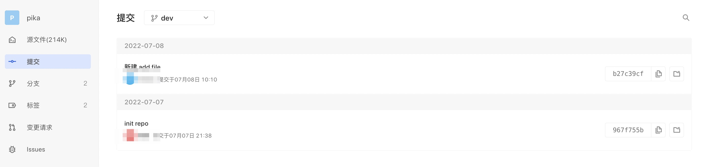
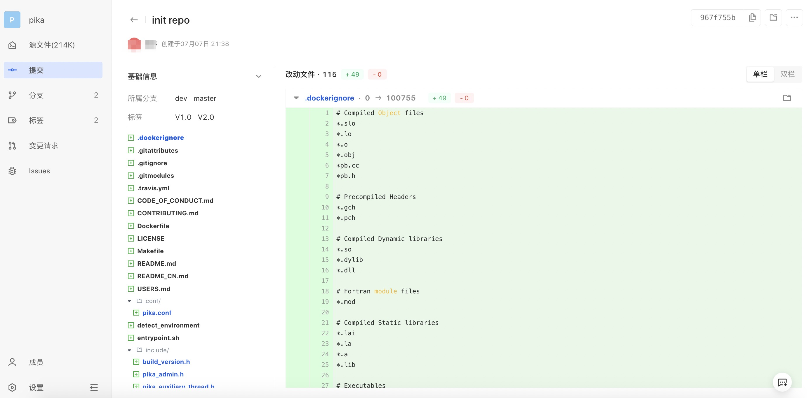
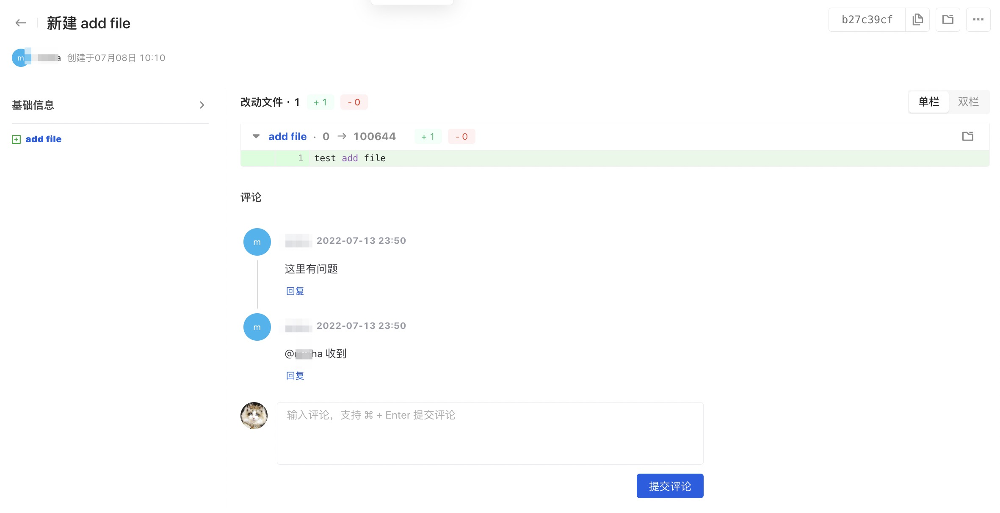

Developers can view a history list of each code commit.

Enter the code base details page and click the Submit menu. According to the actual situation, you can choose branch filtering and support retrieval according to the submitted message.

Click the entry title or submission ID to view submission details:

Comments are supported for submission details, and the submitter will be notified via email of the comment content:

